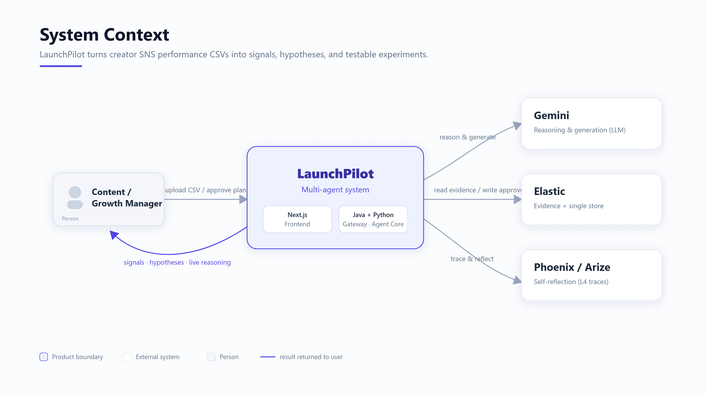
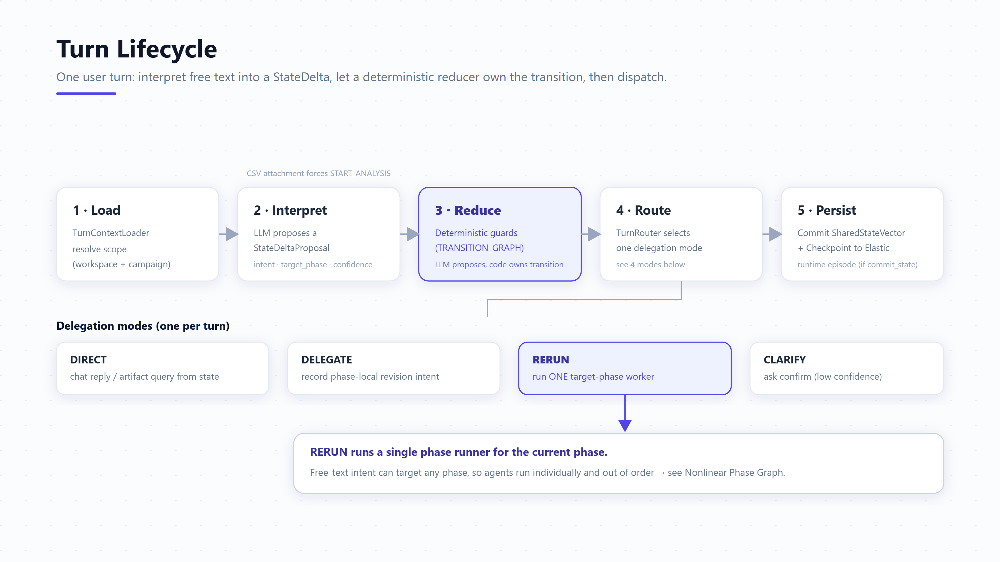
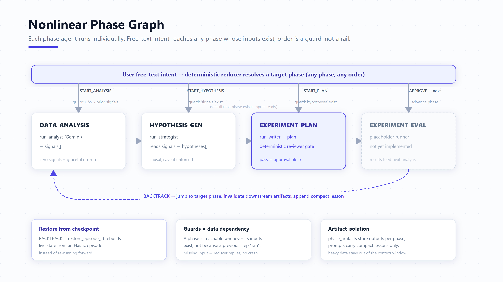
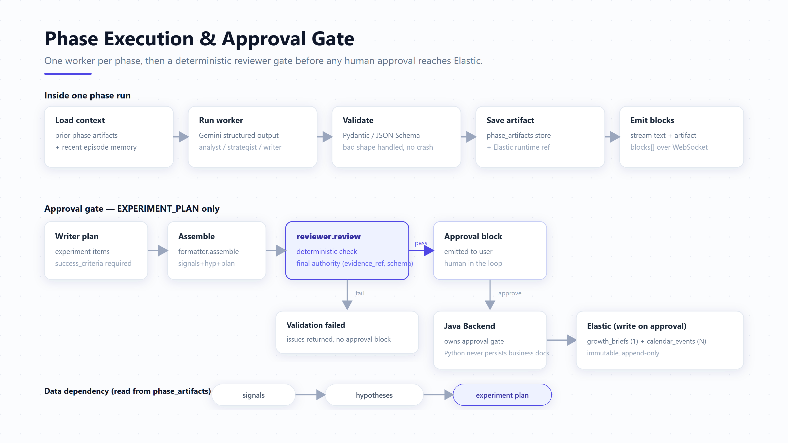
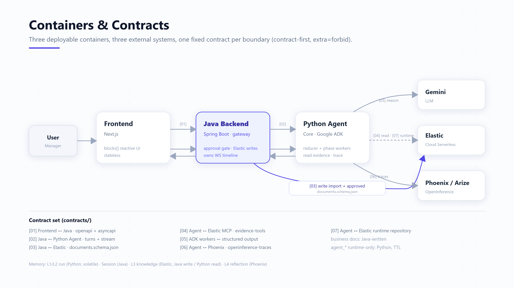
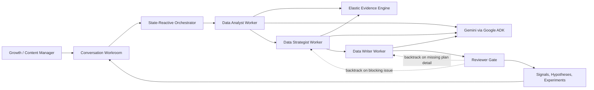
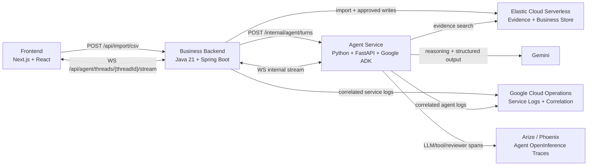

# LaunchPilot 
**Link**: <https://launchpilot-frontend-ynoeu4ngsa-uc.a.run.app>

LaunchPilot is a conversation-first multi-agent workroom for content and
growth teams. It turns social performance CSVs into evidence-backed growth
signals, hypotheses, approval-ready content experiments, Growth Briefs, and
calendar actions.

The project focuses on the work that usually happens after a dashboard: a
marketer sees that something changed, but still has to explain why it matters,
what to test next, and how to turn the decision into a concrete campaign plan.

## Architecture Diagrams

LaunchPilot reads a creator team's SNS performance CSV, finds growth signals, forms causal hypotheses, and turns them into next-week experiments that a human approves into the calendar. The five diagrams below walk from the outside in: what the system is, how a single turn flows, how the agents run, how output is gated, and how it deploys. Source SVGs and a viewer live in [`docs/architecture/diagrams/`](docs/architecture/diagrams/).

### 1. System Context



A content or growth manager uploads a CSV and approves plans. Behind one product boundary, LaunchPilot orchestrates three external systems: Gemini reasons and generates, Elastic serves evidence and is the single store, and Cloud Logging plus Phoenix/Arize capture service and agent traces. The user gets back signals, hypotheses, experiments, and the live reasoning that produced them.

### 2. Turn Lifecycle



Every user turn follows the same path. The agent interprets free text into a proposed `StateDelta`, a deterministic reducer (not the LLM) owns the actual transition, and the router picks exactly one delegation mode: chat directly, delegate a revision, re-run a phase worker, or ask for clarification. State is then committed and checkpointed to Elastic. The principle: the LLM proposes, code owns the transition.

### 3. Nonlinear Phase Graph



The four phase agents (analysis, hypothesis, planning, evaluation) each run individually. Free-text intent can reach any phase whose inputs already exist, so ordering is enforced as a data-dependency guard rather than a fixed rail. A user can backtrack to any earlier phase, which invalidates downstream artifacts and records a compact lesson, or restore an earlier state from an Elastic checkpoint instead of re-running forward.

### 4. Phase Execution & Approval Gate



Inside one phase, a single worker runs against Gemini with structured output, gets validated, saved, and streamed back as blocks. The experiment plan additionally passes a deterministic reviewer gate (the final authority on schema and evidence grounding) before any approval block reaches the user. Only after a human approves does the Java backend write the immutable `growth_briefs` and `calendar_events` to Elastic; the Python agent never persists business documents.

### 5. Containers & Contracts



Three deployable containers (Next.js frontend, Java gateway, Python agent core) and three external systems, with one fixed contract per boundary. Java owns the approval gate and all business writes to Elastic; the Python core reads evidence over an MCP wrapper and keeps its own runtime-only state in `agent_*` indices. Every boundary is contract-first (`extra=forbid`), numbered `[01]`–`[07]` in [`contracts/`](contracts/).

## Product Loop

```text
Signal -> Hypothesis -> Experiment -> Approval -> Brief -> Continuity
```

LaunchPilot is not a reporting dashboard or a caption generator. The core
artifact is a human-approved experiment plan that can become the next campaign
brief and calendar schedule.

## Main User Scenario

Mina is an influencer manager preparing a weekly content meeting for a comeback
teaser campaign.

1. Mina opens the LaunchPilot campaign workroom.
2. She asks, "This campaign feels mixed. What should we test next week?"
3. LaunchPilot asks for the campaign metrics it needs.
4. Mina attaches a CSV with recent post performance.
5. The backend imports the CSV into Elastic so the agent can query fresh data.
6. The agent analyzes metric baselines and supporting content evidence.
7. LaunchPilot streams a signal card, such as a save-rate lift on a specific
   content format.
8. Mina asks why the signal matters, then asks for hypotheses.
9. The strategist agent proposes evidence-backed hypotheses with confidence and
   caveats.
10. Mina asks for next-week experiments.
11. The writer agent drafts channel, hook, CTA, metric, success criteria, and
    schedule for each experiment.
12. The reviewer gate validates schema, references, and grounding before the
    plan becomes approvable.
13. Mina approves the final plan.
14. Java persists the approved Growth Brief and calendar events as immutable
    Elastic documents.
15. The next analysis cycle can use the approved brief as continuity.

The user experience stays conversational throughout. Buttons are shortcuts, not
the product contract. User intent leaves the frontend as `message.send`, and
specialized UI behavior comes from streamed `StreamMessage.blocks[]`.

## Agent Architecture

LaunchPilot is built around a role-separated agent system rather than a single
chatbot prompt.



### Orchestrator

The Python Agent Core treats every user turn as free conversation. A turn
interpreter extracts a `StateDeltaProposal`, but that proposal is not workflow
authority. A deterministic reducer checks the current phase, confidence,
pending approval, referenced artifacts, and requested mutation before updating
the shared state.

This keeps the UX flexible without letting an LLM directly control the workflow.

### Data Analyst Worker

Finds quantitative growth signals. It uses Elastic evidence wrappers such as
`query_metric_baseline` and `search_content_posts` to compare current metrics
against a baseline and ground the signal in real campaign rows.

Output: `SignalDraftOutput`

### Data Strategist Worker

Turns signals into hypotheses. It connects quantitative changes to qualitative
context such as content patterns or team notes, while avoiding causal
overclaims.

Every hypothesis includes confidence, supporting evidence references, and
caveats.

Output: `HypothesisDraftOutput`

### Data Writer Worker

Turns hypotheses into next-week experiments. Each experiment includes the
channel, content format, hook, CTA, target metric, success criteria, schedule,
and production brief.

Output: `ExperimentPlanDraftOutput`

### Reviewer Gate

The reviewer is the trust boundary. It performs deterministic validation over
the assembled payload:

- evidence references must exist
- hypothesis IDs must point to real signals
- experiment items must point to real hypotheses
- success criteria and schedules must be present
- unsupported channels and unsafe claims are blocked
- low-confidence claims need caveats

LLMs can propose. The reducer and reviewer gate decide what becomes workflow
state.

## System Architecture



| Layer | Responsibility |
| --- | --- |
| Frontend | Conversation workroom, CSV attachment, streamed blocks, draft review UI. |
| Java Backend | Public API, WebSocket timeline, CSV import, approval gate, immutable business writes. |
| Python Agent Core | Turn interpretation, state reduction, worker orchestration, evidence search, structured generation. |
| Elastic | Single business datastore, evidence engine, and runtime coordination store. |
| Google Cloud Operations | Correlated service logs across Java and Python containers. |
| Phoenix / Arize | OpenInference tracing and agent observability. |
| Gemini / Google ADK | Worker reasoning and structured generation. |

## Why Elastic

Elastic is both the evidence engine and the primary datastore.

- CSV import writes `content_posts` directly to Elastic.
- Approved plans write `growth_briefs` and `calendar_events`.
- Agent workers read campaign evidence through constrained wrapper tools, not
  arbitrary raw queries.
- Structured metrics and unstructured context can be searched in one place.
- Runtime coordination documents are separated from approved business
  documents, so draft state never becomes operational truth by accident.

LaunchPilot intentionally avoids a separate Postgres or SQLite application DB
for the MVP. This removes dual-write synchronization and makes the Elastic
track central to the product architecture.

## Conversation-First Contract

The frontend does not know the internal worker state machine. It sends one
command shape and reacts to one streamed message shape.

| Direction | Shape |
| --- | --- |
| Frontend -> Java | `message.send` |
| Java -> Frontend | `StreamMessage { blocks[] }` |

Block kinds drive the interface:

| Block | UI behavior |
| --- | --- |
| `text` | Conversational response. |
| `activity` | Tool/progress row for glass-box execution. |
| `markdown_document` | Evidence notes, brief, or detailed document panel. |
| `artifact` | Signal, hypothesis, or experiment plan card. |
| `approval` | Human approval gate. |
| `result` | Completion receipt with created brief/calendar references. |
| `error` | Recoverable or terminal error surface. |

## Trust And Approval Model

LaunchPilot is human-in-the-loop by design.

- The agent can propose signals, hypotheses, and experiment plans.
- The agent does not persist approved business outputs.
- Draft candidates are not written as `growth_briefs` or `calendar_events`.
- Java owns the approval gate and final immutable writes.
- Approved outputs are append-only business records in Elastic.
- Observability spans are the trace-level source of truth; UI tool logs are
  summaries for the user.

This boundary keeps the system useful without turning the agent into an
unsupervised campaign operator.

## Repository Map

```text
apps/frontend/        Next.js conversation workroom
backend/              Java Spring Boot gateway, CSV import, approval persistence
apps/agent/           Python FastAPI Agent Core and ADK workers
contracts/            OpenAPI, AsyncAPI, JSON Schema, examples, trace schema
docs/                 Product, architecture, data flow, ADRs
e2e/                  Real-stack Playwright acceptance tests
scenarios/            Scenario coverage marker checks
tools/                Contract and scenario verification scripts
```

## Running Locally

Create a `.env` file with real Gemini or Vertex credentials, then run the full
stack. Compose starts local Elasticsearch and Redis, so no GCP runtime services
are required for the app containers:

```sh
cp .env.example .env
# Fill GEMINI_API_KEY, or configure Vertex AI credentials.
docker compose up --build
```

Default ports:

| Service | URL |
| --- | --- |
| Frontend | `http://localhost:3000` |
| Backend | `http://localhost:8080` |
| Agent | `http://localhost:8000` |
| Elasticsearch | `http://localhost:9200` |

For frontend-only development:

```sh
npm run frontend:dev
```

## Verification

Run repository-level contract and scenario checks:

```sh
npm test
```

Run contract checks only:

```sh
npm run test:contracts
```

Run conversation-first scenario marker checks:

```sh
npm run test:scenarios
```

List Playwright E2E tests:

```sh
npm run test:e2e:list
```

Run the real-stack E2E test against frontend, Java backend, Python agent,
Gemini/Vertex, and Elastic:

```sh
E2E_ENV_FILE=.env npm run test:e2e:real
```

The real-stack Playwright spec is the executable source of truth for the
round-based conversation flow: free chat, CSV analysis, analysis discussion,
hypothesis request, planning request, revision, approval, post-experiment
analysis, and backtracking.

## Documentation

| Topic | Document |
| --- | --- |
| Product requirements and user scenarios | [LaunchPilot PRD](docs/product/LaunchPilot_PRD.md) |
| Architecture overview | [Architecture overview](docs/architecture/overview.md) |
| System diagram | [C4 architecture](docs/architecture/launchpilot-c4.md) |
| Data and block flow | [Data flow](docs/architecture/data-flow.md) |
| Java backend components | [Java backend component boundaries](docs/architecture/java-backend-components.md) |
| Agent Core v2 design | [Agent Core v2](docs/architecture/agent-core-v2-design.md) |
| Agent loop autonomy plan | [Agent loop autonomy](docs/architecture/agent-loop-autonomy-plan.md) |
| Architecture decisions | [ADRs](docs/architecture/adr/README.md) |
| Frontend state ownership | [Frontend state ownership](docs/frontend/frontend-state-ownership-decision.md) |
| Contracts | [Contract index](contracts/README.md) |
| E2E workflow | [Playwright E2E tests](e2e/README.md) |
