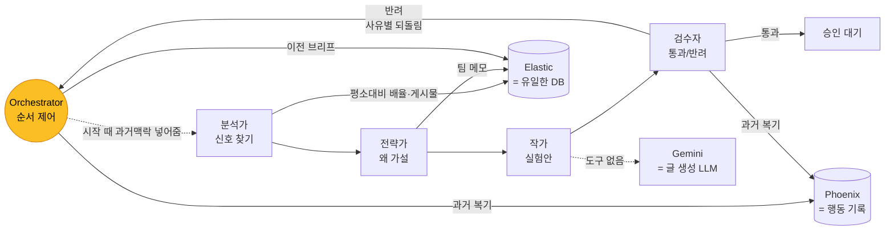
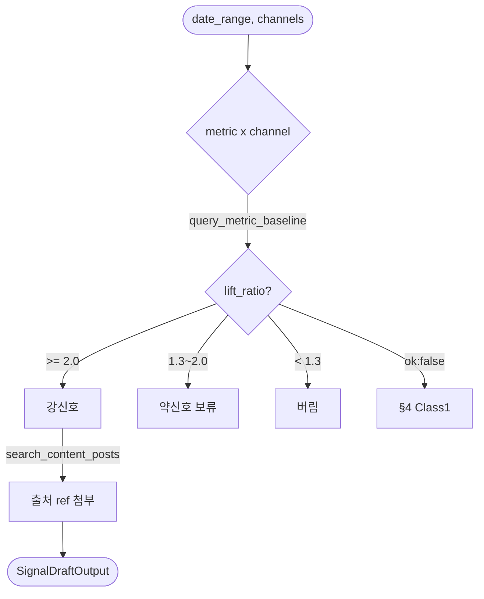
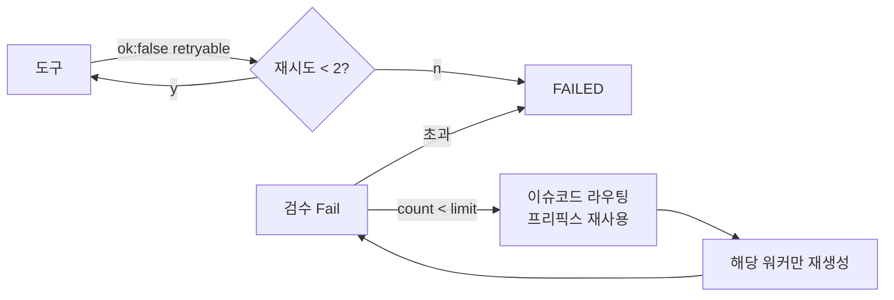
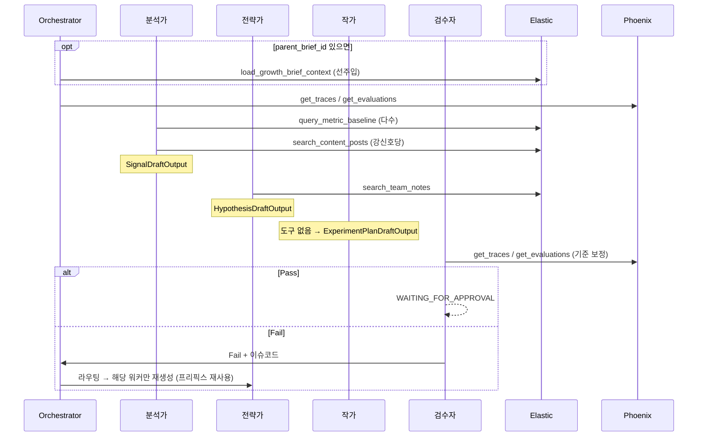
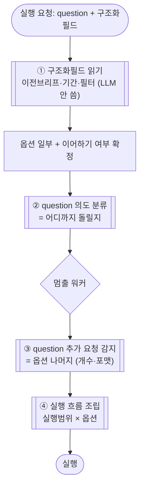

# AI Agent 설계 리포트

> LaunchPilot 멀티에이전트의 **누가 / 무슨 도구로 / 어떤 케이스에 / 실패하면 어떻게**를 한 문서로.
> PRD/contract 문서 = 시스템 전체 지도. 이 문서 = 에이전트 머릿속 + 실패 복원 설계. Last synced: 2026-06-04

---

## 0. 한눈에

### 먼저, 그림에 나오는 말들

| 말 | 뜻 |
|---|---|
| **Elastic** | 이 시스템의 **유일한 DB**. 게시물·지표·팀 메모·과거 브리프가 다 여기 있음. 워커는 여기서 **읽기만**. |
| **baseline (평소값)** | "평소엔 이 정도였다"는 기준치. 예: save율이 평소 2.6%. 이번 주 값을 이거랑 비교해 몇 배 튀었는지 봄. |
| **team_notes (팀 메모)** | 크리에이터 팀이 평소 적어둔 정성 메모. 예: "BTS 컴백 티저 올림". 숫자 신호의 *이유*를 찾는 근거. |
| **이전 브리프** | 지난 캠페인에서 승인된 결과물. 이어서 할 때 시작 시점에 한 번 불러옴. |
| **Phoenix** | 에이전트가 과거에 어떻게 돌았고 뭘 틀렸는지 **기록**해두는 곳. 근거 아님, 검수 기준 조정용. |
| **Gemini** | 실제 글(가설·실험안)을 써내는 LLM. 작가는 도구 없이 이걸로 생성만. |

### Elastic 안에 뭐가 들어있나 (데이터셋별 목적)

| 데이터셋 | 무엇 | 목적 (누가 왜 씀) | 언제 쓰임(write) |
|---|---|---|---|
| **`content_posts`** | CSV서 들어온 **게시물별 성과 숫자** (채널·발행일·조회/좋아요/저장/save_rate 등) | **분석가**가 신호 찾고 평소값(baseline) 계산하는 원천 데이터 | CSV import 때 |
| **`growth_briefs`** | **승인된 결과물** (신호+가설+실험안+근거가 한 덩어리로, 수정 불가) | 과거 기록 보관 + 이어가는 캠페인의 **이전 브리프** 원천 | 사람이 승인할 때 |
| **`calendar_events`** | 승인된 실험을 **캘린더 보기용**으로 따로 뺀 것 | 화면에서 일정 빠르게 보여주려고 | 사람이 승인할 때 |
| **`team_notes`** ⚠️ | 팀이 적어둔 **정성 메모** ("BTS 티저 올림" 같은) | **전략가**가 숫자 신호의 *이유* 찾는 근거 | 읽기 계약 중심으로 유지 |

> 쓰기 규칙: **Elastic에 쓰는 건 Java만, 딱 2번** — ① CSV import 때 `content_posts`, ② 승인 때 `growth_briefs`+`calendar_events`. 에이전트(워커)는 **읽기만**, 절대 안 씀. 그래서 승인 전 결과물은 아직 DB에 없고 화면 메모리에만 있음.
> `content_posts`는 **읽고**(분석가 근거), `growth_briefs`/`calendar_events`는 승인 결과로 **써짐**. team_notes는 PRD엔 있으나 Java-Elastic 문서 계약이 아직 없음(미확정).

### 순서대로 한 번 (BTS 예시로)

1. **(있으면) Orchestrator가 과거맥락 넣어줌** — 이어가는 캠페인이면 이전 브리프를 Elastic서 불러와 메모리에 깔아둠. 새 분석이면 생략.
2. **분석가: 신호 찾기** — Elastic서 지표를 평소값과 비교. "save율 2.6% → 7.4%, 2.8배" 같은 주목할 신호를 잡고, 근거 게시물도 같이 찾음.
3. **전략가: 왜 가설** — 신호를 보고 "왜?"를 추론. 팀 메모에서 "지난주 BTS 클립 올림"을 찾아 "그것과 연관" 가설을 Gemini로 만듦.
4. **작가: 실험안** — 가설을 받아 다음 주 실험안을 씀("BTS 30초 클립 화·목 업로드"). 도구 없이 생성만.
5. **검수자: 통과/반려** — 근거·필수항목이 다 있는지 기계적으로 대조. 과거에 뭘 틀렸나(Phoenix)도 참고.
   - **통과** → 승인 대기 (사람이 보고 승인).
   - **반려** → Orchestrator가 사유 보고 **진짜 원인 워커로** 되돌림(전략가로 갈 수도, 작가로 갈 수도). → §4.

> 한 줄 요약: **분석가가 숫자로 신호 잡고 → 전략가가 이유 붙이고 → 작가가 다음 행동 짜고 → 검수자가 거름.** Elastic은 근거 창고, Phoenix는 복기 노트, Gemini는 글 쓰는 손.

---

## 1. 에이전트 4명 + Orchestrator

순서대로 분석가 → 전략가 → 작가 → 검수자. Orchestrator는 추론 안 하고 순서만 제어.

| 역할 | 하는 일 | 쓰는 도구 | 내놓는 것 |
|---|---|---|---|
| **분석가** | 숫자에서 주목할 신호 찾기 | 평소 대비 배율 계산, 근거 게시물 검색 | 신호 목록 (`SignalDraftOutput`) |
| **전략가** | "왜 그랬나" 가설 세우기 | 팀 메모 검색 | 가설 목록 (`HypothesisDraftOutput`) |
| **작가** | 다음 주 실험안 쓰기 | 없음 (받아서 쓰기만) | 실험안 (`ExperimentPlanDraftOutput`) |
| **검수자** | 통과/반려 판정 | 과거 실패 기록 (Phoenix) | 검수 결과 (`ValidationReport`) |
| **Orchestrator** | 순서 제어 | 이전 브리프 로드, Phoenix | — |

> 누가 근거를 캐나: **분석가·전략가만** Elastic에서 근거를 찾는다. 작가는 안 찾고 가설 받아 쓰기만. 검수자는 근거 대신 "과거에 뭘 틀렸나"(Phoenix)만 본다.

---

## 2. 도구 — 2층

### 2-A. 근거 찾는 도구 4개 (Elastic, 읽기 전용)

| 도구 | 하는 일 | 누가 |
|---|---|---|
| `query_metric_baseline` | 한 지표가 평소(baseline) 대비 몇 배인지 계산 | 분석가 |
| `search_content_posts` | 근거가 될 실제 게시물 찾기 | 분석가 |
| `search_team_notes` | 팀 메모에서 정성 근거 찾기 | 전략가 |
| `load_growth_brief_context` | 이전 브리프 불러오기 | Orchestrator (시작 때 1번) |

> 응답엔 성공여부·근거ref·소요시간. 최종 결과엔 근거의 `ref_id`만 복사하고 원본 쿼리는 안 내보냄.
> 이전 브리프는 **Orchestrator가 세션 시작 때 1번** 불러와 메모리에 넣어둔다(이전 브리프가 있을 때). 워커는 메모리서 읽기만, 직접 호출 안 함.

### 2-B. 과거 복기 도구 2개 (Phoenix, 읽기 전용)

| 도구 | 하는 일 | 누가 / 언제 |
|---|---|---|
| `get_traces` | 과거 런이 어떻게 돌았는지 | Orchestrator·검수자 / 시작·검수 |
| `get_evaluations` | 과거에 낮은 평가·실패한 패턴 | Orchestrator·검수자 / 시작·검수 |

> 이건 **근거가 아니다.** "지난번 이런 식으로 틀렸다"를 읽어 검수 기준만 조정하는 용도.

---

## 3. 워커별로 언제 뭘 하나

### 3-A. 분석가 — 신호 찾기

언제 멈추나: 강신호 1개 이상 나오거나 볼 지표 다 봤을 때. 하나도 없으면 약신호 중 제일 센 걸 올림.
> ⚠️ 강신호 2.0배 / 약신호 1.3배 기준은 **임시값.** 데모 숫자(2.8배)에서 거꾸로 맞춘 거라 실데이터로 다시 정해야 함(§6).
> 신호 근거는 **도구가 실제로 돌려준 것만** 붙인다. 없는 근거 지어내기 금지.

### 3-B. 전략가 — 가설 세우기

> 가설마다 필수: 어느 신호서 나왔는지 + 근거 1개 이상 + 단서(caveat) 1개 이상. "~때문이다"(caused) 단정 금지, "~와 연관"(associated with)만 허용.

### 3-C. 작가 · 검수자

| 워커 | 하는 일 | 도구 | 빠지면 안 되는 것 | 결과 |
|---|---|---|---|---|
| 작가 | 가설별로 실험안 작성 | 없음 | 성공 기준·일정·채널 | 초안 |
| 검수자 | 기계적 대조 + 과거 복기 | Phoenix | 검수 결과 | 통과 → 승인대기 / 반려 → §4 |

검수 반려 사유(코드): 없는 근거 갖다붙임 `UNKNOWN_EVIDENCE_REF` / 잘못된 id `UNKNOWN_SIGNAL_ID`·`UNKNOWN_HYPOTHESIS_ID` / 항목 누락 `MISSING_SUCCESS_CRITERIA`·`MISSING_SCHEDULE` / 빈 실험안 `EMPTY_EXPERIMENT_PLAN` / 단서 누락 `LOW_CONFIDENCE_WITHOUT_CAVEAT`.

> 검수자는 새 근거 못 만든다. 대조만. Gemini 비평은 보조일 뿐, 기계적 검사 실패는 못 뒤집는다.

---

## 4. 실패 처리 (2종) — 핵심 설계

실패는 **성격이 다른 2종**. 섞으면 비용 낭비.

| | Class 1 — 도구 자체가 실패 | Class 2 — 추론이 틀림 |
|---|---|---|
| 무엇 | 인덱스 다운, 쿼리 깨짐 같은 인프라 문제 | 검수 반려 (없는 근거, 단서 누락) |
| 어떻게 아나 | 도구 응답 `ok:false` | 검수 결과 `passed=false` |
| 추론이 틀린 건가 | 아니다 | 그렇다 |
| 처리 | 그냥 다시 시도, **LLM 안 부름** | 틀린 부분만 다시, LLM 부름 |
| 한계 | **1~2번** 재시도 후 포기 | **2~3번** 후 포기 (무한루프 방지) |

### 4-A. Class 1 — 도구 자체가 실패

| 코드 | 다시 시도? | 행동 |
|---|---|---|
| `INDEX_UNAVAILABLE` (인덱스 없음) | 안 함 | 건너뛰고 단서 남김 (team_notes) |
| `NO_EVIDENCE_FOUND` (근거 없음) | 안 함 | 신호/가설 강도 낮춤 |
| `ESQL_FAILED`·`SEARCH_FAILED`·`MCP_TOOL_FAILED` (일시 오류) | 함 | 같은 요청 1~2번 → 넘으면 포기. **LLM 안 부름** |
| `INVALID_TOOL_REQUEST` (잘못된 요청) | 안 함 | 버그. 로그 남기고 포기 |

### 4-B. Class 2 — 추론이 틀림: 어디로 되돌릴지

검수 반려됐다고 **무조건 전략가로 안 돌아간다.** 반려 사유 따라 진짜 원인 워커로:

| 반려 사유 | 되돌릴 워커 |
|---|---|
| 성공기준·일정·빈 실험안·채널·잘못된 가설id 누락 | **작가** |
| 단서 누락·근거 없는 주장·잘못된 신호id | **전략가** |
| 없는 근거 갖다붙임 (`UNKNOWN_EVIDENCE_REF`) | **만든 워커** (분석가/전략가) |
| 형식 오류 (`SCHEMA_INVALID`) | **포맷 단계** (Python 정규화, LLM 아님) |

### 4-C. 다시 할 때 4원칙 (논문 근거)

핵심: **많이 탐색하는 게 아니라, 뭘 틀렸는지 기억해서 중복 작업을 줄이는 게 효율.**

| 원칙 | 우리 규칙 | 논문 |
|---|---|---|
| **성공한 부분 재사용** | 처음부터 다시 X. 성공한 결과는 두고 **틀린 것만** 다시 생성 | Path-Consistency |
| **틀린 이유 같이 전달** | 다시 시킬 때 "뭐가 문제였는지"를 프롬프트에 넣음. 도구 실패엔 LLM 안 씀 | Failure is Feedback |
| **틀린 항목만 수정** | 전체가 아니라 그 항목 하나만 | Plan-MCTS |
| **원인으로 바로 점프 + 루프 가드** | 한 단계씩 말고 원인 워커로 직행, 재시도 횟수로 무한루프 방지 | BEAP-Agent |

> **핵심: 단기 메모리(Shared Context)에 성공한 결과가 이미 다 있다.** 처음부터 다시 안 하고 거기서 재사용만 하면 위 효율을 공짜로 얻는다.

---

## 5. 전체 흐름 (시퀀스)

---

## 6. 정해둔 값 (✅ 확정 / 🟡 미검증)

| 항목 | 값 | 근거 |
|---|---|---|
| 도구 재시도 횟수 | ✅ **1~2번** | 인프라 실패는 다시 해도 같으니 최소만 |
| 다시 하기 한계 | ✅ **2~3번** | 싸게 수렴, 무한루프 방지 |
| 워커 호출 예산 | ✅ 횟수 제한 대신 **다시 할 때 재호출 금지**(캐시 재사용) | — |
| 포맷 단계 방식 | ✅ **Python 정규화 (결정론, LLM 아님)** 별도 단계 | 형식 실수는 추론오류 아님 → 결정론으로 고침 (§4-C). 구조화 출력 쓰면 거의 안 터짐 |
| 전략가의 게시물 재검색 | ✅ **금지** | 근거 캐는 건 분석가 책임 |
| 강신호 / 약신호 기준 | 🟡 **2.0배 / 1.3배** | 데모 숫자(2.8배)서 거꾸로 맞춘 **임시값. 실데이터로 재검증 필요** |
| 어떤 지표부터 볼지 | 🟡 **저장율 우선** | 임시 도메인값 |

> 위 5개는 확정. 🟡 2개(신호 기준값·지표 순서)만 실데이터 보고 다시 정하면 됨.

---

## 7. 지난 결정 기록 (2026-06-02)

| # | 문제였던 것 | 어떻게 정함 |
|---|---|---|
| G1 | 검수자가 도구 0개라 이상함 | 과거 복기 도구(Phoenix) 추가 |
| G2 | 신호 근거 출처가 너무 넓음 | 넓게 두되 지어내기만 금지 |
| G3 | 반려되면 항상 전략가로 감 | 사유별로 원인 워커에 되돌림 |
| G4 | 이전 브리프 로드 주체 모호 | Orchestrator 하나로 통일 |

> ✅ 후속 패치 완료: `contracts/04 README`(load_brief→Orchestrator), `PRD §9.3`(Python 단일).

---

## 8. 입력에 따라 파이프라인이 어떻게 달라지나

> **이 절이 답하는 것:** 사용자가 입력창에 친 한 줄(`question`)에 따라, 4 에이전트가 *얼마나 다르게* 일해야 하나. 그리고 그게 사용자가 원한 결과로 이어지는지.
> **쓰는 방식:** 추상적인 분류부터 안 한다. 먼저 사용자가 실제로 칠 질문 10개를 깔고, 각 질문마다 "이 사람이 진짜 받고 싶은 결과물"을 적는다(= 정답지). 거기서 거꾸로 "그럼 어느 워커까지 돌려야 하나"를 푼다. 이래야 설계가 의도대로인지를 결과물로 확인할 수 있다.

### 8-0. 입력이 정하는 건 딱 2가지

에이전트를 케이스마다 새로 만들 필요 없다. **에이전트 4명은 고정.** 입력은 다음 2가지만 바꾼다.

| 입력이 정하는 것 | 뜻 | 코드로 치면 |
|---|---|---|
| **① 실행 범위** | 어느 워커까지 돌리고 멈추나 | 조건부 분기 (routing) |
| **② 파라미터** | 도는 워커에 어떤 옵션을 넘기나 (채널·지표·개수 등) | 함수 인자 / 설정값 |

> 예: "틱톡만 보여줘"는 *분석가를 틱톡 전용으로 새로 만드는 게* 아니다. 그냥 분석가에게 `channels=[tiktok]`를 넘기는 것. **같은 워커, 다른 옵션.** 이게 §8 전체의 핵심.

### 8-1. 기준 시나리오 (이게 기본값, 나머지는 다 이걸 줄인 것)

먼저 처음부터 끝까지 다 도는 한 흐름. 크리에이터 팀 A:

> 5월 SNS 성과 CSV 올림 → **"다음 주에 뭘 테스트할까?"** 입력
> → **분석가**: save율이 평소 2.6% → 이번 주 7.4%(2.8배)로 튐 → 주목할 신호로 잡음
> → **전략가**: "지난주 BTS 클립 올린 거랑 관련 있어 보인다" 가설 + 팀 메모 근거
> → **작가**: 실험안 3개("BTS 30초 클립 화·목 업로드" 등) + 캘린더
> → **검수자**: 근거·필수항목 다 있는지 확인 → 승인 대기
> → 사람이 보고 승인 → 브리프 저장.

이게 **기본값(4워커 풀 가동)**. 아래 다른 질문들은 전부 "여기서 어디까지만 돌리나 / 어떤 옵션으로 좁히나"의 차이일 뿐이다.

### 8-2. 실제 질문 10개 → 받고 싶은 결과 → 거꾸로 푼 실행 범위·옵션

머리로 분류 짜는 대신 사용자가 칠 법한 문장에서 출발한다. **가운데 칸 "받고 싶은 결과"가 정답지** — 파이프라인이 이걸 뽑으면 의도 충족, 못 뽑으면 구멍.

| # | 사용자 질문 | 받고 싶은 결과 (정답지) | 어디까지 돌릴까 | 넘길 옵션 |
|---|---|---|---|---|
| 1 | "다음 주에 뭘 테스트할까?" | 실험안 카드 N + 캘린더 + 1장 브리프 | **작가까지** (기본값) | 없음 |
| 2 | "이번 주 뭐가 달라졌어?" | "어떤 지표가 평소 대비 몇 배" 신호만. 해석·실험안 필요 없음 | **분석가에서 끝** | 없음 |
| 3 | "save율 왜 갑자기 올랐어?" | 신호 + **왜** 가설 + 근거. 실험안은 아직 안 원함 | **전략가에서 끝** | 없음 |
| 4 | "틱톡만 보고 계획 줘" | 틱톡 한정 실험안 | 작가까지 | `channels=[틱톡]` |
| 5 | "지난주 가설 중 뭐 해볼만해?" | 기존 가설 기반 실험안 (새로 신호 안 찾음) | 작가까지 | 이전 브리프 로드, 분석·전략 최소, 이어서 |
| 6 | "이번 주 결과 한 장으로 요약" | 1페이지 글 요약. 새 분석 필요 없음 | 작가만 | `포맷=글요약`, 추론 생략 |
| 7 | "3가지 다른 방향으로 줘" | 서로 다른 실험안 3세트 | 작가까지 | `안 개수=3` (전략·작가) |
| 8 | "유튜브랑 틱톡 중 뭐가 더 잘됐어?" | 채널별 비교 신호 표 | **분석가에서 끝** | `channels=[유튜브,틱톡]` 따로 집계 |
| 9 | "조회수 말고 저장·공유 위주로" | 저장·공유 기준 결과 | 작가까지 | `지표=[저장,공유]` |
| 10 | "지난번 추천한 실험 효과 있었어?" | **과거 실험 결과 vs 이번 신호 비교 평가** | ⚠️ (§8-6 구멍) | 이전 브리프 로드, 평가 |

> 보는 법: 오른쪽 두 칸이 §8-0의 2가지 실제 값이다. **어디까지 돌릴지는 4가지(분석가/전략가/작가/평가)뿐, 옵션도 몇 종(채널·지표·개수·이전브리프·포맷)뿐.** 질문 10개가 이 좁은 조합으로 거의 다 덮인다.

### 8-3. 질문을 묶으면 모드 4개로 정리됨

10개를 "어디까지 돌리나 + 옵션" 기준으로 묶으면 자연스럽게 **4가지 모드**로 모인다. (사전에 정한 게 아니라 §8-2에서 떨어진 결과)

| 모드 | 사용자 의도 | 어디까지 | 해당 질문 | 흐름 |
|---|---|---|---|---|
| **M1 빠른 진단·비교** | "무슨 일 났는지만 빨리" | 분석가 | Q2, Q8 | 분석가 → 검수 |
| **M2 원인 파악** | "왜 그런지 알고 싶다" | 전략가 | Q3 | 분석가 → 전략가 → 검수 |
| **M3 주간 계획 (기본값)** | "다음에 뭘 할지 정해줘" | 작가 | Q1, Q4, Q7, Q9 | 4워커 풀 (옵션으로 채널·지표·개수 변형) |
| **M4 정리·이어가기** | "있는 거 다듬어/정리" | 작가만 | Q5, Q6 | 새 분석 최소, 기존 결과 재사용 |

> M3가 질문 4개를 한 번에 흡수하는 게 핵심 — Q4(채널)·Q7(개수)·Q9(지표)는 **새 모드가 아니라 M3에 옵션만 다르게** 넣은 것. 옵션으로 처리되니 모드가 안 늘어난다.

### 8-4. 정리 — 입력이 바꾸는 2가지

| 바꾸는 것 | 무엇을 | 가능한 값 (관찰된 것만) | 비용 | 어디서 읽나 |
|---|---|---|---|---|
| **① 실행 범위** | 어느 워커까지 돌릴지 | 분석가 / 전략가 / 작가 / (평가) | 쌈 — 켜고 끄기만 | `question` 의도 |
| **② 파라미터** | 워커에 넘길 옵션 | 채널 · 지표 · 안 개수 · 이전브리프 · 포맷 | 거의 공짜 — 프롬프트/도구 인자 | 구조화 필드 + `question` |

> 검수자는 이 2가지 밖 — **어느 워커든 결과를 1개라도 내면 그 뒤에 항상 검수.** M1이면 신호만 검수. "맨 끝에 한 번"이 아니라 "마지막으로 돈 워커 바로 뒤".
> 실행 범위는 워커를 **켜고 끄기만**, 파라미터는 **옵션만** 바꾼다 — 워커 자체를 새로 안 만드니 §4 백트래킹·재사용 로직과 안 부딪힌다.

### 8-5. 처리 순서 (입력 한 덩어리 → 실행 흐름 하나)

핵심: **②가 흐름 길이(어디까지 돌릴지)를 정하고, ①③이 옵션을 채운다.** 의도 분류가 풀 건 "어디까지" 하나 + 추가 요청 약간뿐 — 나머지는 구조화 필드에서 그냥 읽힌다.

### 8-6. ⚠️ 질문에서 거꾸로 풀다 발견한 구멍

질문에서 역산하니 **지금 4워커로는 못 만드는 결과**가 드러났다. 이게 질문-먼저 방식의 값어치다.

| 구멍 | 어느 질문 | 왜 안 되나 | 어떻게 |
|---|---|---|---|
| **과거 결과 평가** | Q10 "효과 있었어?" | 지금 흐름은 신호→가설→실험안 **만들기 한 방향뿐.** 과거 실험이 실제로 먹혔는지 *채점하는* 워커·도구가 없음 | MVP에서 빼거나, "회고 모드" 따로 만들지 결정 |
| **이어가기 의존** | Q5, M4 | 이전 브리프 이어받기(R12/R13)가 **아직 미구현**(report.md §11) | 그거 구현 전엔 M4 반쪽만 동작 |

> 교훈: Q1~Q9는 실행범위·옵션 2가지로 깔끔히 덮이는데 Q10만 안 된다. 이건 분류 문제가 아니라 **기능 자체가 없는 것** — 머리로 짠 분류표로는 안 보였을 것.

### 8-7. 구현 순서 (지금 만들 것 vs 나중)

설계를 *아는 것*과 *만드는 것*은 다르다. 지금(Python 워커 미구현) 기준 순서:

| 단계 | 할 일 | 방식 | 데모 위험 |
|---|---|---|---|
| **1 (지금)** | §8-2 질문·정답지를 **실제 사용자 기준으로 손보기** (위 10개는 초안) | — | — |
| **2** | **기본값 흐름 1개**(M3) 처음부터 끝까지 동작 | 고정 흐름 | 낮음 |
| **3** | 실행 범위 분기만 추가 (M1·M2) | 조건부 분기 — *어디까지만 나눔* | 중간 |
| **4 (나중)** | 옵션 변형(채널/개수/지표), M4, 과거 결과 평가 | 동적 구성 | 데모 후 |

> 권장: **2→3까지가 MVP.** question 보고 워커 조합을 매번 새로 짜는 방식(동적 구성)은 검증·데모 위험이 커서 보류. 조건부도 분기 3개(M1/M2/M3)면 충분.

### 8-8. 🔴 정해야 할 것

| # | 결정 | 기본 권장 |
|---|---|---|
| 1 | §8-2 질문 10개를 실제 사용자 질문으로 손보기 | 팀 확인 |
| 2 | MVP 모드 = M1·M2·M3 (M4·과거평가는 나중) 인가 | 그렇게 |
| 3 | 의도 분류 = 키워드 규칙 vs LLM | 키워드 먼저 (싸고 검증 쉬움) |
| 4 | 과거 결과 평가(Q10) MVP에 넣나 | 빼는 거 권장 (기능 공백) |

> 정하면 §0 전체 흐름도에 분기(M1/M2/M3) 반영. report.md §11 "agent-tool-spec §8" 미결정 항목과 연결.

---

## 9. 원본 링크

### 설계 계약
- 도구 스키마: [`contracts/04-agent-elastic-mcp/evidence-tools.schema.json`](../contracts/04-agent-elastic-mcp/evidence-tools.schema.json)
- 출력 스키마: [`contracts/05-agent-output/`](../contracts/05-agent-output/README.md)
- 시스템 전체: [`docs/report.md`](report.md) · PRD §6: [`LaunchPilot_PRD.md`](product/LaunchPilot_PRD.md)

### 백트래킹 효율 연구 근거 (§4-C)
- P1: [Path-Consistency with Prefix Enhancement](https://arxiv.org/pdf/2409.01281), [Path of Least Resistance](https://arxiv.org/pdf/2601.21494)
- P2: [Failure is Feedback (2602.03432)](https://arxiv.org/abs/2602.03432)
- P3: [Plan-MCTS (2602.14083)](https://arxiv.org/abs/2602.14083)
- P4: [BEAP-Agent (2601.21352)](https://arxiv.org/pdf/2601.21352)
