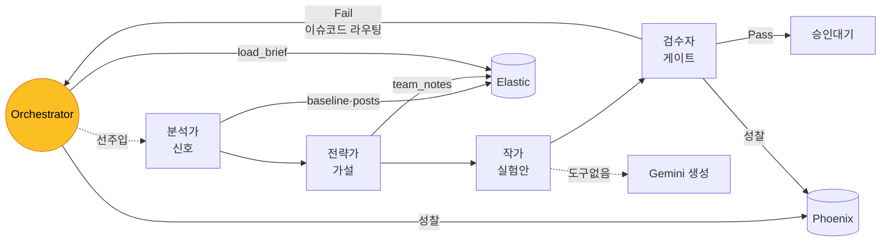
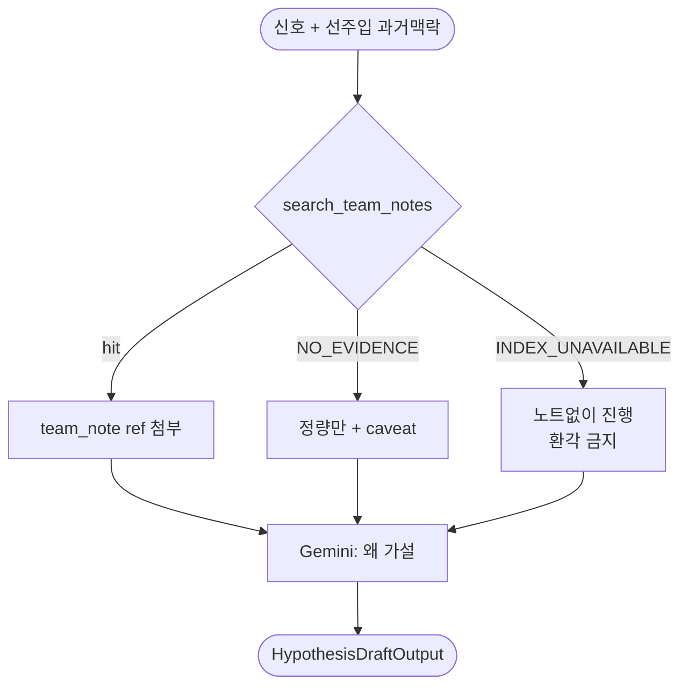
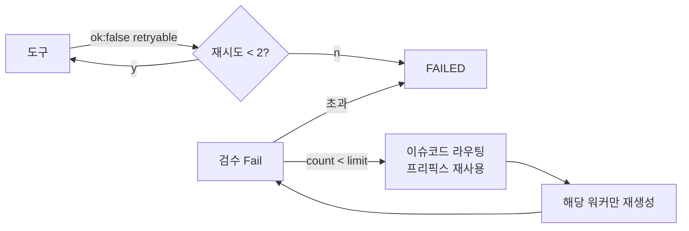
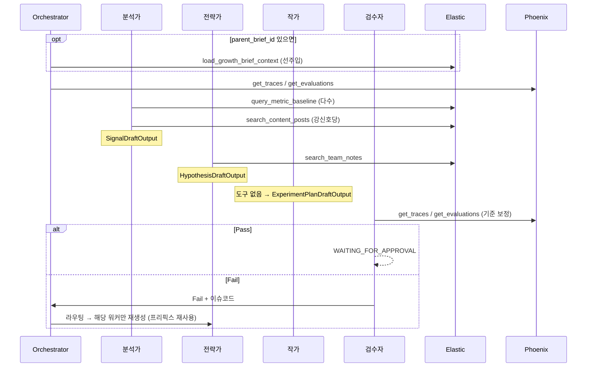

# AI Agent 설계 리포트

> LaunchPilot 멀티에이전트의 **누가 / 무슨 도구로 / 어떤 케이스에 / 실패하면 어떻게**를 한 문서로.
> report.md = 시스템 전체 지도. 이 문서 = 에이전트 머릿속 + 실패 복원 설계. Last synced: 2026-06-02

---

## 0. 30초 멘탈모델

3줄 요약:
1. **워커 4명** 순차 진행(분석→전략→작가→검수), 묶는 건 **Orchestrator** 상태머신.
2. **도구는 2층**: Elastic 증거 4종(근거 캐기) + Phoenix 성찰 2종(과거 오답노트). 작가는 0도구.
3. **실패는 2종**: 도구 인프라 실패(싸게 재시도) vs 추론 오류(맥락 보존 백트래킹). → §4.

---

## 1. 에이전트 4명 + Orchestrator

| 역할 | 한 일 | 입력 → 출력 | 도구 | 상태 |
|---|---|---|---|---|
| **분석가** Analyst | 정량 신호 탐지 | 로그 → `SignalDraftOutput` | `query_metric_baseline` · `search_content_posts` | SIGNAL_DETECTION → EVIDENCE_SEARCH |
| **전략가** Strategist | 인과 "왜?" 가설 | 신호 → `HypothesisDraftOutput` | `search_team_notes` | HYPOTHESIS_GENERATION |
| **작가** Writer | 실험안 설계 | 가설 → `ExperimentPlanDraftOutput` | **없음** (순수 생성) | EXPERIMENT_GENERATION |
| **검수자** Reviewer | 검증 게이트 | 전체 → `ValidationReport` | `get_traces` · `get_evaluations`(Phoenix) | VALIDATING |
| **Orchestrator** | 상태머신 제어 | — | `load_growth_brief_context` · Phoenix | (전 단계) |

> 책임 경계: **분석가·전략가만 Elastic 근거를 캔다. 작가는 안 캔다. 검수자는 근거 대신 과거 오답노트(Phoenix)만 본다.** Orchestrator는 추론 안 하고 제어만.

---

## 2. 도구 카탈로그 (2층)

### 2-A. Elastic 증거 도구 4종 (읽기 전용 — 근거 캐기)

| 도구 | MCP | 인덱스 | 입력 | 출력 | 호출자 |
|---|---|---|---|---|---|
| `query_metric_baseline` | esql | content_posts | metric, channel, current/baseline window | `lift_ratio` | 분석가 |
| `search_content_posts` | search | content_posts | date_range, channels, metric_filters | `evidence_refs[]` | 분석가 |
| `search_team_notes` | search | team_notes | query | `evidence_refs[]`(질적) | 전략가 |
| `load_growth_brief_context` | search | growth_briefs | parent_brief_id | 과거 브리프 | **Orchestrator(선주입)** |

> 공통 응답: `ok` · `evidence_refs` · `duration_ms`. `ref_id`만 최종 payload 복사 가능. raw DSL/ESQL 노출 금지.
> `load_brief`는 **Python Orchestrator가 세션 시작 시 1회** 선주입(parent_brief_id 있을 때). 워커는 메모리에서 읽기만, 도구 직접 호출 안 함.

### 2-B. Phoenix 성찰 도구 2종 (읽기 전용 — 메타, 근거 아님)

| 도구 | 용도 | 호출자 | 언제 |
|---|---|---|---|
| `get_traces` | 과거 런 트레이스 | Orchestrator · 검수자 | 시작 / 검수 |
| `get_evaluations` | 과거 낮은 평가·실패 패턴 | Orchestrator · 검수자 | 시작 / 검수 |

> Phoenix 출력은 **evidence_ref 안 됨**. "지난번 이런 패턴서 틀림"을 읽어 검증 기준만 보정.

---

## 3. 워커별 결정 로직 (어떤 케이스에 무슨 도구)

### 3-A. 분석가 — 신호 탐지

종료: 강신호 ≥1 또는 metric 소진. 0개면 약신호 최상위 승격.
signal evidence_ref: 스키마가 `post_/metric_/note_/brief_` 4종 허용(넓게 둠). 단 도구가 실제 반환한 것만(환각 금지).

### 3-B. 전략가 — 가설

필수: 가설마다 `signal_ids` ≥1 + `supporting_evidence_refs` ≥1 + caveat ≥1. "caused" 금지, "associated with" 강제.

### 3-C. 작가 · 검수자

| 워커 | 행위 | 도구 | 필수 출력 | 결과 |
|---|---|---|---|---|
| 작가 | hypothesis_id별 실험 item 생성 | 없음 | `success_criteria`·`schedule`·`channel` | draft |
| 검수자 | 결정론 집합 대조 + Phoenix 성찰 | Phoenix | `ValidationReport` | Pass→승인대기 / Fail→§4 라우팅 |

검수 체크 → 실패코드: evidence_ref 미존재 `UNKNOWN_EVIDENCE_REF` / id 무효 `UNKNOWN_SIGNAL_ID`·`UNKNOWN_HYPOTHESIS_ID` / 필드 누락 `MISSING_SUCCESS_CRITERIA`·`MISSING_SCHEDULE` / 빈 실험 `EMPTY_EXPERIMENT_PLAN` / caveat 누락 `LOW_CONFIDENCE_WITHOUT_CAVEAT`.

> 검수자는 새 근거 못 만듦. 대조만. Phoenix·Gemini 비평은 보조, 결정론 실패 못 뒤집음.

---

## 4. 실패 처리 — 핵심 차별 설계

실패는 **성격 다른 2종**. 섞으면 비용 낭비.

| | Class 1 — 도구 호출 실패 | Class 2 — 추론 오류 |
|---|---|---|
| 무엇 | 인프라/전송(인덱스 다운, ESQL 깨짐) | 검수 Fail(환각 ref, caveat 누락) |
| 감지 | wrapper `ok:false` | `ValidationReport.passed=false` |
| 성격 | 추론 잘못 아님 | 추론 잘못 |
| 처리 | 최소 재시도, **LLM 재생성 0** | 맥락 보존 백트래킹, LLM 씀 |
| 한계 | retry **1~2** → skip/FAILED | backtrack limit **2~3**(루프가드) |

### 4-A. Class 1 — 도구 실패 (인프라)

| code | retryable | 행동 |
|---|---|---|
| `INDEX_UNAVAILABLE` | false | 스킵 + caveat (team_notes) |
| `NO_EVIDENCE_FOUND` | false | 신호/가설 강도 down |
| `ESQL_FAILED`·`SEARCH_FAILED`·`MCP_TOOL_FAILED` | true | 백오프 1~2회(같은 요청) → 초과 FAILED. **Gemini 안 부름** |
| `INVALID_TOOL_REQUEST` | false | 버그. 로그 + FAILED |

### 4-B. Class 2 — 추론 오류 백트래킹 라우팅

검수 Fail 시 **무조건 전략가 아님.** 이슈코드 → root-cause 워커:

| 이슈코드 | 되돌릴 워커 |
|---|---|
| `MISSING_SUCCESS_CRITERIA`·`MISSING_SCHEDULE`·`EMPTY_EXPERIMENT_PLAN`·`UNSUPPORTED_CHANNEL`·`UNKNOWN_HYPOTHESIS_ID` | **작가** |
| `LOW_CONFIDENCE_WITHOUT_CAVEAT`·`UNSAFE_OR_UNGROUNDED_CLAIM`·`UNKNOWN_SIGNAL_ID` | **전략가** |
| `UNKNOWN_EVIDENCE_REF` | **생성 워커**(분석가/전략가) |
| `SCHEMA_INVALID` | **formatter 단계** |

### 4-C. 백트래킹 4원칙 (연구 근거 — 값을 감 아닌 기준으로)

연구 합의: **효율 = "많이 탐색" 아니라 "실패 맥락 보존해 중복 재생성 줄이기".**

| 원칙 | 논문 | 우리 규칙 |
|---|---|---|
| **P1 프리픽스 재사용** | Path-Consistency | 백트래킹 시 PENDING 재시작 **금지**. Shared Context 유효 아티팩트는 프리픽스 풀, **실패 draft만 재생성** |
| **P2 실패맥락+에스컬레이션** | Failure is Feedback | 재실행 프롬프트 = 입력 + `issues`(오답노트). 결정론 먼저, Gemini는 모호할 때만. Class1엔 LLM 0 |
| **P3 plan-space 국소수정** | Plan-MCTS | 백트래킹 단위 = 워커 draft. 실패한 **그 item만** 수정(전체 X) |
| **P4 다단계+루프가드** | BEAP-Agent | root-cause 조상으로 **>1단계 점프**. `retry_count`=무한루프 가드 |

> **핵심: Shared Context(L1/L2)가 이미 P1의 프리픽스 풀.** 백트래킹이 재시작 대신 재사용만 하면 4논문 효율을 공짜로 먹음.

---

## 5. 전체 흐름 (시퀀스)

---

## 6. 값 정의 (✅ 연구근거 / 🟡 도메인 선택)

| # | 항목 | 값 | 근거 |
|---|---|---|---|
| 도구 재시도 | Class1 transient | ✅ **1~2** | P2 — 비추론 실패는 컨텍스트 무용, 최소 |
| 백트래킹 limit | Class2 | ✅ **2~3** | P1·P4 — 싸고 수렴, 루프가드 |
| 호출 예산 | 워커 cap | ✅ **cap 대신 백트래킹 재호출 금지**(캐시) | P1 |
| formatter 위치 | 분리 | ✅ **별도 무도구 단계** | P2 비용 에스컬레이션 |
| 전략가 재검색 | content_posts | ✅ **금지** | 책임경계 + P1 |
| `THRESHOLD_HIGH/LOW` | 신호 임계 | 🟡 **2.0 / 1.3** | 도메인값(데모 2.8x 기준) |
| metric 우선순위 | 탐색순서 | 🟡 **save_rate 우선** | 도메인값 |

> ✅ 5개 연구근거 확정. 🟡 2개(임계값·metric)만 데이터 보고 정하면 됨.

---

## 7. 정합성 결정 로그 (2026-06-02)

| # | 문제 | 결정 |
|---|---|---|
| G1 | 검수자 "0도구" 오류 | Phoenix 2층 추가 |
| G2 | signal ref 소스 넓음 | 넓게 허용 유지(환각만 금지) |
| G3 | Fail 항상 전략가 | 이슈코드 라우팅 |
| G4 | load_brief 소유 모호 | Python Orchestrator 단일 |

> ✅ 후속 패치 완료: `contracts/04 README`(load_brief→Orchestrator), `PRD §9.3`(Python 단일).

---

## 8. 원본 링크

### 설계 계약
- 도구 스키마: [`contracts/04-agent-elastic-mcp/evidence-tools.schema.json`](../contracts/04-agent-elastic-mcp/evidence-tools.schema.json)
- 출력 스키마: [`contracts/05-agent-output/`](../contracts/05-agent-output/README.md)
- 시스템 전체: [`docs/report.md`](report.md) · PRD §6: [`LaunchPilot_PRD.md`](product/LaunchPilot_PRD.md)

### 백트래킹 효율 연구 근거 (§4-C)
- P1: [Path-Consistency with Prefix Enhancement](https://arxiv.org/pdf/2409.01281), [Path of Least Resistance](https://arxiv.org/pdf/2601.21494)
- P2: [Failure is Feedback (2602.03432)](https://arxiv.org/abs/2602.03432)
- P3: [Plan-MCTS (2602.14083)](https://arxiv.org/abs/2602.14083)
- P4: [BEAP-Agent (2601.21352)](https://arxiv.org/pdf/2601.21352)
