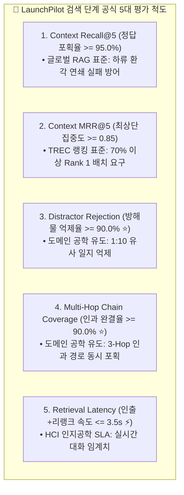

# 🎯 LaunchPilot 2단계 분리 평가 체계 (End-to-End Evaluation Framework)

> **핵심 원칙**:
> RAG 시스템의 평가는 **검색(Retrieval) 계층**과 **생성(Generation) 계층**으로 엄격히 분리(Decoupling)되어야 합니다.
> * **검색 단계**: 에이전트의 워킹 메모리에 올라가는 후보 문서 풀의 신호 대 잡음비(SNR), 적시성, 인과 완결도를 독립 계측합니다.
> * **생성 단계**: 인출된 근거에 대한 100% 사실 귀속, 마케팅 인과 합성 타당성, 수치 오차 제로를 독립 계측합니다.

---

## 🧭 전체 목차 (Table of Contents)
1. **[Part 1] 검색(Retrieval) 단계 공식 5대 평가 척도 및 수치 유도 근거 (확정)**
2. **[Part 2] 생성(Generation) 단계 평가 척도 체계 (WIP: 설계 진행 중)**
   * 2.1 사실 충실도 및 수치 정확성 (Faithfulness & Numeric Precision)
   * 2.2 마케팅 인과 추론 완결도 (Causal Reasoning Completeness)
   * 2.3 출처 귀속 및 인용 정밀도 (Provenance Citation Accuracy)
   * 2.4 부존재 질의 정직 기권율 및 가드레일 (Abstention & Safety Guardrail)
   * 2.5 생성 평가기 구현 (Rule-based Validator + LLM-as-a-Judge)

---

# 1. [Part 1] 검색(Retrieval) 단계 공식 5대 평가 척도

### 1.1 5대 검색 척도 정의 및 수치 유도 근거

| 번호 | 공식 척도명 | 목표치 (Target) | 수치 유도 근거 및 실무 의미 | 분류 |
| :---: | :--- | :---: | :--- | :---: |
| **1** | **Context Recall@5** | **$\ge 95.0\%$** | **글로벌 RAG 표준**: 검색 재현율이 90% 밑으로 떨어지면 하류 생성 LLM의 환각이 기하급수적으로 폭증함 (Cascading Failure 방어선) | **글로벌 표준** |
| **2** | **Context MRR@5** | **$\ge 0.85$** | **TREC/MS-MARCO 표준**: $	ext{MRR} = 1/	ext{Rank}$. 전체 질의의 최소 70%는 반드시 Rank 1에 꽂히고 나머지 30%도 Rank 2 안에 들어와야 달성되는 랭킹 품질선 | **글로벌 표준** |
| **3** | **Distractor Rejection (방해물 억제율 ⭐)** | **$\ge 90.0\%$** | **코퍼스 구조 유도**: 캠페인당 10개의 유사 주간 일지가 공존하는 환경에서, 무관한 9개 방해물 일지를 상위 5위 밖으로 밀어내는 능력 ($1 - rac{	ext{방해물 수}}{10}$) | **도메인 특화** |
| **4** | **Multi-Hop Coverage (인과 체인 완결도 ⭐)** | **$\ge 90.0\%$** | **3-Hop 인과 구조 유도**: [기획 ➔ 지표 ➔ 조치 ➔ 회고] 3단계 인과 단서 중 1개라도 빠지면 인과 추론 불가. 10개 복합 질의 중 9개 이상 완결 포획 요구 | **도메인 특화** |
| **5** | **Retrieval Latency** | **$\le 3.5	ext{s}$** | **HCI 인지공학 SLA**: 사용자가 챗봇 인터랙션에서 지연을 느끼지 않는 임계 시간(3~5초)을 만족하기 위해 검색 단계에 할당된 제한 시간 | **글로벌 표준** |

### 1.2 검색 평가기 도구 구현
* **모듈 위치**: `services/launchpilot-api/evals/retrieval_stage_evaluator.py`
* **입력 데이터**: Golden V3 코퍼스 (1,050개 문서) + 150건 qrels 레이블

---

# 2. [Part 2] 생성(Generation) 단계 평가 척도 체계 (WIP)

> *(생성 단계 돌입에 맞춰 상세 수식, 임계치, LLM-as-a-Judge 프로토콜을 순차적으로 작성할 예정입니다)*

### 2.1 사실 충실도 및 수치 정확성 (Faithfulness & Numeric Precision)
* **개념**: 생성된 모든 명제(Claim)가 인출된 컨텍스트에 100% 귀속되는지 및 ROAS, CPA, 삭감률 수치의 무오차 검증.

### 2.2 마케팅 인과 추론 완결도 (Causal Reasoning Completeness ⭐)
* **개념**: [원인 지표 ➔ 조치 일지 ➔ 회고 결과]의 3-Hop 인과 결합 수준(Level 0~2) 채점.

### 2.3 출처 귀속 및 인용 정밀도 (Provenance Citation Accuracy)
* **개념**: `[surface | UUID | timestamp]` 형식 준수율 및 실존 문서 매칭 전수 검증.

### 2.4 부존재 질의 정직 기권율 및 가드레일 (Abstention & Safety Guardrail)
* **개념**: 미집행 채널/미존재 사건 질의에 대한 환각 없는 정직한 기권율 및 광고주 간 데이터 격리 검증.

### 2.5 생성 평가기 구현 (Rule-based Validator + LLM-as-a-Judge)
* **개념**: 정적 룰 검증기와 NLI 기반 동적 LLM 심판기를 결합한 자동화 평가 파이프라인.
