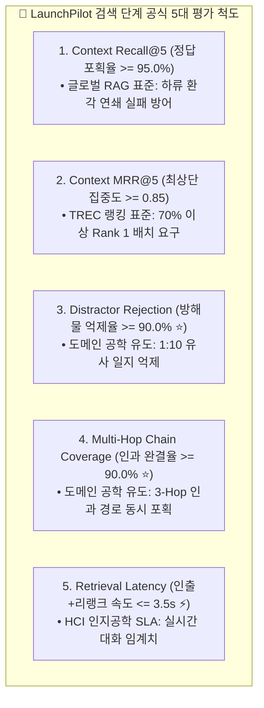

# 🎯 LaunchPilot 2단계 분리 평가 체계 (End-to-End Evaluation Framework)

> **핵심 원칙**:
> RAG 시스템의 평가는 **검색(Retrieval) 계층**과 **생성(Generation) 계층**으로 엄격히 분리(Decoupling)되어야 합니다.
> * **검색 단계**: 에이전트의 워킹 메모리에 올라가는 후보 문서 풀의 신호 대 잡음비(SNR), 적시성, 인과 완결도를 독립 계측합니다.
> * **생성 단계**: 인출된 근거에 대한 사실 충실성, 인과 합성 완성도, 출처 귀속성을 독립 계측합니다.

---

## 🧭 전체 목차 (Table of Contents)
1. **[Part 1] 검색(Retrieval) 단계 공식 5대 평가 척도 및 수치 유도 근거 (확정)**
2. **[Part 2] 생성(Generation) 단계 평가 척도 체계 (WIP: 논의 예정)**

---

# 1. [Part 1] 검색(Retrieval) 단계 공식 5대 평가 척도

### 1.1 5대 검색 척도 정의 및 수치 유도 근거

| 번호 | 공식 척도명 | 목표치 (Target) | 수치 유도 근거 및 실무 의미 | 분류 |
| :---: | :--- | :---: | :--- | :---: |
| **1** | **Context Recall@5** | **>= 95.0%** | **글로벌 RAG 표준**: 검색 재현율이 90% 밑으로 떨어지면 하류 생성 LLM의 환각이 기하급수적으로 폭증함 (Cascading Failure 방어선) | **글로벌 표준** |
| **2** | **Context MRR@5** | **>= 0.85** | **TREC/MS-MARCO 표준**: MRR = 1/Rank. 전체 질의의 최소 70%는 반드시 Rank 1에 꽂히고 나머지 30%도 Rank 2 안에 들어와야 달성되는 랭킹 품질선 | **글로벌 표준** |
| **3** | **Distractor Rejection (방해물 억제율 ⭐)** | **>= 90.0%** | **코퍼스 구조 유도**: 캠페인당 10개의 유사 주간 일지가 공존하는 환경에서, 무관한 9개 방해물 일지를 상위 5위 밖으로 밀어내는 능력 (1 - 방해물수/10) | **도메인 특화** |
| **4** | **Multi-Hop Coverage (인과 체인 완결도 ⭐)** | **>= 90.0%** | **3-Hop 인과 구조 유도**: [기획 -> 지표 -> 조치 -> 회고] 3단계 인과 단서 중 1개라도 빠지면 인과 추론 불가. 10개 복합 질의 중 9개 이상 완결 포획 요구 | **도메인 특화** |
| **5** | **Retrieval Latency** | **<= 3.5s** | **HCI 인지공학 SLA**: 사용자가 챗봇 인터랙션에서 지연을 느끼지 않는 임계 시간(3~5초)을 만족하기 위해 검색 단계에 할당된 제한 시간 | **글로벌 표준** |

### 1.2 검색 평가기 도구 구현
* **모듈 위치**: `services/launchpilot-api/evals/retrieval_stage_evaluator.py`
* **입력 데이터**: Golden V3 코퍼스 (1,050개 문서) + 150건 qrels 레이블

---

# 2. [Part 2] 생성(Generation) 단계 평가 척도 체계 (WIP)

> **상태**: 논의 예정 (To be discussed)  
> 생성 단계 돌입 및 인과 추론 엔진 개발에 맞춰, 생성 평가 척도와 채점 기준을 순차적으로 논의하고 정의할 예정입니다.
