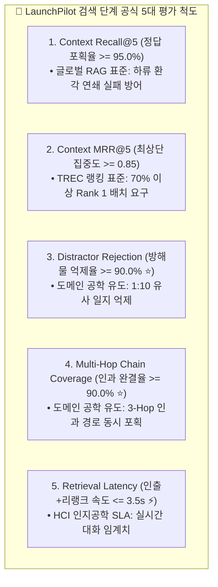
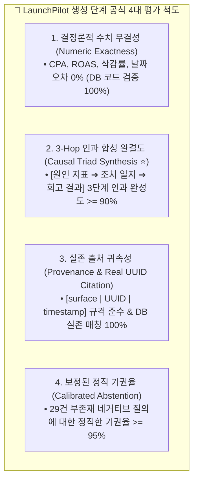

# 🎯 LaunchPilot 2단계 분리 평가 체계 (End-to-End Evaluation Framework)

> **핵심 원칙**:
> RAG 시스템의 평가는 **검색(Retrieval) 계층**과 **생성(Generation) 계층**으로 엄격히 분리(Decoupling)되어야 합니다.
> * **검색 단계**: 에이전트의 워킹 메모리에 올라가는 후보 문서 풀의 신호 대 잡음비(SNR), 적시성, 인과 완결도를 독립 계측합니다.
> * **생성 단계**: 범용 LLM-as-a-Judge의 수치 둔감증(Numeric Blindness)과 장식용 각주(Tacked-on Citations) 착시를 극복하고, **결정론적 수치 무결성, 3-Hop 인과 합성 완결도, 실존 출처 귀속성, 정직한 기권율**을 계측합니다.

---

## 🧭 전체 목차 (Table of Contents)
1. **[Part 1] 검색(Retrieval) 단계 공식 5대 평가 척도 및 수치 유도 근거 (확정)**
2. **[Part 2] 생성(Generation) 단계 공식 4대 평가 척도 및 하이브리드 검증 프로토콜 (확정)**
   * 2.1 결정론적 수치 무결성 (Deterministic Numeric Exactness)
   * 2.2 마케팅 3-Hop 인과 합성 완결도 (Causal Triad Synthesis Score)
   * 2.3 실존 출처 귀속 및 인용 무결성 (Provenance & Real UUID Citation)
   * 2.4 부존재 질의 정직 기권율 (Calibrated Negative Abstention)
   * 2.5 생성 평가기 구현 아키텍처 (Rule-based + NLI Judge)

---

# 1. [Part 1] 검색(Retrieval) 단계 공식 5대 평가 척도

### 1.1 5대 검색 척도 정의 및 수치 유도 근거

| 번호 | 공식 척도명 | 목표치 (Target) | 수치 유도 근거 및 실무 의미 | 분류 |
| :---: | :--- | :---: | :--- | :---: |
| **1** | **Context Recall@5** | **>= 95.0%** | **글로벌 RAG 표준**: 검색 재현율이 90% 밑으로 떨어지면 하류 생성 LLM의 환각이 기하급수적으로 폭증함 (Cascading Failure 방어선) | **글로벌 표준** |
| **2** | **Context MRR@5** | **>= 0.85** | **TREC/MS-MARCO 표준**: MRR = 1/Rank. 전체 질의의 최소 70%는 반드시 Rank 1에 꽂히고 나머지 30%도 Rank 2 안에 들어와야 달성되는 랭킹 품질선 | **글로벌 표준** |
| **3** | **Distractor Rejection (방해물 억제율 ⭐)** | **>= 90.0%** | **코퍼스 구조 유도**: 캠페인당 10개의 유사 주간 일지가 공존하는 환경에서, 무관한 9개 방해물 일지를 상위 5위 밖으로 밀어내는 능력 (1 - 방해물수/10) | **도메인 특화** |
| **4** | **Multi-Hop Coverage (인과 체인 완결도 ⭐)** | **>= 90.0%** | **3-Hop 인과 구조 유도**: [기획 -> 지표 -> 조치 -> 회고] 3단계 인과 단서 중 1개라도 빠지면 인과 추론 불가. 10개 복합 질의 중 9개 이상 완결 포획 요구 | **도메인 특화** |
| **5** | **Retrieval Latency** | **<= 3.5s** | **HCI 인지공학 SLA**: 사용자가 챗봇 인터랙션에서 지연을 느끼지 않는 임계 시간(3~5초)을 만족하기 위해 검색 단계에 할당된 제한 시간 | **글로벌 표준** |

### 1.2 검색 평가기 도구
* **모듈 위치**: `services/launchpilot-api/evals/retrieval_stage_evaluator.py`
* **입력 데이터**: Golden V3 코퍼스 (1,050개 문서) + 150건 qrels 레이블

---

# 2. [Part 2] 생성(Generation) 단계 공식 4대 평가 척도

### 2.1 4대 생성 척도 상세 명세

| 번호 | 공식 척도명 | 검증 방식 및 알고리즘 | 목표치 (Target) | 엔지니어링 및 실무 의미 |
| :---: | :--- | :--- | :---: | :--- |
| **1** | **결정론적 수치 무결성 (`Numeric Exactness`)** | Python 정규식 및 SQL 팩트 테이블과의 1:1 매칭 (LLM 미의존) | **100.0%** | 범용 LLM의 수치 둔감증을 배제하고 ROAS 1.2/1.5, 예산 15% 삭감 등 핵심 숫자의 무오차 보증 |
| **2** | **3-Hop 인과 합성 완결도 (`Causal Triad Score ⭐`)** | [트리거 지표 이상 ➔ 실행 조치 ➔ 회고 성과] 3단계 연결 상태 채점 (Level 0~2) | **>= 90.0%** | 단순 팩트 나열을 넘어, 마케터에게 필수적인 "원인-조치-후속영향" 인과 서사를 완결했는지 평가 |
| **3** | **실존 출처 귀속성 (`Real UUID Citation`)** | 본문 내 `[surface | UUID | timestamp]` 추출 후 DB 실존 전수 쿼리 | **100.0%** | 모델이 임의로 조작한 가짜/유령 UUID를 배제하고 실제 클릭 검증 가능한 권위 있는 출처 보장 |
| **4** | **보정된 정직 기권율 (`Calibrated Abstention`)** | 29건 부존재 네거티브 질의에 대한 명시적 거절 구문(`"기록이 없습니다"`) 검증 | **>= 95.0%** | 미집행 채널/미존재 사건에 대해 그럴듯한 거짓 보고서를 지어내지 않고 정직하게 거절하는 방어력 |

---

## 💻 3. 하이브리드 생성 평가기 아키텍처 (`generation_stage_evaluator.py`)

1. **[결정론적 정적 검증기 (Deterministic Rule Engine)]**:
   * 수치 팩트 정규식 매칭, UUID 실존 DB 조회, 네거티브 거절 키워드 판별.
2. **[동적 NLI 인과 심판기 (Causal & Entailment Judge)]**:
   * 3-Hop 인과 결합 수준(Level 0/1/2) 및 문장 단위 컨텍스트 귀속 여부 판정.
