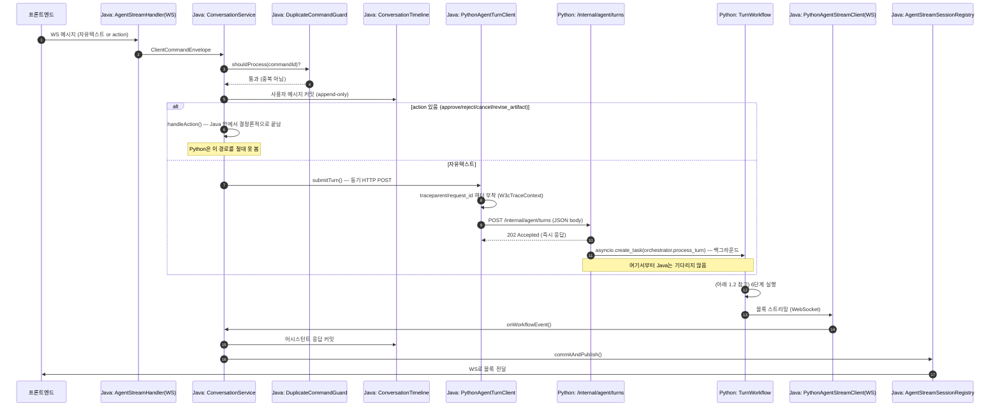
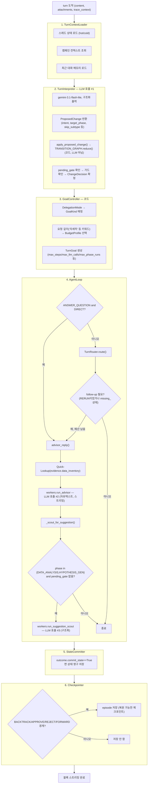
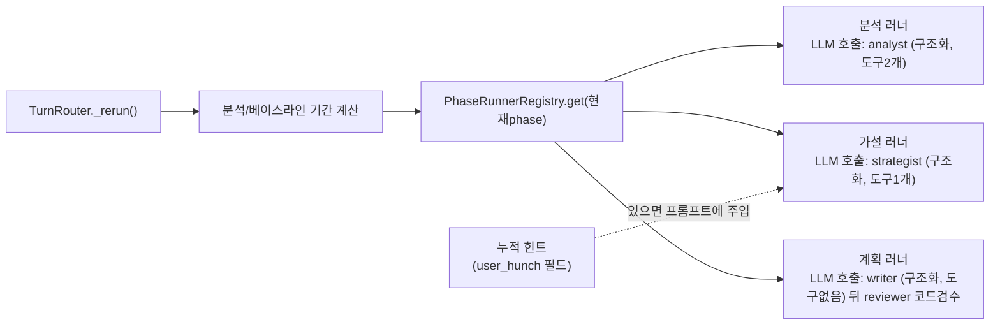
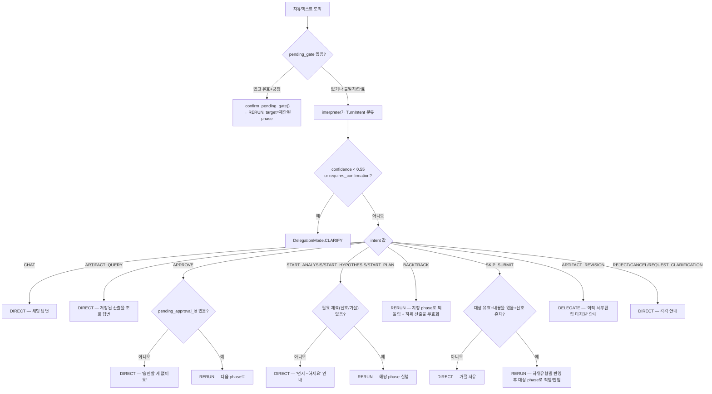
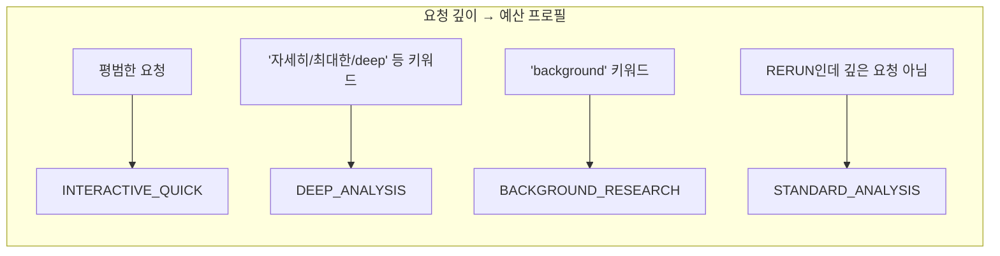
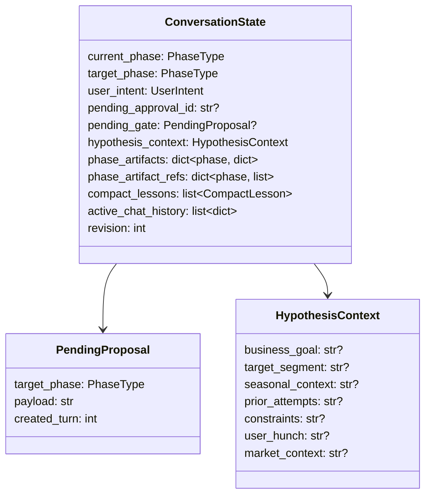

# LaunchPilot 전체 요청 흐름 — 코드 기반 상세 트레이스 + 섹션별 트레이드오프

전부 실제 코드 확인 후 작성. 파일 경로는 문서 끝 부록에 모음.

---

# Part 1. A-Z 전체 흐름

## 1.1 프론트엔드 → Java → Python → 다시 프론트엔드까지, 전체 시퀀스

**핵심 포인트**: action(버튼)은 Java 안에서 완전히 끝나고 Python에 절대 안 넘어옴. 자유텍스트만 Python까지 감. Java→Python 호출 자체는 동기(blocking) HTTP지만, Python 쪽은 202 먼저 반환하고 실제 처리는 백그라운드(`asyncio.create_task`)로 함 — 그래서 Java 입장에선 "보냈다"까지만 빠르게 끝나고, 실제 결과는 별도 WebSocket으로 옴.

---

## 1.2 오케스트레이터(TurnWorkflow) 내부 6단계

**RERUN 경로(2번 라운드 실행)일 때 4번 내부가 어떻게 되는지 별도로 펼치면:**

---

## 1.3 이번 대화 한 번에 실제로 불리는 LLM 목록 (모델/형식/도구)

| 순서 | 이름 | 모델 | 출력형식 | 도구 | 불리는 조건 |
|---|---|---|---|---|---|
| 1 | interpreter | gemini-3.1-flash-lite | 구조화(JSON) | 없음 | 매 턴 항상 |
| 2 | advisor | gemini-3.1-flash-lite | 자유텍스트(스트리밍) | Quick-Lookup 2개 | ANSWER_QUESTION+DIRECT 또는 follow-up 조건 만족 시 |
| 3 | suggestion_scout | gemini-3.1-flash-lite | 구조화(JSON) | 없음 | phase가 DATA_ANALYSIS/HYPOTHESIS_GEN이고 pending_gate 없을 때만 |
| 4 | analyst | gemini-3.1-flash-lite | 구조화(JSON) | query_metric_baseline, search_content_posts | RERUN이고 현재phase=DATA_ANALYSIS |
| 5 | strategist | gemini-3.1-flash-lite | 구조화(JSON) | search_team_notes | RERUN이고 현재phase=HYPOTHESIS_GEN |
| 6 | writer | gemini-3.1-flash-lite | 구조화(JSON) | 없음 | RERUN이고 현재phase=EXPERIMENT_PLAN |
| (죽은코드) | chat | gemini-3.1-flash-lite | 자유텍스트 | Quick-Lookup 2개 | 실제 흐름에서 안 불림 |
| (코드,LLM아님) | reviewer | - | - | - | writer 실행 직후 항상 |

**한 턴에 최대 몇 번 LLM 호출되나:** 가장 단순한 CHAT 응답 = 1(interpreter)+1(advisor)+1(suggestion_scout, 조건부) = **최대 3번**. RERUN + follow-up까지 겹치면 interpreter(1)+phase워커(1)+advisor(1)+suggestion_scout(1) = **최대 4번**.

---

## 1.4 8개 카테고리 → 실제 라우팅 결정 (통합)

---

## 1.5 반복/예산(호출 횟수 제한) 메커니즘

| 프로필 | max_steps | max_llm_calls | max_phase_runs | max_seconds |
|---|---|---|---|---|
| INTERACTIVE_QUICK | 6 | 3 | 1 | 60 |
| STANDARD_ANALYSIS | 15 | 8 | 2 | 180 |
| DEEP_ANALYSIS | 40 | 20 | 4 | 600 |
| BACKGROUND_RESEARCH | 80 | 40 | 8 | 1800 |

`max_llm_calls`가 advisor follow-up 반복 여부를 실제로 제한하는 값이에요(`_should_follow_up`에서 `state.llm_calls >= goal.budgets.max_llm_calls`면 중단).

---

## 1.6 이번 세션에 다룬 상태/데이터 목록 전체

`phase_artifacts`는 4개 phase 각각 key로 실제 산출물(signals/hypotheses/experiment_plan)을 담는 딕셔너리 — 4단계 그래프의 "노드별 결과물 저장소"예요.

---

## 1.7 에이전트/역할 최종 로스터

| 이름 | 종류 | 그래프 소속 여부 |
|---|---|---|
| interpreter | LLM | 그래프 아님 (그래프에 신호를 넣어주는 입력단) |
| advisor | LLM | 그래프 아님 (능력자 풀) |
| suggestion_scout | LLM | 그래프 아님 (pending_gate 생성만 담당) |
| analyst | LLM | 그래프 아님 (능력자 풀, 노드 안에서 호출됨) |
| strategist | LLM | 그래프 아님 |
| writer | LLM | 그래프 아님 |
| chat | LLM (죽은코드) | 해당없음 |
| reviewer | 코드(비-LLM) | 그래프 아님 (노드 안에서 호출되는 검사 함수) |
| **TransitionGraph** | 코드 | **그래프 그 자체** |

---

# Part 2. 섹션별 트레이드오프 & 개선점

## 2-A. interpreter 분류 방식

**현재:** 단일 LLM 호출로 11개 intent 중 하나 + confidence 반환. confidence<0.55면 되물음.

**트레이드오프:** 빠르고 저렴(호출 1번)하지만, 정말 애매한 케이스(한 문장에 의도 2개 섞임 등)는 여전히 하나로만 강제 분류됨. `mutation` 필드로 일부 흡수 가능하나 완전하진 않음.

**개선 가능성:** 낮은 confidence일 때 clarify 대신 "가능한 해석 2개를 제시하고 고르게" 하는 패턴 — 되묻기가 한 번 더 늘지만 오분류 자체를 줄임. 지금 규모(하루 몇 턴)에선 이득 작음, 사용량 늘면 검토 가치 있음.

## 2-B. TransitionGraph 구현 방식 (dict vs 진짜 그래프 객체)

**현재:** 열거형+딕셔너리+데이터클래스.

**트레이드오프:** 지금 규모(노드4개)에선 충분. LangGraph 등으로 옮기면 자동시각화/체크포인트 내장/그래프알고리즘 공짜지만, ADK와 프레임워크 이중화 + 마이그레이션 비용.

**개선 가능성:** 노드가 6개 이상으로 늘거나, 사용자별로 그래프 모양 자체가 달라져야 하는 요구(예: 캠페인 유형별 다른 단계 구성)가 생기면 그때 전환 검토.

## 2-C. suggestion_scout (제안-확인 메커니즘)

**현재:** advisor 응답 뒤에 별도 LLM 호출 1번 추가.

**트레이드오프:** advisor의 실시간 스트리밍을 보존하기 위한 선택(구조화출력+스트리밍이 한 호출에서 안 섞임). 대신 매 응답마다 호출 1번 추가 비용(레이턴시+비용).

**개선 가능성:** advisor 응답 텍스트에 간단한 마커 규칙(예: 끝에 숨김 태그)을 쓰게 하고 정규식으로 감지하는 방식도 가능하나, 스트리밍 도중 마커가 노출될 위험 때문에 지금은 안 씀. 스트리밍을 마지막 N자만 지연 버퍼링하는 방식으로 절충 가능 — 지금은 구현 안 함.

## 2-D. GoalBudget 예산 체계

**현재:** 4개 고정 프로필, 키워드 매칭으로 프로필 선택.

**트레이드오프:** 단순하고 예측 가능하나, "자세히"라는 단어가 없어도 실제론 복잡한 질문일 수 있음(키워드 매칭의 한계).

**개선 가능성:** interpreter가 이미 문장을 다 읽으니, 키워드 매칭 대신 interpreter 출력에 "요청 복잡도" 필드를 하나 추가해서 그 값으로 프로필 선택 — 추가 LLM 호출 없이 정확도만 높이는 개선. 비교적 싸게 할 수 있는 개선.

## 2-E. 검수(reviewer)

**현재:** 형식 검사만(코드), 내용 정확성은 오프라인 judge만.

**트레이드오프:** (앞서 논의함) 안전은 확실하나, 내용이 틀렸는데 형식만 맞으면 실시간으로 못 거름.

**개선 가능성:** judge.py를 실시간 경로에 "참고용 경고"로만(승인 차단 권한 없이) 붙이는 절충안 — ADR-0006 원칙(코드가 최종권한) 안 깨면서 정보량만 늘림. 비용은 계획 단계마다 LLM 호출 1번 추가.

## 2-F. 관측성 (Phoenix 스팬 미도착 버그)

**현재:** 원인 미규명, 이슈 #28에 기록됨.

**개선 방향:** 다음 세션에서 재시작 후 프로브 결과 확인부터 이어가야 함.

---

## 부록 — 파일 경로

- Java: `backend/src/main/java/com/launchpilot/websocket/AgentStreamHandler.java`, `conversation/ConversationService.java`, `conversation/InMemoryDuplicateCommandGuard.java`, `conversation/InMemoryConversationTimeline.java`, `agentbridge/PythonAgentTurnClient.java`, `agentbridge/PythonAgentStreamClient.java`, `observability/W3cTraceContext.java`, `observability/LoggingObservabilityGateway.java`, `websocket/AgentStreamSessionRegistry.java`
- Python: `apps/agent/app/api/turns.py`, `apps/agent/app/orchestration/workflow.py`, `interpreter.py`, `goals.py`, `loop.py`, `router.py`, `checkpoint.py`, `phases/*.py`, `runtime/transitions.py`, `runtime/state.py`, `agents/adk_agents.py`, `agents/workers.py`, `agents/reviewer.py`, `eval/judge.py`
