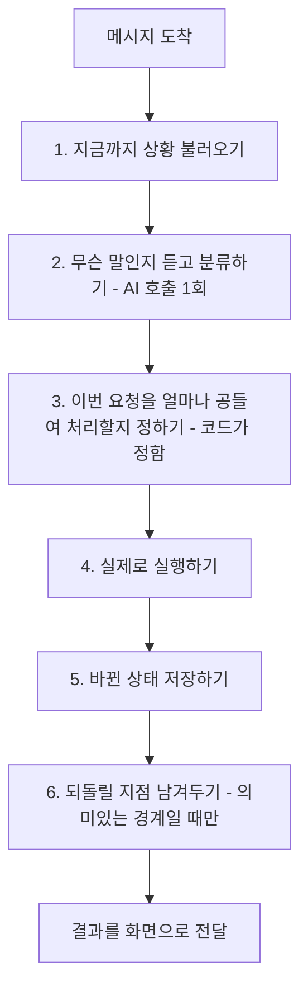
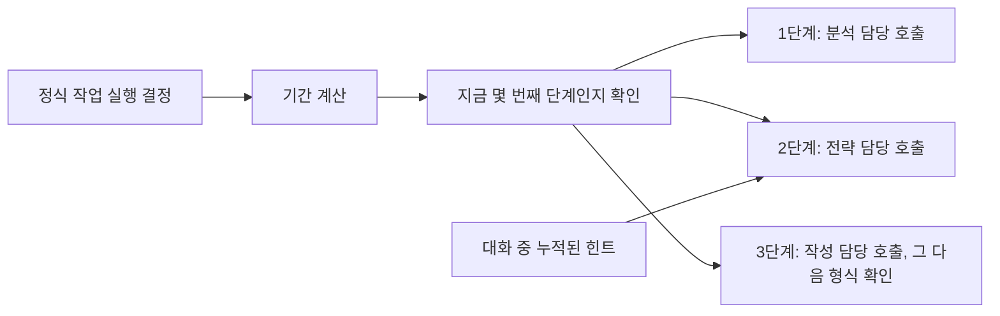
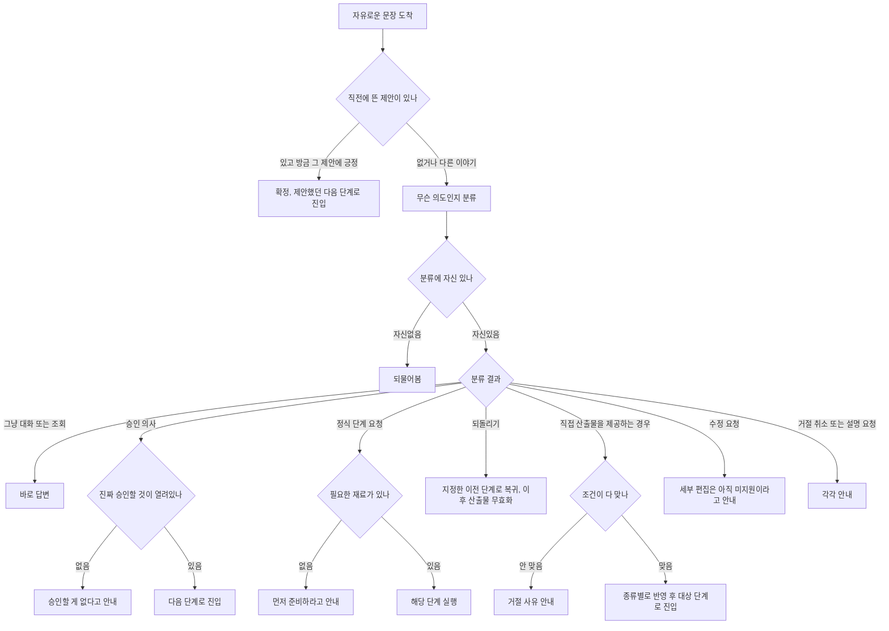

# LaunchPilot 전체 요청 흐름 — 쉬운 말 번역본

같은 내용을 코드 용어(변수명·클래스명) 없이 쉬운 말로 옮긴 문서예요. 정확한 코드 근거가 필요하면 옆 문서(`full-system-trace-and-tradeoffs.md`)를 보세요.

---

# Part 1. 처음부터 끝까지, 쉬운 말로

## 1.1 사용자가 메시지를 보내면 어디를 거쳐서 돌아오나

사용자가 채팅창에 뭔가 쓰면, 그게 버튼(승인/거절 등)인지 그냥 쓴 말인지부터 갈려요.

- **버튼을 눌렀으면**: 자바 서버 안에서 그 자리에서 다 끝나요. 파이썬 쪽은 이 요청을 아예 못 봐요.
- **그냥 말로 썼으면**: 자바 서버가 그 문장을 파이썬 쪽으로 넘겨요. 넘기자마자 "받았어요"라고 먼저 응답하고, 실제 처리는 뒤에서 계속 진행돼요. 자바는 넘기는 순간 바로 다음 일을 처리할 수 있어요.

파이썬이 실제 대답을 다 만들고 나면 그 결과를 자바 쪽으로 실시간으로 보내고, 자바가 그걸 받아 화면에 띄워요. 정리하면: 버튼은 바로 끝나고, 자유롭게 쓴 말만 파이썬까지 갑니다.

---

## 1.2 요청 하나를 처리하는 6단계

**2단계(분류하기)**는 AI가 문장을 읽고 "이런 요청 같다"는 후보 하나를 뽑는 일이에요. 그 후보를 실제로 받아들일지는 AI가 아니라 정해진 조건표(코드)가 최종 결정해요. "제안은 AI가 하고, 확정은 코드가 한다"는 원칙이 여기서 적용돼요.

**4단계(실제로 실행하기)**는 다시 두 갈래로 나뉩니다.

- 그냥 답하면 되는 경우: 답변 담당이 준비하기 전에 저장된 자료를 잠깐 조회함 → 실제 답변 작성(실시간으로 나감) → 그 답변에 다음 단계 제안이 들어있는지 별도로 한 번 더 확인
- 정식 작업(분석/가설/계획)을 돌려야 하는 경우: 아래 그림 참고

---

## 1.3 요청 한 번에 실제로 몇 번 AI를 부르나

| 역할 | 하는 일 | 답변 형태 | 도구 사용 | 언제 불리나 |
|---|---|---|---|---|
| 해석 담당 | 문장 듣고 분류 | 정해진 형식 | 없음 | 매번 항상 |
| 답변 담당 | 실제 답변 작성 | 자유 문장, 실시간 | 조회 도구 2개 | 그냥 대화이거나 추가 설명이 필요할 때 |
| 제안 확인 담당 | 답변 담당이 다음 단계를 제안했는지 확인 | 정해진 형식 | 없음 | 초반 두 단계에 있고, 이미 뜬 제안이 없을 때만 |
| 분석 담당 | 데이터에서 신호 찾기 | 정해진 형식 | 조회 도구 2개 | 정식 분석 요청 시 |
| 전략 담당 | 가설 세우기 | 정해진 형식 | 조회 도구 1개 | 정식 가설 요청 시 |
| 작성 담당 | 계획서 작성 | 정해진 형식 | 없음 | 정식 계획 요청 시 |
| (사용 안 하는 잔재) | - | - | - | 실제로는 아무도 안 부름 |
| 형식 확인 | 결과물 규칙 확인 | - | - | AI 아님, 코드. 계획 나올 때마다 항상 실행 |

**요청 한 번에 최대 몇 번 AI를 부르나:** 그냥 대화면 해석(1회)+답변(1회)+제안확인(1회, 조건부) = 최대 3회. 정식 작업까지 겹치면 최대 4회.

---

## 1.4 애매한 입력 8가지 묶음이 실제로 어디로 가는지

---

## 1.5 요청을 얼마나 공들여 처리할지 정하는 기준

| 처리 등급 | 언제 이 등급이 되나 | 최대 단계 수 | 최대 AI 호출 | 최대 처리 시간 |
|---|---|---|---|---|
| 가벼운 대화 | 평범한 요청 | 6 | 3 | 60초 |
| 보통 분석 | 정식 작업이지만 깊지 않은 요청 | 15 | 8 | 3분 |
| 깊은 분석 | 자세히 또는 최대한 봐달라는 요청 | 40 | 20 | 10분 |
| 장시간 조사 | 백그라운드로 진행해달라는 요청 | 80 | 40 | 30분 |

최대 AI 호출 숫자가 실제로 "답변 담당한테 한 번 더 설명해달라고 시킬지"를 제한하는 값이에요.

---

## 1.6 시스템이 기억하고 있는 것들

| 항목 | 수명 | 내용 |
|---|---|---|
| 지금 몇 단계인지 | 계속 유지 | 4단계 중 현재 위치 |
| 열려있는 정식 승인 여부 | 승인/거절 전까지 | 승인 대상이 있는지 |
| 직전 제안 기록 | 한 턴 정도 | 방금 뜬 제안 내용과 시점 |
| 가설에 참고할 누적 정보 | 대화 세션 내내 | 목표, 타겟, 제약 등 7개 항목 |
| 단계별 결과물 저장 | 대화 세션 내내 | 신호, 가설, 계획을 각 단계별로 보관 |
| 최근 대화 기록 | 대화 세션 내내 | 최근 주고받은 메시지 |

직전 제안 기록은 다음 턴이면 사라지는 임시 정보고, 누적 정보와 결과물 저장은 대화가 이어지는 동안 계속 쌓여요.

---

## 1.7 지금 있는 역할들, 다시 정리

| 역할 | AI인가 | 전환 규칙(그래프) 소속인가 |
|---|---|---|
| 해석 담당 | AI | 아님, 전환 규칙에 신호를 넣어주는 입력단 |
| 답변 담당 | AI | 아님 |
| 제안 확인 담당 | AI | 아님 |
| 분석/전략/작성 담당 | AI (3명) | 아님 |
| (사용 안 하는 잔재) | AI | 해당없음 |
| 형식 확인 | 코드, AI 아님 | 아님, 단계 안에서 불리는 검사기 |
| 단계 순서와 이동 조건표 | 코드 | 이게 전환 규칙, 즉 그래프 그 자체 |

---

# Part 2. 어디를 더 좋게 만들 수 있나

## 2-A. 분류하기

**지금:** 한 번 듣고 11가지 중 하나로 분류, 자신 없으면 되물음.

**트레이드오프:** 빠르고 비용이 적지만, 한 문장에 의도가 두 개 섞이면 여전히 하나로만 분류됨.

**개선 방향:** 자신 없을 때 후보 두 개를 보여주고 고르게 하는 방식. 되묻는 횟수는 늘지만 오분류는 줄어듦. 지금 규모에서는 급하지 않음.

## 2-B. 전환 규칙(그래프) 만드는 방식

**지금:** 이름표와 표 조합으로 직접 구현.

**트레이드오프:** 지금 규모(4단계)에는 충분함. 전용 그래프 도구로 바꾸면 그림 자동 생성과 되돌리기 기능이 딸려오지만, 관리할 도구가 하나 더 늘어남.

**개선 방향:** 단계가 6개 넘게 늘거나, 요청 종류마다 단계 구성 자체가 달라져야 할 때 재검토.

## 2-C. 제안 확인 담당

**지금:** 답변 담당과 별도로 한 번 더 호출.

**트레이드오프:** 답변 담당의 실시간 응답을 유지하기 위한 선택. 대신 매번 호출이 하나 더 들어감.

**개선 방향:** 답변 텍스트 안에 표시를 남기고 감지하는 방법도 있지만, 실시간 응답 도중 그 표시가 그대로 노출될 위험이 있어서 지금은 안 씀.

## 2-D. 처리 등급 정하는 기준

**지금:** 특정 단어가 있는지만 확인.

**트레이드오프:** 단순하지만, 그 단어가 없어도 실제로는 복잡한 질문일 수 있음.

**개선 방향:** 해석 담당이 이미 문장을 다 읽으니, 그 결과에 복잡도 표시를 하나 더 붙이면 새 AI 호출 없이 정확도만 올라감. 비교적 낮은 비용으로 개선 가능.

## 2-E. 형식 확인

**지금:** 형식만 확인함, 내용이 실제로 맞는지는 실시간으로 안 봄. 별도의 오프라인 채점만 있음.

**개선 방향:** 오프라인 채점을 실시간에도 참고용 경고로만 붙이는 방법. 승인을 막을 권한은 주지 않고 정보만 늘림. 계획이 나올 때마다 AI 호출이 하나 더 들어감.

## 2-F. 모니터링

**지금:** 실제 대화가 모니터링 도구에 기록되지 않는 문제가 있음, 원인 미확인, 이슈로 등록됨.

**개선 방향:** 다음 세션에서 재확인부터 이어가야 함.
