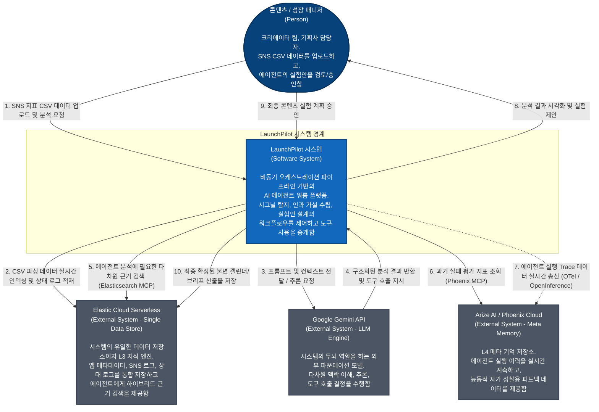
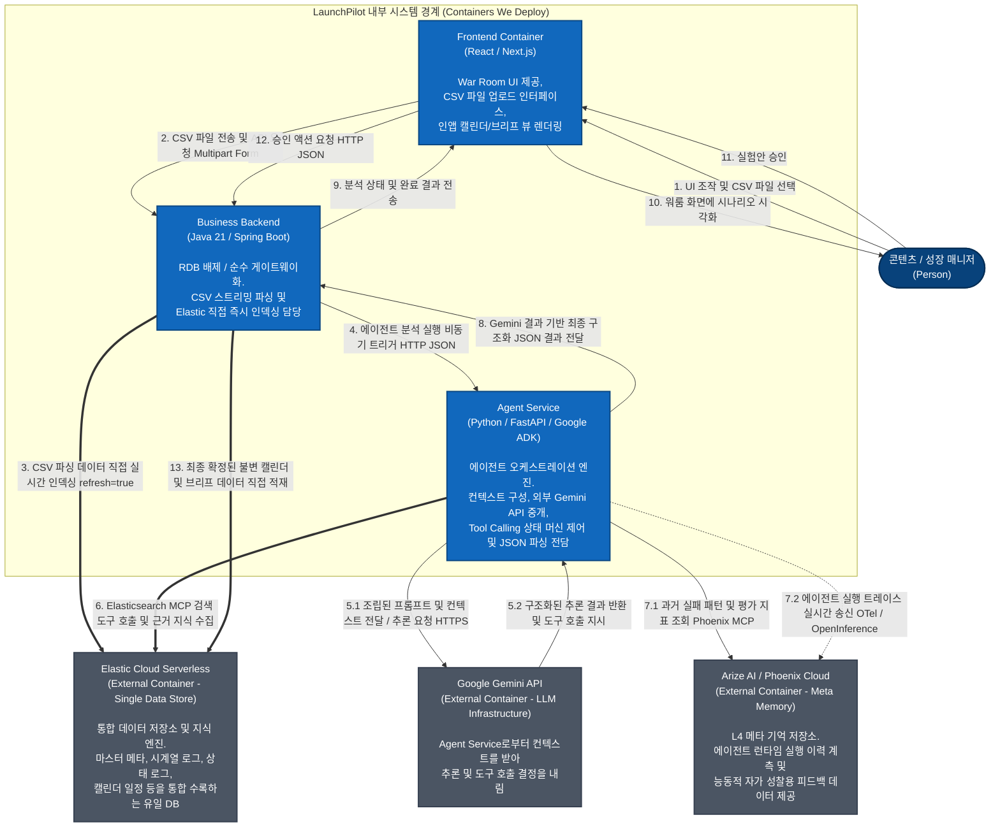
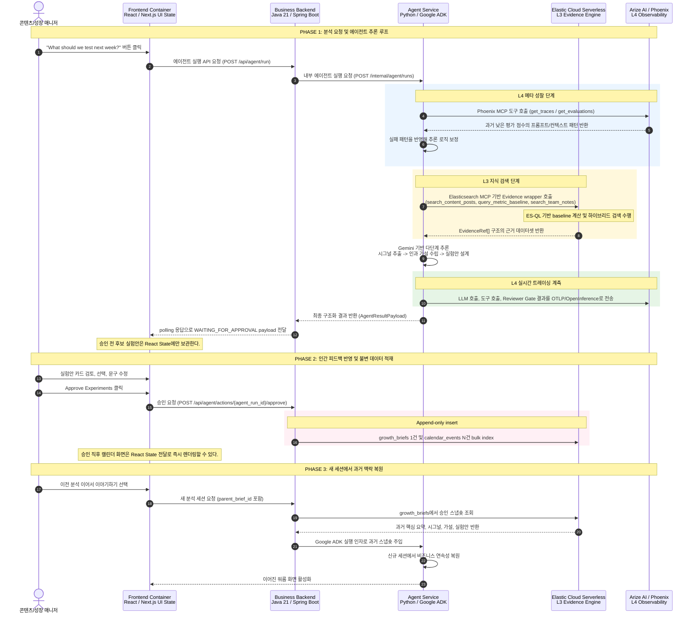
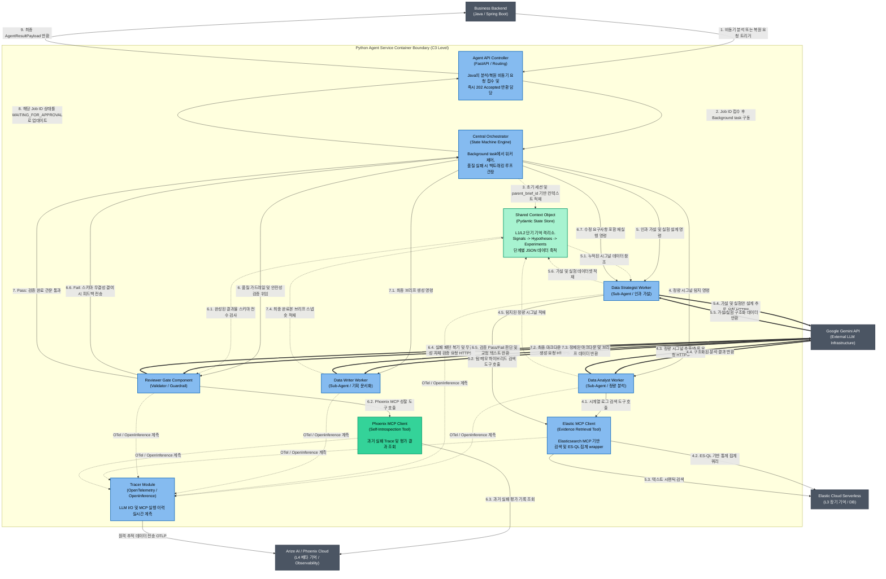
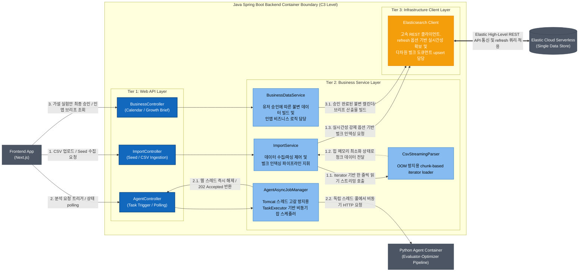

# LaunchPilot Architecture Diagrams

Status: Draft v0.1  
Scope: C4 context/container/component views and main user scenario sequence  
Last updated: 2026-06-01

## 1. System Context

This C1 view shows LaunchPilot as an AI agent workroom platform used by content and growth managers. The system coordinates Gemini reasoning, Elastic evidence retrieval, and Phoenix/Arize observability behind a single product boundary.

## 2. Container View

This C2 view shows the three deployable containers owned by LaunchPilot: Next.js frontend, Java backend, and Python agent service.

## 3. Main User Scenario Sequence

This sequence highlights the stateless frontend rule: candidate experiment plans live in frontend memory until human approval. Only approved artifacts are persisted to Elastic.

## 4. Agent Service Component View

This C3 view describes the Python Agent Service internals.

## 5. Java Backend Component View

This C3 view describes the Java Spring Boot backend internals.

## 6. Contract Map

The architecture above is enforced by the contract set under `contracts/`.

| Architecture Boundary | Contract Folder |
| --- | --- |
| Frontend <-> Java Backend | `contracts/01-frontend-java` |
| Java Backend <-> Python Agent | `contracts/02-java-python-agent` |
| Java Backend <-> Elastic documents | `contracts/03-java-elastic` |
| Python Agent <-> Elasticsearch MCP | `contracts/04-agent-elastic-mcp` |
| Agent structured output and Reviewer Gate | `contracts/05-agent-output` |
| OpenInference / Phoenix observability | `contracts/06-observability` |
