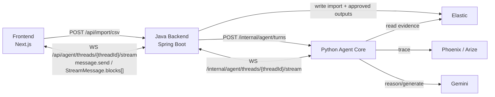

# LaunchPilot Architecture

LaunchPilot is a conversation-first agent workspace for campaign experiment planning.

## Core Principle

The main product surface is free conversation. Specialized work appears as blocks attached to assistant messages, and the UI reacts to those blocks.

## Public Frontend Contract

| Direction | Shape |
| --- | --- |
| Client to Java | `message.send` |
| Java to client | `StreamMessage` with `blocks[]` |

The WebSocket remains the transport, but transport state is not exposed as a product workflow contract.

## Block Reaction Model

| Block | Product behavior |
| --- | --- |
| `text` | Conversational answer. |
| `activity` | Progress row/status. |
| `markdown_document` | Thread document card plus opened right panel. |
| `artifact` | Structured review card in the main stream. |
| `approval` | Approval controls in the main stream. |
| `result` | Receipt/completion state. |
| `error` | Error notice and retry affordance. |

## Data Writes

Java writes Elastic at two moments:

1. CSV import writes `content_posts`.
2. Human approval writes `growth_briefs` and `calendar_events`.

The agent reads evidence and produces candidate outputs, but it does not persist business documents.
