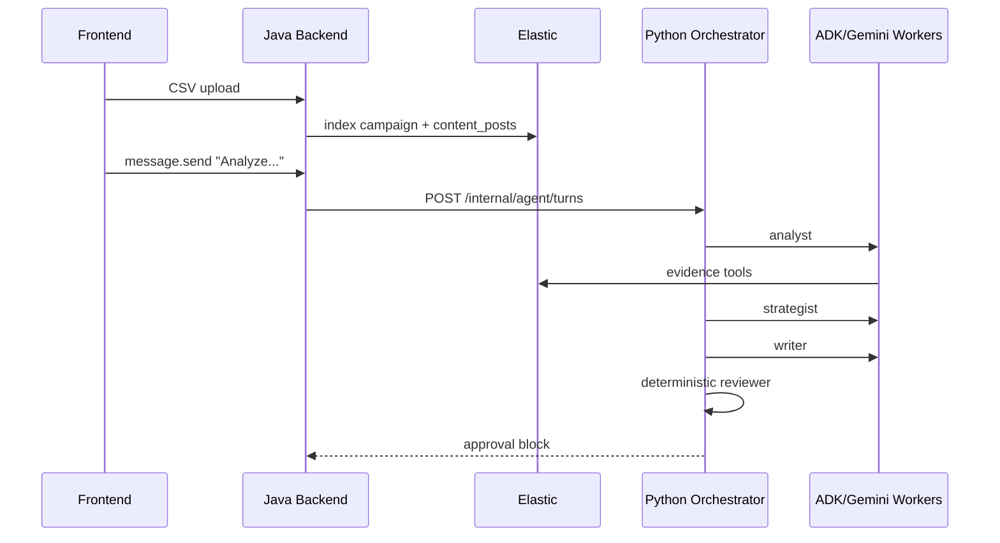

# Orchestrator Latency Analysis Before Refactor

Status: Evidence snapshot before refactor  
Date: 2026-06-11  
Scope: Orchestrator component, Python Agent Core v2, real Vertex/Gemini + Elastic-backed E2E

## 1. Why This Document Exists

The full E2E path passed, but the latency profile was not acceptable for a
Flash-based demo experience.

The important engineering question was not "is Gemini slow?" or "is Elastic
slow?" in isolation, but:

> Why does one user turn synchronously accumulate so many external I/O costs?

This document records the pre-refactor evidence so that the later refactor can
be explained as a measured architectural correction, not as a vague performance
tuning pass.

## 2. Current E2E Shape

The current full E2E scenario is real from the user's point of view:

1. User opens the planner page.
2. User sends a free-form chat message.
3. User attaches a CSV file.
4. Frontend sends the CSV to Java as multipart form data.
5. Java parses the CSV and writes `campaigns` + `content_posts` to Elastic.
6. Frontend sends an analysis request to Java.
7. Java posts the free-form turn to Python Agent Core.
8. Python orchestrator runs analyst -> strategist -> writer -> reviewer.
9. Python streams an approval gate.
10. User approves.
11. Java persists `growth_briefs` + `calendar_events`.



Important boundary note:

- Java owns business persistence and approval.
- Python owns runtime orchestration.
- The current implementation still lets the orchestrator directly invoke concrete
  ADK workers. That is the main architectural tension identified here.

## 3. Observed Symptom

In real E2E, approval gate latency was in the 1.5-2.2 minute range.

This was suspicious because the configured model was `gemini-2.5-flash`, and
the dataset was tiny. Treating that number as normal Flash behavior would be an
incorrect diagnosis.

## 4. Hypothesis Decomposition

Because this E2E path depends on several external services, the first
responsible hypothesis is not "our internal design is slow." The first
responsible hypothesis is:

> External service I/O boundaries are dominating latency.

Only after measuring those boundaries should we blame the orchestrator or worker
design. This ordering matters for interview defense: network calls, hosted model
runtime, Elastic queries, MCP transport, and telemetry export all have higher
initial probability than an abstract "bad architecture" claim.

We decomposed the problem into falsifiable hypotheses in that order. The goal
was not just to find one slow service. The goal was to find whether the
orchestrator design makes multiple external I/O costs accumulate in the critical
path of one user turn.

| Hypothesis | Why It Was Plausible | Evidence Needed |
| --- | --- | --- |
| H1. Vertex/Gemini I/O adds repeated latency | Every worker call crosses the hosted model boundary. Even 2-3s calls become expensive when serialized. | Measure raw Gemini, minimal ADK calls, and real worker calls in the same container/env. |
| H2. Elastic / CSV I/O adds evidence latency | The analysis depends on Java CSV ingestion and Elastic evidence reads. Even small reads matter if they happen inside repeated tool loops. | Measure CSV size and direct Elastic query latency. |
| H3. Phoenix telemetry I/O can add overhead | Phoenix previously emitted repeated `401 Unauthorized`; tracing hooks ADK spans. | Fix env, confirm 401 gone, compare traces/logs. |
| H4. Elastic MCP I/O / fallback adds penalty | Logs showed ES|QL `Unknown column [metrics.saves]` and fallback to direct ES. | Disable MCP and rerun E2E. |
| H5. Orchestrator serializes and amplifies these I/O costs | Current orchestrator directly runs analyst -> strategist -> writer in one user turn, and analyst itself performs multiple model/tool I/O steps. | Measure worker-level latencies, inspect function-call count, and compare cumulative latency. |

The critical point is that each hypothesis has a specific disconfirming test.
The final conclusion should explain both the individual I/O costs and why they
compound into a poor E2E experience.

## 5. Evidence

### 5.1 Elastic / CSV I/O Is Measurable But Not Alone Sufficient

The fixture CSV contains 4 data rows:

```text
post_id,published_at,channel,views,likes,comments,save_rate
post_014,2026-05-27,tiktok,120000,8400,320,0.074
post_015,2026-05-28,instagram,85000,5100,190,0.024
post_016,2026-05-29,youtube,230000,18000,980,0.018
post_017,2026-05-30,tiktok,95000,6900,280,0.071
```

Direct Elastic query against the campaign returned 28 hits in about 1.1 seconds.

This means Elastic is not a 50-second standalone bottleneck. However, it is still
an external I/O boundary. If it is called repeatedly inside agent tool loops, the
cost compounds with model latency and transport overhead.

### 5.2 Vertex/Gemini I/O Is Fast In Isolation But Expensive When Repeated

Measured inside the same agent container and same Vertex/Gemini environment:

| Probe | Measured Latency |
| --- | ---: |
| Raw Gemini text call | 3.4s |
| Minimal ADK text agent | 2.8s |
| Minimal ADK structured schema agent | 2.5s |

This rejects the claim that Flash is inherently a 50-80 second model call. But it
does not make Gemini I/O free. The important observation is that every extra
worker call and every extra tool-reasoning round pays this external I/O cost
again.

### 5.3 Phoenix Telemetry I/O Was A Configuration Risk

After env refresh:

- `Phoenix tracing enabled` appeared in the agent logs.
- `401`, `Unauthorized`, and `Failed to export span batch` no longer appeared.
- Full E2E still spent most time in the worker pipeline.

This removes the previous 401 export failure as the main explanation. It does
not remove telemetry as an I/O surface; it means the current observed latency is
not dominated by broken Phoenix auth.

### 5.4 Elastic MCP I/O / Fallback Adds A Large Penalty

With MCP enabled, logs previously showed:

```text
ES|QL error: Unknown column [metrics.saves]
```

The system recovered through direct ES fallback, but this made the analyst path
longer.

Observed analyst latency:

| Condition | Analyst Latency |
| --- | ---: |
| MCP enabled, fallback observed | 80.5s |
| MCP disabled, direct ES only | 52.8s |

MCP fallback adds meaningful overhead, roughly 27.7 seconds in the observed run.
However, the analyst still took 52.8 seconds without MCP. Therefore MCP fallback
is a major I/O penalty, but it is not the only cause of the slow path.

### 5.5 Worker Latency Shows I/O Amplification

With MCP disabled, the measured worker timings were:

| Worker | Measured Latency |
| --- | ---: |
| chat | 3.6s |
| analyst | 52.8s |
| strategist | 9.0-14.1s |
| writer | 7.0-11.0s |

These numbers show that even the non-analyst phases are not free:

- writer has no tools, but still pays a hosted structured-generation call;
- strategist has one tool and pays model + tool loop overhead;
- analyst is the outlier because it pays repeated model/tool I/O rounds.

The issue is not a single service. The issue is that the orchestrator waits for
all of these I/O-heavy phases serially before the user sees the approval gate.

### 5.6 Analyst Produced Six Function Calls

The decisive log line:

```text
Warning: there are non-text parts in the response:
['function_call', 'function_call', 'function_call',
 'function_call', 'function_call', 'function_call']
```

Timeline with MCP disabled:

```text
09:39:06 analyst start
09:39:10 function_call x6 observed
09:39:58 analyst done
elapsed: 52.75s
```

This confirms that the analyst is not a simple Flash completion. It is an ADK
agent loop that lets the model choose and execute multiple evidence probes, then
produce a structured output. In the current orchestrator, that whole loop is
blocking inside the same user turn.

Therefore H5 is accepted as the common architectural cause: the orchestrator
serializes and amplifies multiple external I/O costs.

## 6. Root Cause

The current bottleneck is not just "analyst is slow." The root cause is:

> The orchestrator directly executes I/O-heavy phase workers synchronously inside
> one user turn, so hosted model calls, tool calls, Elastic reads, MCP fallback,
> and structured output generation accumulate in the user's critical path.

The analyst path is the clearest example:

```text
LLM chooses metric/channel probes
-> ADK emits multiple function calls
-> evidence tools execute
-> LLM consumes tool results
-> LLM generates contract-shaped structured JSON
```

In other words, the analyst uses Gemini Flash as:

- explorer,
- tool caller,
- data analyst,
- evidence selector,
- structured JSON generator,

all inside one analyst worker call.

But the broader orchestrator problem is that this analyst loop is followed
serially by strategist and writer, each of which performs additional hosted model
I/O before the gate can open.

The model is fast when used as a simple generator, but the current orchestrator
turn path treats the phase pipeline as one synchronous blocking operation.

## 7. Architectural Interpretation

This is not evidence that ADR-004's state-reactive orchestrator is wrong.

The state vector, reducer, runtime repository, and macro workflow control still
match the intended architecture.

The issue is the boundary between orchestrator and phase agents, plus the lack
of an explicit I/O budget:

- The current orchestrator directly invokes concrete `analyst`, `strategist`,
  and `writer` ADK workers.
- Those workers are not just placeholders; they already encode detailed phase
  execution strategy.
- The orchestrator waits for all phase I/O serially before it can emit the final
  approval gate.
- As a result, the orchestrator E2E latency is coupled to external service
  timing and unfinished sub-agent implementation details.

That coupling is the pre-refactor architectural debt.

## 8. Before-Refactor Defense Story

The defensible story is:

> We first observed a 1.5-2.2 minute full E2E latency and did not assume Gemini
> Flash was slow or that the architecture was wrong. Because the path depends on
> hosted Gemini, Elastic, MCP, and Phoenix, we started with external I/O
> hypotheses. Direct Elastic was about 1 second on a tiny dataset. Raw Gemini and
> minimal ADK calls were 2-3 seconds, which means each individual hosted model
> call is acceptable but not free. Phoenix auth was corrected and stopped
> emitting 401s. Disabling MCP removed a large fallback penalty, but analyst
> still took 52.8 seconds. The decisive evidence was that analyst emitted six
> function calls before producing structured output. The conclusion was not that
> one external service was broken; it was that the orchestrator serially combines
> many external I/O costs in one user turn. The ADK analyst loop is the largest
> single expression of that design problem.

## 9. Refactor Implication

The next refactor should not merely increase timeouts or tune one provider.

The target should be:

1. Keep orchestrator responsible for state, scope, reducer decisions, delegation,
   artifact lifecycle, and stream gates.
2. Move phase execution strategy behind a `PhaseExecutionFacade` or equivalent
   gateway.
3. Give phase execution an explicit I/O budget and latency contract.
4. For data analysis, compute metric/channel candidates deterministically in
   Python or a dedicated phase component.
5. Use Gemini Flash to interpret, summarize, and select from precomputed
   candidates, not to discover all candidates through tool calls.
6. Reserve full ADK tool-calling workers for the sub-agent component stage, where
   their quality/latency tradeoff can be evaluated independently.

This preserves the orchestrator architecture while removing its coupling to a
slow, externally I/O-heavy sub-agent execution strategy.
