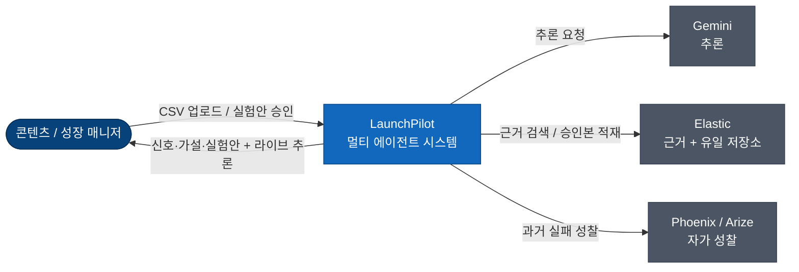

# LaunchPilot 아키텍처 개요

LaunchPilot은 크리에이터 팀의 SNS 성과 CSV를 해석해 성장 신호를 찾고, 원인 가설을 세우며, 다음 주 검증 가능한 콘텐츠 실험안으로 변환하는 멀티 에이전트 시스템이다. 이 문서는 시스템의 구성, 핵심 흐름, 그리고 주요 결정의 색인을 제공한다. 구조 다이어그램은 [C4](launchpilot-c4.md), 제품 맥락은 [PRD](../product/LaunchPilot_PRD.md), 결정의 근거는 [ADR](adr/)에 있다.

## 제품 루프

시스템은 다음 흐름을 자동화한다.

> 신호(Signal) → 가설(Hypothesis) → 실험(Experiment) → 승인(Approval) → 브리프(Brief) → 연속(Continuity)

최종 산출물은 요약 리포트가 아니라 사람이 승인해 캘린더에 반영되는 다음 주 실험안이며, 그 승인은 다음 분석 세션의 입력이 되어 캠페인 학습 루프를 형성한다.

## 시스템 구성

사용자는 단일 제품 경계와 상호작용하고, 그 뒤에서 세 외부 시스템이 조율된다. Gemini가 추론하고, Elastic이 근거 검색과 저장을 담당하며, Phoenix/Arize가 과거 실행을 계측·성찰한다.

배포 컨테이너는 셋이다. Next.js 프론트엔드, Java 백엔드(게이트웨이), Python 에이전트 서비스. 외부 시스템은 Gemini, Elastic Cloud Serverless, Arize/Phoenix Cloud이다. 컴포넌트·시퀀스 상세는 [C4](launchpilot-c4.md)를 참조한다.

## 결정 색인

주요 아키텍처 결정은 ADR로 기록되어 있다. 각 ADR은 결정을 강제한 사실과 포기한 것을 함께 담는다.

| 영역 | 결정 |
|---|---|
| [데이터 · 기억](adr/01-data-and-memory.md) | Elastic 단일 저장소(0001), 기억 4계층 분리(0002), 승인 전 비저장(0003) |
| [에이전트](adr/02-the-agents.md) | 4워커 멀티 에이전트(0004), ADK 직접 제어(0005), 결정적 검수(0006), 형식·의미 오류 분리(0007) |
| [투명성 · 관측성](adr/03-transparency.md) | 영속 WS 타임라인(0008), glass-box 정규화(0009), L4 자가 성찰(0010) |
| [엔지니어링 규율](adr/04-discipline.md) | 계약 우선(0011), 안정적 데모(0012) |

## 범위 외 (Non-goals)

다음은 의도적으로 범위에서 제외한다. Instagram·TikTok·X 실시간 공식 API 연동(CSV로 대체), 자동 게시, 광고 예산 최적화, 고급 예측 모델링, 멀티 워크스페이스 권한 관리, 결제·과금 운영 기능.

## 알려진 한계

- 데이터는 append-only다. 승인된 브리프·캘린더는 수정·삭제하지 않는다(ADR-0001, 0003).
- 승인 전 후보 실험안은 저장되지 않으며 브라우저 새로고침 시 소실된다(ADR-0003).
- 검수자는 스키마·근거 무결성을 결정적으로 보장하지만, 규칙으로 표현되지 않은 의미적 약점은 차단하지 못한다(ADR-0006).
- 모든 추천은 상관관계 기반이며, 가설은 인과 단정 없이 caveat을 강제한다.

## 더 보기

| 대상 | 문서 |
|---|---|
| 컨테이너·컴포넌트·시퀀스 구조 | [launchpilot-c4.md](launchpilot-c4.md) |
| 제품 포지셔닝·사용자·시나리오 | [PRD](../product/LaunchPilot_PRD.md) |
| 결정의 맥락과 대안 | [ADR](adr/) |
| 경계별 계약 | [`contracts/`](../../contracts/) |
