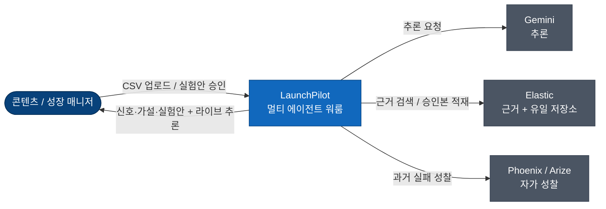

# LaunchPilot 아키텍처 — 데이터에서 결정까지

금요일 오후, 인플루언서 매니저 한 명이 다음 주 콘텐츠 회의를 앞두고 있다. 손에는 60일치 SNS 성과 데이터가 든 스프레드시트가 있다. 조회수, 좋아요, 저장, 팔로워 증감이 줄줄이 박혀 있다. 데이터는 충분하다. 문제는 데이터가 아니다.

답해야 하는 질문은 따로 있다. 이번 주에 진짜 중요한 변화는 무엇인가. 어떤 콘텐츠가 그 변화를 만들었나. 이건 우연인가 반복 가능한 신호인가. 다음 주엔 무엇을 테스트해야 하나. 그리고 이 모든 걸 대표에게 어떻게 한 문장으로 설명하나.

기존 도구는 첫 번째 절반만 해결한다. 차트는 잘 그려준다. 그러나 차트에서 실험안으로 건너가는 사고 과정 — 사람이 회의실에서 감으로 메우던 그 구간 — 은 자동화하지 않는다. LaunchPilot은 바로 그 구간을 겨냥한다. 이 문서는 그 목표가 어떤 시스템으로 구현됐고, 그 과정에서 무엇을 얻고 무엇을 포기했는지를 기록한다.

---

## 목표 — 신탁이 아니라 워룸

LaunchPilot이 압축하려는 것은 하나의 흐름이다.

> 신호(Signal) → 가설(Hypothesis) → 실험(Experiment) → 승인(Approval) → 브리프(Brief) → 연속(Continuity)

이 흐름의 마지막 산출물은 "지난주 요약"이 아니다. **사람이 승인해 캘린더에 박히는, 다음 주에 바로 실행 가능한 콘텐츠 실험안**이다. 그리고 그 승인은 버려지지 않는다. 다음 분석 세션의 출발점이 되어, 캠페인이 주(週)를 넘어 학습하는 루프를 만든다.

사용자 입장에서 시스템은 하나의 제품 경계와만 대화한다. 그 뒤에서 세 개의 외부 시스템이 조율된다. Gemini가 추론하고, Elastic이 근거를 찾고 모든 것을 저장하며, Phoenix가 과거 실행을 되돌아본다.

구조의 세부는 [C4 다이어그램](launchpilot-c4.md)에, 제품 맥락은 [PRD](../product/LaunchPilot_PRD.md)에 있다. 이 문서가 다루는 것은 그 사이, 즉 **왜 이 구조여야 했는가**다.

---

## 첫 설계가 무너진 자리

처음 그린 그림은 단순했다. 단일 에이전트 하나가 데이터를 받아 분석부터 실험안까지 한 번에 뱉는다. 데이터는 평범한 관계형 DB에 넣는다. 진행 상황은 프론트가 주기적으로 폴링한다. 빠르게 만들 수 있는 설계였고, 실제로 데모도 됐다.

그런데 해커톤의 평가 기준 앞에서 이 설계의 세 군데가 동시에 주저앉았다.

첫째, 단일 에이전트의 출력은 들여다볼 수가 없었다. 심사위원이 "이 결론이 어떤 추론을 거쳐 나왔나"를 물으면 보여줄 중간 단계가 없었다. 한 덩어리로 들어가서 한 덩어리로 나왔기 때문이다. 더 나쁜 건, 환각된 근거나 빈약한 가설을 걸러낼 지점도 같은 이유로 존재하지 않았다는 점이다.

둘째, 데이터의 성격이 관계형 DB와 맞지 않았다. 가설을 세우려면 정형 지표(저장률이 평소의 2.8배)와 비정형 메모(팬들이 연습실 클립에 강하게 반응한다는 팀 노트)를 한 추론 흐름 안에서 함께 검색해야 했다. 관계형 DB는 이 하이브리드 검색에 약했고, 검색엔진을 따로 붙이면 같은 데이터를 두 곳에 넣고 동기화하는 비용이 생겼다.

셋째, 폴링은 라이브가 아니었다. 에이전트가 수십 초간 단계별로 사고하는 과정을 사용자가 실시간으로 지켜보는 경험 — 이 제품의 차별점 — 이 끊겨 보였다.

세 문제는 표면적으론 따로지만 뿌리는 하나였다. **AI를 신탁(oracle)으로 다뤘다는 것.** 질문을 던지면 답이 떨어지는 검은 상자. 신탁은 추적할 수도, 검증할 수도, 중간에 멈춰 세울 수도 없다.

그래서 관점을 바꿨다. AI를 한 명의 신탁이 아니라 **역할이 나뉜 팀**으로 굴리면 어떨까. 분석가가 신호를 찾고, 전략가가 가설을 세우고, 작가가 실험안을 쓰고, 검수자가 검증한다. 사람 조직이 일하는 방식 그대로다. 이 한 번의 재구성이 나머지 모든 결정을 끌고 갔다.

---

## 결정의 네 갈래

재구성 이후의 모든 선택은 네 개의 질문으로 묶인다. 각 질문은 하나의 깊은 글로 이어진다.

**[1. 데이터를 어디에, 어떻게 두는가](adr/01-data-and-memory.md)**
관계형 DB를 버리고 Elastic 하나에 모든 것을 맡긴 이유. 에이전트의 "기억"을 한 통이 아니라 수명과 주인이 다른 네 층으로 쪼갠 이유. 그리고 승인 전 데이터는 어디에도 저장하지 않기로 한, human-in-the-loop의 핵심.

**[2. AI를 어떻게 굴리는가](adr/02-the-agents.md)**
단일 에이전트를 네 명의 워커로 나눈 결정과 그 대가. 매니지드 플랫폼 대신 상태 머신을 직접 쥔 이유. 그리고 신뢰의 정점 — AI의 검증을 AI에게 맡기지 않고 결정적 코드에 최종 권한을 준 선택.

**[3. 추론을 어떻게 보여주고 추적하는가](adr/03-transparency.md)**
폴링을 버리고 끊겨도 복구되는 영속 타임라인으로 간 이유. 사람에게 보여줄 것과 감출 것을 가르는 glass-box 원칙. 그리고 과거의 실패를 다음 추론에 먹이는 자가 성찰.

**[4. 어떻게 안정적으로 만드는가](adr/04-discipline.md)**
세 개 언어, 세 개 팀이 동시에 짜면서도 통합이 깨지지 않게 한 계약 우선 원칙. 그리고 실시간 SNS API를 일부러 연동하지 않고 3분 데모의 안정성을 택한 결정.

각 글은 결정만 나열하지 않는다. 그 결정을 강제한 압박과, 그 대가로 포기한 것을 함께 적는다. 포기가 없는 결정은 결정이 아니라 의견이기 때문이다.

---

## 일부러 만들지 않은 것

좋은 시스템은 무엇을 하느냐만큼 무엇을 하지 않느냐로 정의된다. LaunchPilot은 다음을 의도적으로 범위 밖에 뒀다. Instagram·TikTok·X의 실시간 공식 API 연동(CSV 업로드로 대체했다), 자동 게시, 광고 예산 최적화, 고급 예측 모델링, 멀티 워크스페이스 권한 관리, 그리고 결제·과금 같은 운영 기능.

구조가 만든 한계도 솔직히 적어둔다. 데이터는 append-only다. 승인된 브리프와 캘린더는 수정하거나 삭제하지 않는다. 승인 전 후보 실험안은 어느 저장소에도 없어 브라우저를 새로고침하면 사라진다. 검수자는 스키마와 근거의 무결성은 결정적으로 보장하지만, 규칙으로 적히지 않은 의미적 약점 — 그럴듯하지만 빈약한 가설 — 까지 막지는 못한다. 그리고 모든 추천은 상관관계 기반이다. 시스템은 어떤 가설도 인과로 단정하지 않으며, 모든 가설에 반례 가능성(caveat)을 강제한다.

한계를 감추지 않는 것이 이 문서가 신뢰를 얻는 방식이다.

---

## 더 깊이

| 알고 싶은 것 | 어디로 |
|---|---|
| 컨테이너·컴포넌트·시퀀스 구조 | [launchpilot-c4.md](launchpilot-c4.md) |
| 제품 포지셔닝·사용자·시나리오 | [PRD](../product/LaunchPilot_PRD.md) |
| 결정의 강제력과 버린 대안 | [결정 기록](adr/) |
| 경계별 계약 | [`contracts/`](../../contracts/) |
