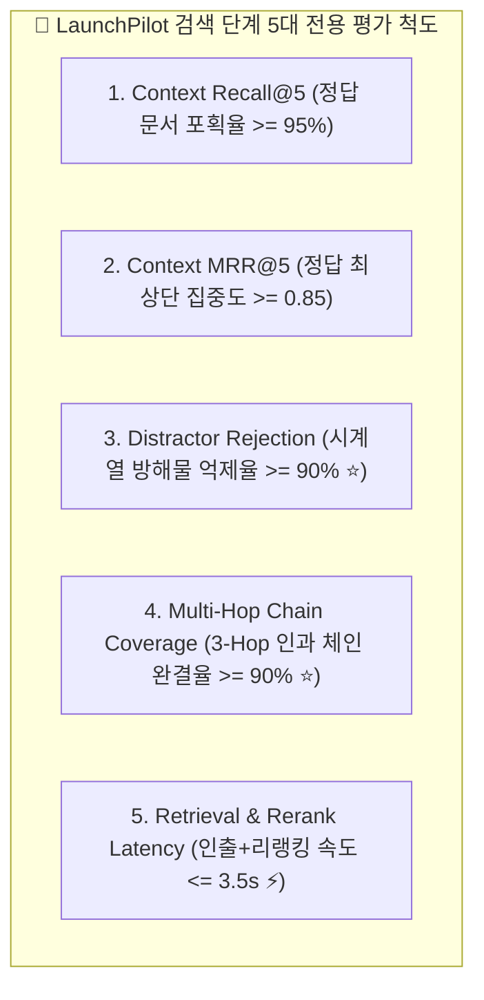

# 🎯 검색(Retrieval) 단계 공식 5대 평가 척도 체계 (Retrieval Evaluation Framework)

> **핵심 원칙**:
> RAG 시스템의 검색(Retrieval) 평가는 생성(Generation) LLM의 추론과 철저히 분리(Decoupling)되어야 하며, **에이전트의 워킹 메모리에 올라가는 후보 문서 풀의 신호 대 잡음비(SNR), 적시성, 인과 완결도를 독립적으로 계측**합니다.

---

## 🏛️ 검색 단계 5대 핵심 평가 척도 명세

| 번호 | 공식 척도명 | 수학적 수식 / 측정 알고리즘 | 목표 기준치 (Target) | 실무 엔지니어링 의미 |
| :---: | :--- | :--- | :---: | :--- |
| **1** | **Context Recall@5** | `Retrieved Ground Truth in Top-5 / Total Ground Truth Targets` | **>= 95.0%** | 에이전트가 답변을 작성하는 데 필요한 핵심 근거 문서를 놓치지 않고 포획하는 비율 |
| **2** | **Context MRR@5** | `1 / Rank(first_ground_truth)` | **>= 0.85** | 진짜 정답 문서가 1위~2위 상단에 위치하여 모델의 워킹 메모리 우선순위를 점유하는 능력 |
| **3** | **Distractor Rejection (방해물 억제율 ⭐)** | `1 - (Irrelevant Weekly Memos in Top-5 / Total Distractors in Corpus)` | **>= 90.0%** | **마케팅 특화 지표**: 10개의 유사한 정기 주간 일지 중 질문 시점과 무관한 9개를 Reranker가 상위권 밖으로 밀어내는 능력 |
| **4** | **Multi-Hop Coverage (인과 체인 완결도 ⭐)** | `Retrieved Path Nodes in Top-5 / Required 3-Hop Chain (기획+조치+회고)` | **>= 90.0%** | Causal Graph 및 복합 질의에서 3-Hop 인과 연결 경로 상의 모든 문서를 누락 없이 동시 인출하는 능력 |
| **5** | **Retrieval Latency** | `Time(Fetch) + Time(Batch Rerank)` | **<= 3.5s** | 다중 키워드 배치 수집 및 원샷 리랭킹이 실시간 사용자 체감 속도(SLA)를 충족하는지 검증 |

---

## 💻 구현 및 평가 도구
* **평가기 모듈**: `services/launchpilot-api/evals/retrieval_stage_evaluator.py`
* **벤치마크 데이터셋**: Golden V3 코퍼스 1,050개 문서 및 150건 qrels 레이블.
