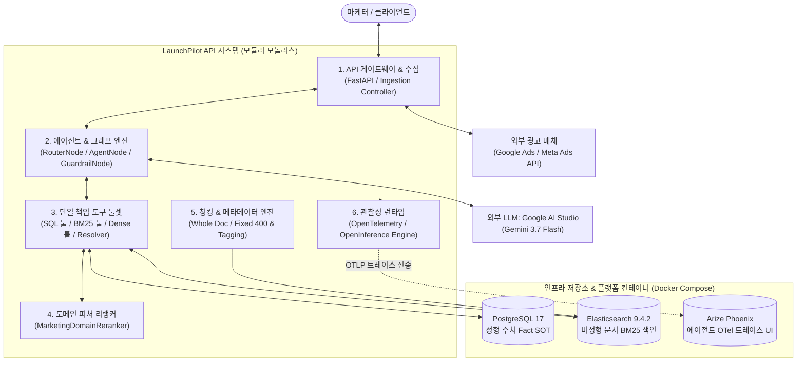

# LaunchPilot C3 Component Architecture

> 상태: **완료 및 검증** · 결정일: 2026-08-19

## 1. 개요 및 아키텍처 설계 원칙

LaunchPilot은 **엔터프라이즈 마케팅 에이전트 RAG 시스템**으로, 정형 광고 수치(SQL Fact)와 비정형 마케팅 문서(Brief, Memo, Analysis)의 이종 질의를 0% 오차와 0% 환각으로 해결하는 **모듈러 모놀리스(Modular Monolith)** 구조를 채택하고 있습니다.

---

## 2. C3 (Component) 다이어그램

---

## 3. 내부 핵심 컴포넌트 역할

| 컴포넌트 덩어리 | 소속 모듈 | 핵심 역할 |
| :--- | :--- | :--- |
| **1. API 게이트웨이 & 수집** | `bootstrap`, `campaigns` | • 마케터 요청 인증 및 API 엔드포인트 라우팅 • Google Ads / Meta Ads 데이터 수집 및 계정 동기화 |
| **2. 에이전트 & 그래프 엔진** | `analysis.graph`, `analysis.router` | • LangGraph 기반 실행 토폴로지 구동 • 테넌트 격리/시간 앵커 주입 및 Gemini 3.7 Flash 다단계 계획 수립 |
| **3. 단일 책임 도구 툴셋** | `analysis.tools`, `performance` | • 정형 SQL 조회 도구 (`get_campaign_performance`) • 비정형 키워드/시맨틱 검색 도구 (`search_documents_keyword / semantic`) |
| **4. 도메인 피처 리랭커** | `analysis.reranker` | • 문서 타입(BRIEF/MEMO/ANALYSIS) 정합도($w_3=0.15$) 및 실무 은어 가중치 교정 (1~3ms) |
| **5. 청킹 & 메타데이터 엔진** | `analysis.chunker`, `knowledge` | • 200~600토큰 문서 완결성 보존(`Whole Document`) 및 타입 메타데이터 색인 |
| **6. 관찰성 런타임** | `observability.runtime` | • API, SQL, LLM, 검색 전 구간 OpenTelemetry 비동기 분산 트레이스 수집 |

---

## 4. 인프라 저장소 & 플랫폼 컨테이너 (Docker Compose)

* **`PostgreSQL 17`**: 2,786개 일별 메트릭 Fact(오차 0%)의 유일한 **Source of Truth**.
* **`Elasticsearch 9.4.2`**: 900개 마케팅 문서의 **초저지연 역색인(Inverted Index) 프로젝션**.
* **`Arize Phoenix`**: 에이전트 다단계 도구 호출 루프와 검색 지표를 실시간 시각화하는 **오픈소스 관찰성 대시보드(Port 6006)**.

---

## 5. 외부 연동 시스템

1. **Google AI Studio (Gemini 3.7 Flash)**: 실시간 도구 자율 호출 및 다단계 추론 엔진.
2. **Google Ads & Meta Ads API**: 광고 계정 데이터 및 캠페인 성과 지표 외부 소스.
