# 대화형 분석 파이프라인 — 상태 기반 아키텍처 설계 보고서

## 0. 이 문서의 목적

지금까지 이 시스템은 "1→2→3→4단계가 순서대로 진행되는 절차"로 설명돼 왔습니다. 이 설명 자체는 틀리지 않았지만, 실제로 자유 대화·제안·스킵·검수가 얽히는 순간을 정확히 다루려면 "절차"보다 "상태 기반(state machine)" 관점으로 다시 짜야 합니다.

문제는 이 시스템을 한 장의 그림으로 그리려고 하면 매번 앞뒤가 안 맞는 그림이 나온다는 점이었습니다. 이유는 하나입니다 — 이 시스템은 실제로 **서로 다른 다섯 개의 질문**에 대한 답을 하나의 그림에 억지로 욱여넣고 있었기 때문입니다. 이 문서는 그 다섯 질문을 먼저 분리하고, 질문마다 답이 되는 그림을 따로 그린 뒤, 마지막에 전부를 하나로 통합한 최종 아키텍처도와, 실제 대화에서 벌어질 수 있는 시나리오 전수를 정리합니다.

---

## 1. 다섯 가지 관점 정의

시스템을 이해하려면 아래 다섯 질문을 각각 따로 던져야 합니다. 질문이 다르면 답(그림)도 다릅니다.

| 순번 | 관점 이름 | 던지는 질문 |
|---|---|---|
| 1 | 업무흐름 관점 | 이 프로젝트가 사업적으로 무슨 순서를 밟는가 |
| 2 | 능력구성 관점 | 어떤 능력(에이전트)들이 존재하고 서로 어떻게 재사용되는가 |
| 3 | 상태전이 관점 | 지금 이 순간, 대화가 정확히 어떤 상태에 있는가 |
| 4 | 데이터저장 관점 | 어떤 데이터가 얼마나 오래 어디에 남는가 |
| 5 | 시나리오 관점 | 실제 케이스 하나가 위 네 가지를 시간순으로 어떻게 관통하는가 |

이 다섯 관점은 서로 배타적입니다. 1번 그림에 "지금 상태가 뭔지"를 넣으려 하면 안 되고, 3번 그림에 "누가 일하는지"를 넣으려 하면 안 됩니다. 각자 자기 질문에만 답합니다.

---

## 2. 관점별 상세 다이어그램

### 2.1 업무흐름 관점 — "사업적으로 무슨 순서인가"

이 관점은 마일스톤의 고정 순서만 다룹니다. 순서는 바뀌지 않는 것이 원칙입니다(단, 사용자가 명시적으로 스킵을 요청하면 건너뛸 수 있습니다 — 이건 3번 관점에서 다룹니다).

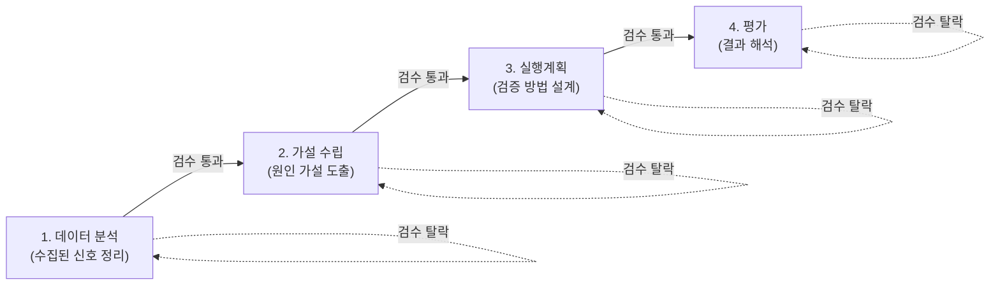

이 관점에서는 "이 마일스톤을 누가 실행하는지", "지금 대화가 몇 번째 제안 단계인지" 같은 정보는 전혀 등장하지 않습니다. 오직 "몇 개의 관문이 있고 순서가 어떻게 되는지"만 봅니다.

### 2.2 능력구성 관점 — "어떤 능력이 존재하고 어떻게 재사용되는가"

에이전트는 특정 단계에 고정 배속된 존재가 아니라, 필요할 때마다 어느 마일스톤에서든 불려 나가는 재사용 가능한 능력입니다.

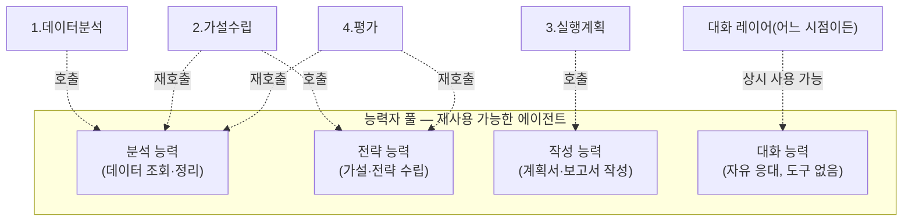

이 관점에서는 "순서"가 배경으로 물러나고, "이 능력이 몇 군데서 재사용되는지"만 보입니다. 분석 능력은 1단계 전용이 아니라 2·4단계에서도 다시 불려 나갑니다.

### 2.3 상태전이 관점 — "지금 이 순간 대화가 뭘 겪고 있는가"

이 관점은 대화의 매 턴마다 시스템이 들고 있는 "팻말"이 무엇인지를 다룹니다. 팻말은 세 가지 값만 가질 수 있습니다: idle / proposal_pending / skip_pending. skip_pending은 다시 세 가지 하위유형(subtype)으로 나뉩니다.

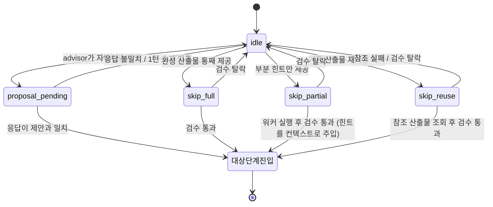

이 관점에서는 "누가 일하는지", "몇 단계인지"는 안 보입니다. 오직 이번 한 턴, 지금 뜬 카드가 무엇인지만 봅니다.

**이 상태를 실제로 담는 데이터 구조** (구현 위치: `apps/agent/app/runtime/state.py`):

```python
class PendingProposal(BaseModel):
    target_phase: PhaseType
    payload: str
    created_turn: int

class SkipSubtype(str, Enum):
    FULL_ARTIFACT = "FULL_ARTIFACT"
    PARTIAL_INPUT = "PARTIAL_INPUT"
    REUSE_PRIOR = "REUSE_PRIOR"
```

만료 판정 (`is_gate_still_valid`):

```python
def is_gate_still_valid(gate: PendingProposal | None, current_revision: int) -> bool:
    return gate is not None and current_revision - gate.created_turn <= 1
```

### 2.4 데이터저장 관점 — "무엇이 얼마나 오래 어디에 남는가"

시스템에는 수명이 서로 다른 세 종류의 저장소가 있습니다. 이걸 섞으면 안 됩니다.

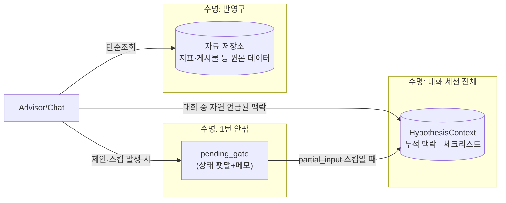

`HypothesisContext`의 실제 필드:

```python
class HypothesisContext(BaseModel):
    business_goal: Optional[str] = None       # 무엇을 개선하려는지
    target_segment: Optional[str] = None      # 누구 대상인지
    seasonal_context: Optional[str] = None    # 계절성/이벤트
    prior_attempts: Optional[str] = None      # 과거 시도 이력
    constraints: Optional[str] = None         # 예산/기간 제약
    user_hunch: Optional[str] = None          # 사용자 직감/초안
    market_context: Optional[str] = None      # 경쟁/시장 정보
```

빈 칸이 있어도 다음 단계 진입을 막지 않습니다. 대신 결과물에 "이 항목은 근거 없이 가정 처리했다"는 커버리지 표시가 붙습니다 (`hypothesis_context_coverage_note`).

### 2.5 시나리오 관점 — "실제 케이스 하나가 시간순으로 어떻게 흘러가는가"

대표적인 다섯 케이스를 시퀀스 다이어그램으로 그리면 아래와 같습니다.

**케이스 A — 그냥 대화만 하는 경우**

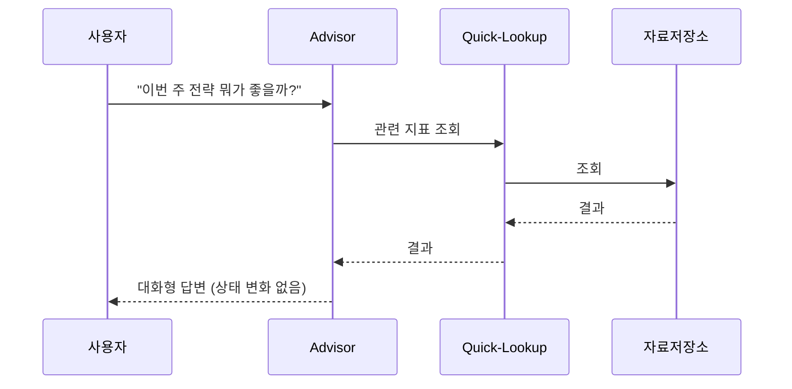

**케이스 B — 제안 후 확정**

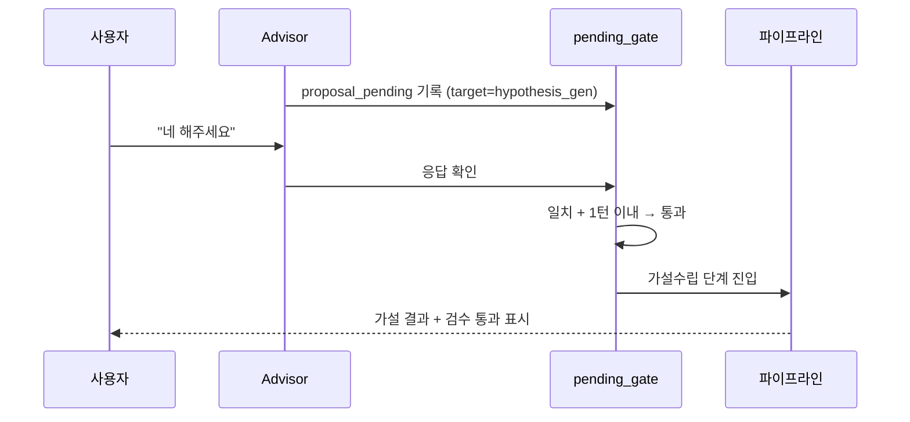

**케이스 C — 제안 후 무시됨**

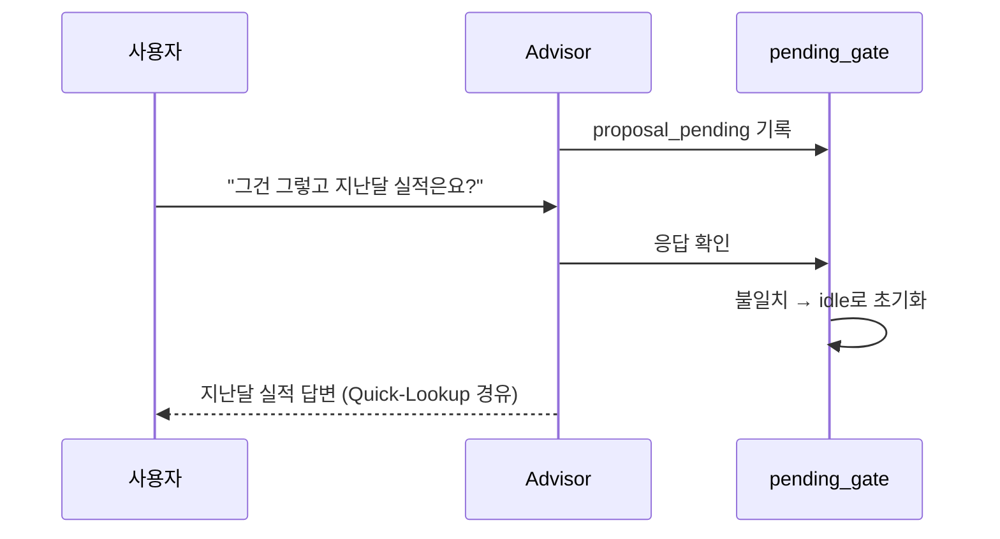

**케이스 D — 스킵 후 검수 통과**

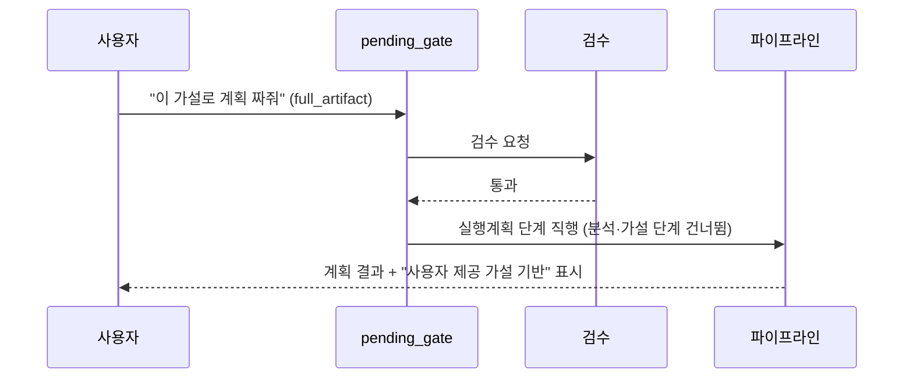

**케이스 E — 스킵 후 검수 탈락**

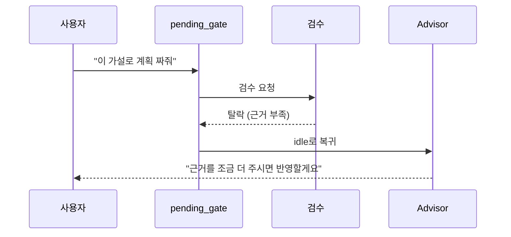

---

## 3. 통합 아키텍처도 — 최종본

다섯 관점을 한 장에 겹치면 아래와 같습니다. (참고용 통합본이며, 실제로 논의할 때는 위 개별 관점 그림을 우선 사용하는 것을 권장합니다.)

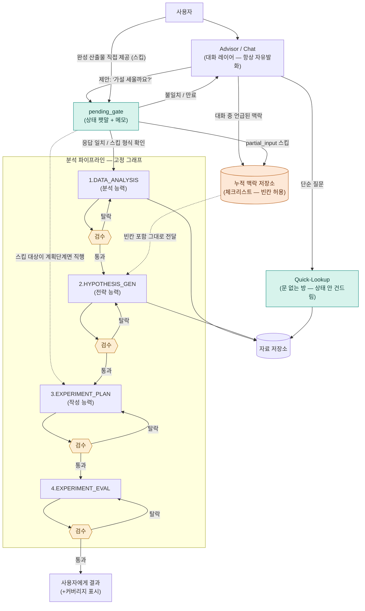

---

## 4. 실제 대화 시나리오 전수 — 8개 카테고리, 30개 사례

시스템에 들어올 수 있는 애매한 입력을 유형별로 묶으면 8개 축, 대표 사례 30개로 정리됩니다.

### 4.1 전략/조언성 애매질문 (5개)
1. "이번 주 전략은 어떤게 좋을까?"
2. "지금 우리 뭐부터 해야 될까요?"
3. "다음 캠페인 방향 좀 잡아줘"
4. "이거 어떻게 접근하면 좋을까"
5. "이 데이터 보고 어떤 인사이트 뽑을 수 있어?"

### 4.2 제안에 대한 애매한 응답 (5개)
6. "음... 글쎄요"
7. "그럴까요?"
8. "일단 보류할게요"
9. "좋아요" (직전 제안과 무관한 화제 직후일 수 있음)
10. "네" (단답, 시점 애매)

### 4.3 스킵인데 하위유형이 애매함 (5개)
11. "20대 이탈은 알림피로 때문일 것 같아요" (의견인지 완성 가설인지 불명)
12. "지난번에 만든 가설 그대로 써주세요" (어느 산출물인지 불명확)
13. "가설은 대충 이런 느낌으로, 나머진 알아서 채워줘"
14. "이 세 개 중에 하나로 진행해줘"
15. "제가 만든거 첨부할게요" (실제 내용 없이 말만 함)

### 4.4 한 메시지에 요청이 여러 개 (3개)
16. "지표 좀 보여주고, 그거 기반으로 가설도 세워줘"
17. "이전 계획 다시 보여주면서 동시에 새 가설도 하나 제안해줘"
18. "간단히 답 주고 정식 분석도 같이 돌려줘"

### 4.5 시점/유효기간 관련 애매함 (3개)
19. 제안 뜬 지 한참 지나서 "아 맞다 아까 그거 할게요"
20. 화제가 완전히 바뀐 뒤 "네 진행해주세요" (뭘 진행하라는 건지 불명)
21. 하루 지나 세션 다시 열고 "계속 진행해주세요"

### 4.6 되돌리기/취소성 애매함 (3개)
22. "아 잠깐만, 그거 말고 다른 걸로"
23. "다시 생각해보니 이전 단계로 돌아갈래요"
24. "그 가설 말고 새로 하나 해주세요" (기존 진행중인 산출물 폐기 여부 불명)

### 4.7 권한/전문가 스킵 오남용 애매함 (3개)
25. "그냥 승인, 다 믿을게요" (내용 없이 승인만 요청)
26. "제가 전문가니까 그냥 넘어가주세요" (근거 없이 권한만 주장)
27. "이거 검수 없이 그냥 넘겨주세요"

### 4.8 Quick-Lookup ↔ 정식분석 경계 애매 (3개)
28. "이 숫자가 왜 이런지 설명해줘"
29. "이 추세가 계속될까?"
30. "이거 문제 있는 거 아니야?"

### 4.9 통합 처리 워크플로우

30개 사례 전부가 아래 하나의 분류 깔때기로 흡수됩니다. 사례마다 별도 로직을 추가하는 게 아니라, 정해진 몇 개의 출구 중 하나로 떨어지는 구조입니다.

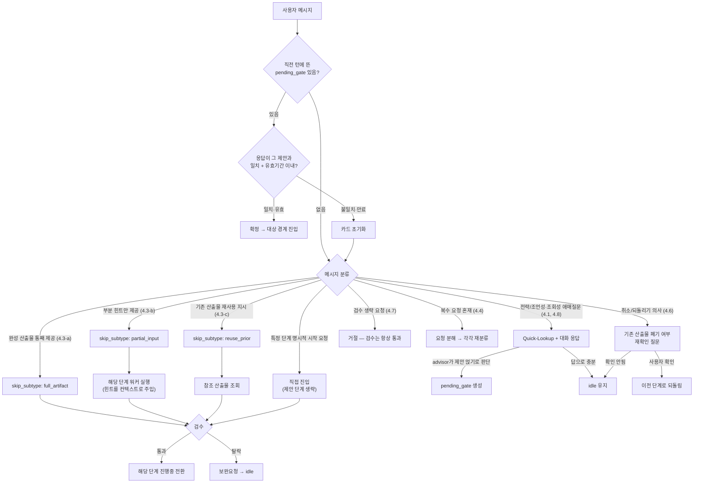

시점/유효기간 애매함(4.5)은 별도 출구가 없습니다. 맨 위 `C1`의 "유효기간 이내" 조건에서 자동 흡수됩니다 — 한참 지난 응답은 그냥 불일치로 처리되어 카드가 초기화되고, 이후 `CLS`에서 새로 분류됩니다.

**구현 범위 주석:** 위 30개 사례 중 4.3(스킵 하위유형), 4.1/4.8(Quick-Lookup 경계), "제안-확인" 경로(4.2, 4.5 관련 C0/C1)는 이번 변경으로 실제 코드에 반영됐습니다. 4.4(복수 요청 분해), 4.6(되돌리기 재확인), 4.7(검수 생략 거절)은 기존 BACKTRACK/가드 로직으로 이미 상당 부분 커버되며, 세부 문구 다듬기는 후속 과제입니다.

---

## 5. 검수(리뷰어) 메커니즘

검수는 워커(분석/전략/작성 능력)가 낸 결과물을 두고 "다음 단계로 넘어가도 되는 최소 기준을 통과했는가"를 판정하는 절차입니다. 결과물을 만든 주체와, 그걸 통과시킬지 결정하는 주체가 분리되어 있습니다 — 워커가 스스로 "이 정도면 됐다"고 판단하는 게 아니라, 고정된 조건표가 판정합니다.

단계별 확인 항목 예시:

- **분석 단계**: 신호를 최소 개수 이상 정리했는지, 숫자 근거가 실제로 붙어있는지
- **가설 단계**: 검증 가능한 형태인지, 근거와 연결되는지
- **계획 단계**: 실행 가능한 구체적 절차인지, 필수 항목(기간·측정지표·방법)이 채워졌는지
- **평가 단계**: 결과가 처음 가설과 연결되는지, 결론이 근거로 뒷받침되는지

이 검수는 4개 마일스톤 경계마다 동일하게 반복되며, 스킵으로 특정 단계에 직행한 경우에도 예외 없이 그 지점의 검수를 통과해야 합니다.

---

## 6. 확장성 — 에이전트가 추가되거나 분할될 때

| 변경 유형 | 영향 범위 |
|---|---|
| 완전히 새로운 마일스톤 추가 | 정거장 목록에 항목 하나, 담당 능력자 하나, 진입 조건 하나만 추가. 기존 마일스톤 코드는 무변경 |
| 기존 마일스톤 내부에서 능력자 증설/분할 | 바깥에서 보이는 산출물 형태가 같으면 완전히 격리됨. 팻말·검수·다른 마일스톤 전부 무영향 |
| 마일스톤 자체를 분할 | 다음 마일스톤의 진입 조건문 하나만 같이 손보면 됨. 전체 재설계 아님 |

이 확장성은 "능력자 = 재사용 가능한 풀"과 "마일스톤 = 고정 순서"를 분리해 둔 2.2절 구조 덕분에 성립합니다.

---

## 7. 남은 논의사항

- `HypothesisContext`의 7개 체크리스트 항목 중 `user_hunch` 외 6개(business_goal 등)는 아직 자동 채움 경로가 없습니다 — 지금은 `partial_input` 스킵으로만 채워집니다. 캐주얼한 대화 중 자연스럽게 언급된 내용을 자동으로 뽑아 채우려면 별도 추출 호출이 필요하며, 이번 변경 범위에서는 제외했습니다.
- 검수 조건표(5절 예시)의 구체적 임계값(최소 신호 개수 등)은 아직 미정 — 실측 데이터 기반 조정 필요.
- 제안-확인(`pending_gate` 생성) 판정은 advisor 응답 뒤에 붙는 별도 판정(`suggestion_scout`)이 담당하며, 확정 시 사용자 응답의 좁은 키워드 매칭(`_affirmative_reply`)만 봅니다 — 의도적으로 좁게 만든 규칙이며, 오탐 사례가 쌓이면 목록을 조정해야 합니다.

## 참고 (세부 근거)

- `apps/agent/app/runtime/state.py` — `PendingProposal`, `SkipSubtype`, `HypothesisContext`, `is_gate_still_valid`, `hypothesis_context_coverage_note`
- `apps/agent/app/runtime/transitions.py` — `SKIP_SUBMIT` 규칙, 제안-확인 판정, 승인 가드
- `apps/agent/app/orchestration/loop.py` — `_scout_for_suggestion`
- `apps/agent/app/orchestration/phases/hypothesis.py` — 힌트 주입, 커버리지 안내
- `apps/agent/app/agents/adk_agents.py`, `instructions.py`, `output_schemas.py` — Quick-Lookup 도구 연결, `suggestion_scout` 에이전트
- `apps/agent/tests/test_skip_gate.py`, `test_suggestion_scout.py`, `test_agent_loop_goal.py`
