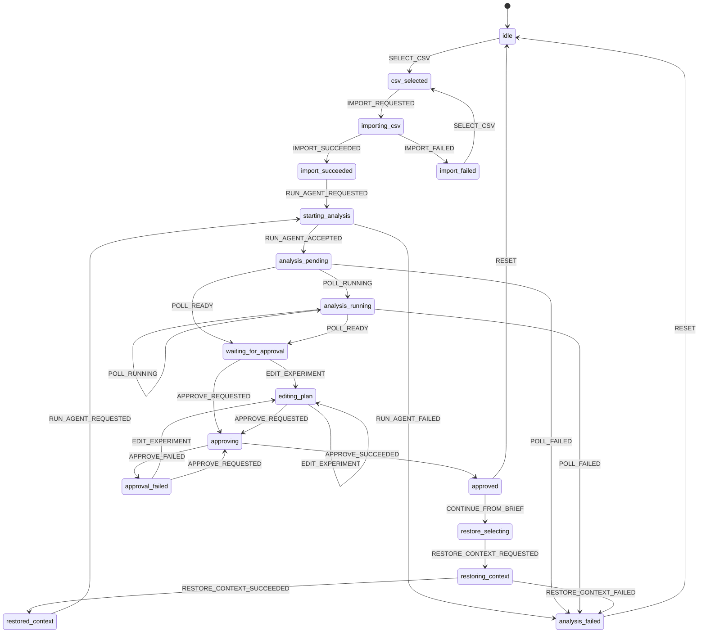

# LaunchPilot Frontend State Machine

Status: Draft v0.1  
Scope: War Room frontend state machine for the main analysis-to-approval flow  
Last updated: 2026-06-01

## Purpose

The frontend is a stateful workroom over an asynchronous backend contract.

This state machine translates the contracts and executable scenario into implementation rules for the Next.js UI. It is the bridge between:

- `contracts/01-frontend-java/frontend-types.ts`
- `scenarios/main-analysis-approval.scenario.json`
- `e2e/main-analysis-approval.mock.spec.ts`
- `docs/product/mvp-requirements-traceability.md`

## Design Principles

- The frontend only talks to the Java Backend public API.
- Candidate experiment plans live in frontend memory until approval.
- Backend polling state is the source of truth for analysis progress.
- User edits are local draft state until `APPROVE_REQUESTED`.
- Approval success creates calendar/brief output and moves the UI into an approved state.
- A continued session must preserve the linear chain from prior hypothesis to approved action, observed result, and next recommendation.
- The reducer should make impossible states unrepresentable.

## High-Level State Diagram



## State Model

Recommended TypeScript shape:

```ts
import type {
  AgentResultPayload,
  AgentRunStatus,
  ApproveExperimentPlanResponse,
  CalendarEventRef,
  ExperimentItem,
  ImportCsvResponse,
  ToolCallLog,
} from "@/contracts/frontend-types";

type WarRoomState =
  | { tag: "idle" }
  | { tag: "csv_selected"; file: File }
  | { tag: "importing_csv"; file: File }
  | { tag: "import_succeeded"; file: File; importResult: ImportCsvResponse }
  | { tag: "import_failed"; file?: File; message: string }
  | {
      tag: "starting_analysis";
      source:
        | { kind: "csv_import"; importResult: ImportCsvResponse }
        | {
            kind: "continued_brief";
            parentBriefId: string;
            previousHypothesis: string;
            previousActionSummary: string;
            observedResultSummary: string | null;
            continuityPrompt: string;
          };
    }
  | { tag: "analysis_pending"; agentRunId: string; status: "PENDING"; toolLogs: ToolCallLog[] }
  | {
      tag: "analysis_running";
      agentRunId: string;
      status: Exclude<AgentRunStatus, "PENDING" | "WAITING_FOR_APPROVAL" | "SUCCESS" | "FAILED">;
      currentStage: string | null;
      toolLogs: ToolCallLog[];
    }
  | {
      tag: "waiting_for_approval";
      agentRunId: string;
      payload: AgentResultPayload;
      selectedExperimentIds: string[];
      draftExperiments: ExperimentItem[];
      toolLogs: ToolCallLog[];
    }
  | {
      tag: "editing_plan";
      agentRunId: string;
      payload: AgentResultPayload;
      selectedExperimentIds: string[];
      draftExperiments: ExperimentItem[];
      toolLogs: ToolCallLog[];
      dirty: true;
    }
  | {
      tag: "approving";
      agentRunId: string;
      payload: AgentResultPayload;
      selectedExperimentIds: string[];
      draftExperiments: ExperimentItem[];
    }
  | {
      tag: "approved";
      agentRunId: string;
      approval: ApproveExperimentPlanResponse;
      calendarEvents: CalendarEventRef[];
      finalExperiments: ExperimentItem[];
    }
  | {
      tag: "restore_selecting";
      parentBriefId: string;
    }
  | {
      tag: "restoring_context";
      parentBriefId: string;
    }
  | {
      tag: "restored_context";
      parentBriefId: string;
      previousHypothesis: string;
      previousActionSummary: string;
      observedResultSummary: string | null;
      continuityPrompt: string;
    }
  | {
      tag: "analysis_failed" | "approval_failed";
      agentRunId?: string;
      message: string;
      recoverable: boolean;
    };
```

## Events

```ts
type WarRoomEvent =
  | { type: "SELECT_CSV"; file: File }
  | { type: "IMPORT_REQUESTED" }
  | { type: "IMPORT_SUCCEEDED"; importResult: ImportCsvResponse }
  | { type: "IMPORT_FAILED"; message: string }
  | { type: "RUN_AGENT_REQUESTED" }
  | { type: "RUN_AGENT_ACCEPTED"; agentRunId: string }
  | { type: "RUN_AGENT_FAILED"; message: string }
  | { type: "POLL_RUNNING"; status: AgentRunStatus; currentStage: string | null; toolLogs: ToolCallLog[] }
  | { type: "POLL_READY"; agentRunId: string; payload: AgentResultPayload; toolLogs: ToolCallLog[] }
  | { type: "POLL_FAILED"; agentRunId?: string; message: string }
  | { type: "TOGGLE_EXPERIMENT"; experimentId: string; selected: boolean }
  | { type: "EDIT_EXPERIMENT"; experimentId: string; patch: Partial<ExperimentItem> }
  | { type: "APPROVE_REQUESTED" }
  | { type: "APPROVE_SUCCEEDED"; approval: ApproveExperimentPlanResponse }
  | { type: "APPROVE_FAILED"; message: string }
  | { type: "CONTINUE_FROM_BRIEF"; parentBriefId: string }
  | { type: "RESTORE_CONTEXT_REQUESTED" }
  | {
      type: "RESTORE_CONTEXT_SUCCEEDED";
      previousHypothesis: string;
      previousActionSummary: string;
      observedResultSummary: string | null;
      continuityPrompt: string;
    }
  | { type: "RESTORE_CONTEXT_FAILED"; message: string }
  | { type: "RESET" };
```

## Transition Rules

| From | Event | To | Notes |
| --- | --- | --- | --- |
| `idle` | `SELECT_CSV` | `csv_selected` | Store the selected file only. |
| `csv_selected` | `IMPORT_REQUESTED` | `importing_csv` | Calls `POST /api/import/csv`. |
| `importing_csv` | `IMPORT_SUCCEEDED` | `import_succeeded` | Store `ImportCsvResponse`. |
| `importing_csv` | `IMPORT_FAILED` | `import_failed` | Show retry affordance. |
| `import_succeeded` | `RUN_AGENT_REQUESTED` | `starting_analysis` | Calls `POST /api/agent/run` with `source.kind = "csv_import"`. |
| `starting_analysis` | `RUN_AGENT_ACCEPTED` | `analysis_pending` | Store `agent_run_id`. |
| `analysis_pending` | `POLL_RUNNING` | `analysis_running` | `payload` must be null. |
| `analysis_running` | `POLL_RUNNING` | `analysis_running` | Append/replace tool logs. |
| `analysis_pending` / `analysis_running` | `POLL_READY` | `waiting_for_approval` | Initialize `draftExperiments` from `payload.experiment_plan.items`. |
| `waiting_for_approval` | `EDIT_EXPERIMENT` | `editing_plan` | Local-only draft mutation. |
| `waiting_for_approval` / `editing_plan` | `APPROVE_REQUESTED` | `approving` | Builds `ApproveExperimentPlanRequest`. |
| `approving` | `APPROVE_SUCCEEDED` | `approved` | State passing to calendar can use local final experiments. |
| `approving` | `APPROVE_FAILED` | `approval_failed` | Preserve local draft through retry. |
| `approved` | `CONTINUE_FROM_BRIEF` | `restore_selecting` | Start a new analysis from an approved `growth_brief_id`. |
| `restore_selecting` | `RESTORE_CONTEXT_REQUESTED` | `restoring_context` | Load previous hypothesis, approved action, and observed result context. |
| `restoring_context` | `RESTORE_CONTEXT_SUCCEEDED` | `restored_context` | Show continuity context before the next run. |
| `restored_context` | `RUN_AGENT_REQUESTED` | `starting_analysis` | Calls `POST /api/agent/run` with `source.kind = "continued_brief"` and `parent_brief_id`. |
| `restoring_context` | `RESTORE_CONTEXT_FAILED` | `analysis_failed` | Restore failure blocks continuation. |
| `analysis_failed` / `approved` | `RESET` | `idle` | Start over. |

## Screen Mapping

| State | Primary Screen | Required UI |
| --- | --- | --- |
| `idle` | Empty War Room | CSV input labeled with `CSV`; disabled or secondary analyze button. |
| `csv_selected` | Upload Review | File name, row expectations, primary analyze/import action. |
| `importing_csv` | Import Progress | Uploading/indexing status. |
| `import_succeeded` | Ready To Analyze | Imported row count, campaign scope, primary analysis action. |
| `starting_analysis` | Starting Analysis | Non-blocking spinner, request accepted copy. |
| `analysis_pending` | Analysis Pending | Agent run ID, polling status. |
| `analysis_running` | Evidence Search / Reasoning | Visible copy matching `Analyzing`, `Running evidence`, or `Searching evidence`; tool logs. |
| `waiting_for_approval` | Three-Panel Workroom | Signals, hypotheses, experiment plan, editable experiment title field, approve button. |
| `editing_plan` | Three-Panel Workroom | Dirty indicator, selected experiment count, approve button. |
| `approving` | Approval In Progress | Disable edits and show persistence status. |
| `approved` | Calendar / Brief Confirmation | Approved experiment title and approval/calendar confirmation. |
| `analysis_failed` | Recoverable Error | Failure message and reset/retry actions. |
| `approval_failed` | Approval Error | Preserve draft and allow retry. |
| `restore_selecting` | Continue Prior Brief | Selected prior brief ID and continue action. |
| `restoring_context` | Restoring Context | Loading prior brief lineage. |
| `restored_context` | Continuity Workroom | Previous hypothesis, approved action, observed result, next analysis prompt. |

## API Side Effects

| Event | API | Contract |
| --- | --- | --- |
| `IMPORT_REQUESTED` | `POST /api/import/csv` | `contracts/01-frontend-java/examples/import-csv-response.json` |
| `RUN_AGENT_REQUESTED` | `POST /api/agent/run` | `contracts/01-frontend-java/examples/agent-run-accepted-response.json` |
| polling tick | `GET /api/agent/runs/{agent_run_id}` | running or ready agent run response |
| `APPROVE_REQUESTED` | `POST /api/agent/actions/{agent_run_id}/approve` | `approve-experiment-plan-response.json` |
| `RESTORE_CONTEXT_REQUESTED` | Frontend prepares local lineage context from the approved brief or selected history entry | `contracts/03-java-elastic/examples/growth-brief.json` |
| continued `RUN_AGENT_REQUESTED` | `POST /api/agent/run` with `parent_brief_id` | `contracts/01-frontend-java/openapi.yaml`, `contracts/04-agent-elastic-mcp/examples/load-growth-brief-context-response.json` |

## MVP Analyze Action

For the MVP, the visible primary action after CSV selection is a single `Analyze` button.

Internally, this button runs two ordered effects:

1. Dispatch `IMPORT_REQUESTED` and call `POST /api/import/csv`.
2. After `IMPORT_SUCCEEDED`, dispatch `RUN_AGENT_REQUESTED` and call `POST /api/agent/run`.

The state machine keeps `import_succeeded` as an explicit state because importing and analysis are different backend responsibilities. The UI may pass through it immediately without requiring a second user click.

The user-facing progress copy must still distinguish import work from agent reasoning.

## Approval Request Construction

When moving from `waiting_for_approval` or `editing_plan` into `approving`, construct:

```ts
const request: ApproveExperimentPlanRequest = {
  experiment_plan_id: state.payload.experiment_plan.id,
  approved_by: "demo_user",
  final_experiments: state.draftExperiments.filter((experiment) =>
    state.selectedExperimentIds.includes(experiment.id),
  ),
};
```

Validation before approval:

- At least one experiment must be selected.
- Every selected experiment must have `title`, `hook`, `cta`, `success_criteria`, `scheduled_at`, and `production_brief`.
- `experiment_plan_id` must come from the latest `POLL_READY` payload.
- MVP default is to approve all draft experiments. Dedicated checkbox selection is deferred; a later chat or command interaction may mutate the draft experiment set before approval.

## Continuity And Restore Rules

Continuation is part of the campaign learning loop, not a generic history feature.

When the user continues from an approved brief, preserve this lineage:

1. `parent_brief_id`
2. previous approved hypothesis
3. previous approved action or experiment
4. observed result or metric outcome, when available
5. next analysis question

`RUN_AGENT_REQUESTED` from `restored_context` must include `parent_brief_id` in the request body. The Python agent then uses `load_growth_brief_context` through the Elastic MCP wrapper to retrieve the approved prior context.

The UI must make the lineage visible in the continuation surface. The next recommendation should be framed as a follow-up to the previous hypothesis/action/result chain, not as an unrelated fresh analysis.

## Polling Rules

- Poll only in `analysis_pending` and `analysis_running`.
- Recommended interval: 1500ms.
- Stop polling immediately on `WAITING_FOR_APPROVAL` or `FAILED`.
- Treat `SUCCESS` from public API as already approved/restored state, not as the normal Python terminal state.

## Playwright Acceptance Hooks

The current happy-path E2E spec expects these accessible affordances:

- File input label containing `CSV`.
- Primary analysis button named `Analyze`, `Analyse`, or `Run analysis`.
- Running text containing `Analyzing`, `Running evidence`, or `Searching evidence`.
- Generated signal text: `BTS shorts outperformed recent baseline`.
- Generated hypothesis text containing `raw behind-the-scenes clips may be converting`.
- Generated experiment title: `BTS face-first hook test`.
- Editable title textbox accessible by `Experiment title` or `Title`.
- Approval button named `Approve` or `Approve Experiments`.
- Approved/calendar confirmation text containing `Human approval processed`, `Approved`, or `Calendar`.

These hooks are not decorative; they are the first executable acceptance target for frontend implementation.

## Reducer Guidance

- Keep all network effects outside the reducer.
- Reducer handles events only.
- Effects observe state changes and dispatch follow-up events.
- Do not store pending candidate experiments in Elastic before approval.
- Keep original `payload` immutable and apply user edits to `draftExperiments`.
- `selectedExperimentIds` should default to all experiment IDs from the ready payload for the happy path.
- Keep continuity context immutable during a continued run; user edits apply to the next draft, not to the prior approved brief.
