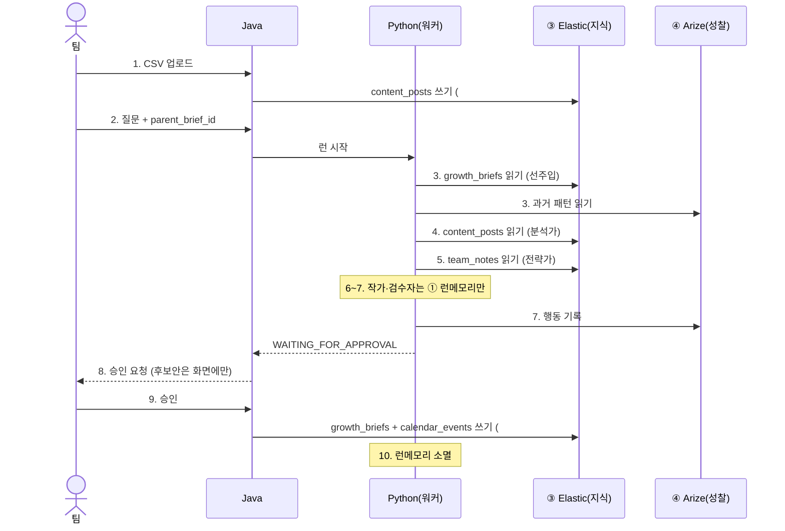

# 메모리 & DB 흐름

> 데이터가 **언제 어디에 쓰이고 읽히나**를 한 문서로. report.md §7(계층 표)의 상세판.
> 핵심 한 줄: **에이전트는 Elastic에 안 쓴다. 읽기만. 영구 저장은 Java가 import·승인 딱 2번.**

---

## 0. 메모리는 4층 (한 통으로 보면 안 됨)

"단기기억"을 한 덩어리로 보면 꼬인다. 수명·주인·용도가 다 다르니 4층으로 가른다.

| 층 | 수명 | 주인 | 들어가는 것 | 용도 | report.md |
|---|---|---|---|---|---|
| **① 런메모리** | 런 1회 (끝나면 소멸) | Python 프로세스 | 이번 런의 신호·가설·초안 | 워커끼리 주고받기 + 백트래킹 때 재사용 | L1/L2 |
| **② 세션** | 대화 세션 | **Java** | 메시지 타임라인·승인 상태·sequence | 끊겨도 리플레이, 승인 처리 | (Java 소유) |
| **③ 지식 (Elastic)** | 영구 | Java 쓰기 / Python 읽기 | content_posts·growth_briefs·calendar_events·team_notes | 근거 검색 + 결과 보관 | L3 |
| **④ 성찰 (Arize/Phoenix)** | 런 넘어 누적 | Python 쓰기 | 과거 트레이스·평가 | 검수 기준 보정 (근거 아님) | L4 |

> **진짜 "단기"는 ①뿐.** ②는 Java 소유라 ①과 섞으면 안 되고, ④는 런을 넘어 쌓이니 단기 아님. "Elastic 메타데이터(인덱스 구조)"는 메모리 아님 — 시작 때 인덱스 모양 확인용일 뿐.

---

## 1. E2E 순서 — 이어가는 2차 캠페인 (모든 층이 다 나옴)

지난주 1차 캠페인이 승인돼 `growth_briefs`에 brief1이 이미 있는 상태. 이번 주 2차.

| # | 누가 | 한 일 | 건드리는 메모리 |
|---|---|---|---|
| 1 | 팀 → Java | 5월 CSV 업로드 | Java 파싱 → **③ `content_posts` 쓰기 (1번째 쓰기)** |
| 2 | 팀 → Java | "지난번 이어서 다음 주 뭐 테스트?" + `parent_brief_id` 입력, Analyze | **② user 메시지 기록** / Java→Python 런 시작 |
| 3 | Orchestrator | 이어가기니까 이전 브리프 불러옴 | **③ `growth_briefs`(brief1) 읽기** → **① 런메모리에 선주입** / **④ 과거 실패패턴 읽기** |
| 4 | 분석가 | 신호 찾기 | **③ `content_posts` 읽기** (배율 계산·근거 게시물) → 신호 **① 쓰기** / 진행상황 **② 기록** |
| 5 | 전략가 | 왜 가설 | **③ `team_notes` 읽기** + **① 신호 읽기** → 가설 **① 쓰기** |
| 6 | 작가 | 실험안 | **① 가설 읽기** → 실험안 **① 쓰기**. **Elastic 안 건드림 (도구 0)** |
| 7 | 검수자 | 통과/반려 | **① 전체 읽기** + **④ 과거 패턴 읽기** → 판정. 런 내내 행동 **④ 쓰기** |
| 8 | Java → 팀 | "승인하실래요?" | 후보안은 아직 **화면(React state)에만.** 어떤 DB에도 없음 |
| 9 | 팀 → Java | 검토·수정 후 승인 | Java가 **③ `growth_briefs`(brief2) + `calendar_events` N개 쓰기 (2번째 쓰기)** / **② 승인 기록** |
| 10 | — | 런 종료 | **① 런메모리 전부 소멸.** 남는 것: ③ brief2(다음 캠페인의 parent) · ② 세션 기록 · ④ 트레이스 |

---

## 2. 변하지 않는 규칙 3개

1. **Elastic(③)에 쓰는 건 Java만, 런당 딱 2번** — ① import, ② 승인. 그 사이 분석·추론은 전부 ① 런메모리에서만.
2. **③ 읽는 워커는 분석가·전략가뿐.** 작가·검수자는 Elastic 안 봄.
3. **① 런메모리는 저장이 아니다.** 런 끝나면 사라짐. 영구로 남기려면 승인해서 ③에 박아야 함.

---

## 3. 층별 설계 (어떻게 만들지)

### ① 런메모리 — Python 프로세스 안

- `run_id`로 키. 신호·가설·실험안 초안을 단계별로 쌓음.
- §4 백트래킹의 핵심: 검수 반려 시 **성공한 부분은 그대로 두고 틀린 것만** 다시 생성. 그 "성공한 부분"이 여기 있음.
- **영구 저장 안 함.** 런이 죽으면 그 런은 FAILED 처리하고 다시 시작 (중간상태 복구 안 함). MVP는 이대로 충분.
- 참조: agent-tool-spec §4-C (재사용 4원칙).

### ② 세션 — Java 소유

- 메시지 타임라인을 `sequence` 붙여 보관 → 끊겨도 리플레이 (이미 계약됨: `contracts/01-frontend-java/asyncapi.yaml`).
- 승인 게이트·승인 결과(`approval.committed`)도 Java가 소유.
- **런메모리(①)와 절대 안 섞음.** 세션은 "대화·승인"이고 런메모리는 "추론 중간물".

### ③ 지식 (Elastic) — 영구 DB

| 인덱스 | 언제 써짐 | 누가 | 용도 |
|---|---|---|---|
| `content_posts` | import | Java | 분석가 근거·배율 계산 원천 |
| `growth_briefs` | 승인 | Java | 승인 결과 보관 + 이어가기 parent |
| `calendar_events` | 승인 | Java | 캘린더 화면용 |
| `team_notes` | **사전 시드** (런과 무관) | 시드/팀 | 전략가 정성 근거 |

- Java 쓰기, Python은 **읽기 전용**(Elastic MCP 경유, `contracts/04`).
- 불변(append-only): 승인 결과는 수정·삭제 없음. 수정 = 새 `growth_brief_id` + version++.

### ④ 성찰 (Arize/Phoenix) — 관측·복기

- Python이 런 내내 행동을 트레이스로 기록 (OpenInference, `contracts/06`).
- 시작·검수 때 과거 트레이스·낮은 평가를 읽어 검수 기준만 보정.
- **근거 아님.** 최종 결과(payload)에 절대 안 들어감.

---

## 4. 🔴 정해야 할 것

| # | 결정 | 권장 | 근거 |
|---|---|---|---|
| 1 | `team_notes` **누가·언제·무슨 필드로** 넣나 | 데모용 **사전 시드 스크립트**. 필드 최소: `note_id`·`workspace_id`·`campaign_id`·`text`·`created_at`(+선택 `channel`) | 런 흐름과 무관한 참조 데이터. Java import 경로 재사용 가능 |
| 2 | 런메모리(①) 영구 저장하나 | **안 함** (MVP) | 죽으면 재시작이 단순·안전. 중간복구는 과한 복잡도 |
| 3 | Python이 Elastic에 쓰나 | **안 씀, 읽기 전용** | report.md 규칙 유지. 쓰기 책임은 Java 단일 |
| 4 | `team_notes` Java-Elastic 문서 계약(03) 추가하나 | 시드만 할 거면 **04 읽기 계약으로 충분**, 03은 선택 | Java가 안 쓰면 03(쓰기 계약)에 없는 게 맞음 |

> 정하면 report.md §7·§11, contracts/03·04에 반영.

---

## 5. 원본 링크

- 시스템 전체: [`docs/report.md`](report.md) §7
- 에이전트 내부·백트래킹: [`docs/agent-tool-spec.md`](agent-tool-spec.md) §4
- 세션 계약(②): [`contracts/01-frontend-java/asyncapi.yaml`](../contracts/01-frontend-java/asyncapi.yaml)
- 지식 읽기(③): [`contracts/04-agent-elastic-mcp/`](../contracts/04-agent-elastic-mcp/README.md)
- 지식 쓰기(③): [`contracts/03-java-elastic/`](../contracts/03-java-elastic/README.md)
- 성찰(④): [`contracts/06-observability/`](../contracts/06-observability/README.md)
