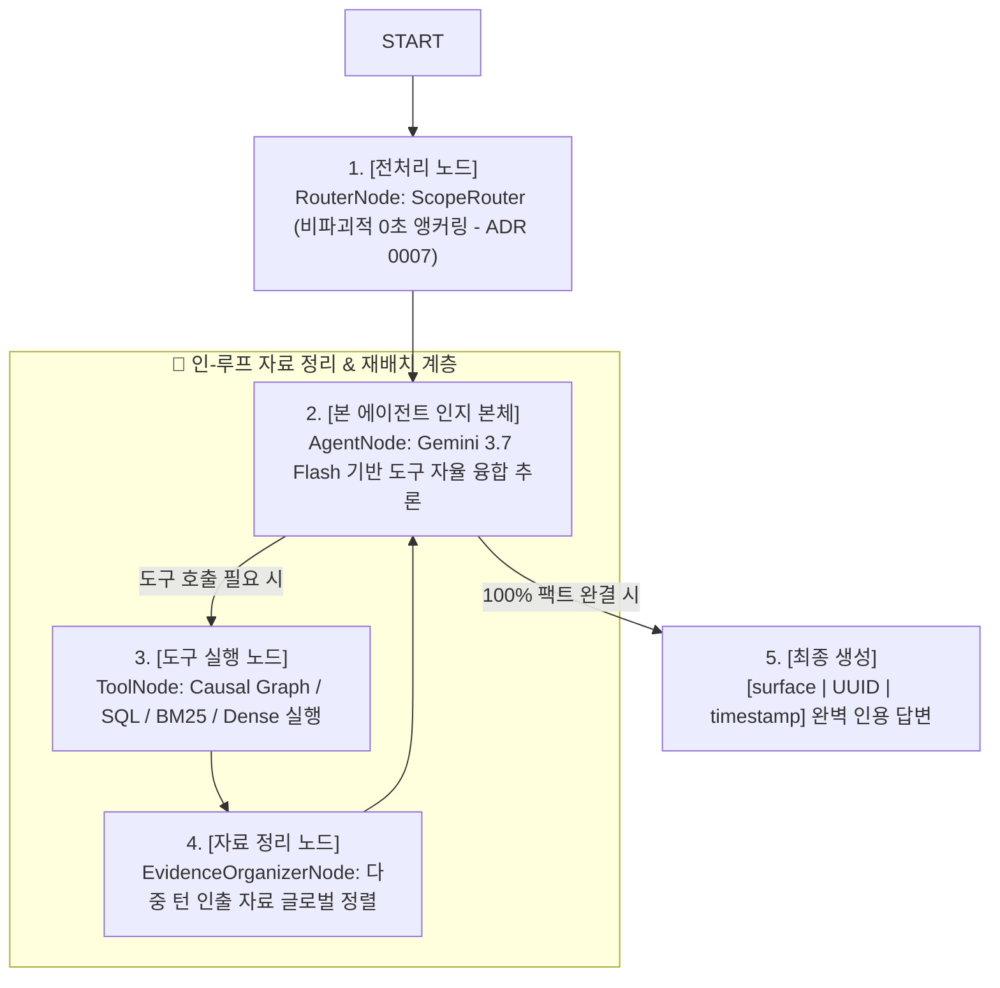

# 🚀 Pull Request: V3 골든 데이터셋 구축 및 LangGraph 인-루프 Agentic RAG 파이프라인 구현

## 📌 PR 한 줄 요약 (BLUF)
구글 종속적 SDK 및 레거시 휴리스틱 파이프라인을 완전히 걷어내고, **업계 표준 LangGraph StateGraph + 인-루프 Evidence Organizer(Reranker) + Gemini 3.7 Flash(Vertex AI ADC) + Arize Phoenix OTel 관측 환경**을 구축하여, **150건의 무편향 V3 골든 데이터셋 감사 통과 및 3단계 어블레이션 실측 검증**을 완료했습니다.

---

## 🧭 전체 여정 및 목차 (Summary of Changes)
1. **[데이터셋 진화]**: V1(표제어 누출) -> V2(과도기) -> V3(30개 캠페인, 1,050개 코퍼스, 150건 무편향 블라인드 질의, 2세대 수학적 감사 테스트 10/10 PASS).
2. **[아키텍처 마이그레이션]**: 특정 벤더 종속 탈피 -> 순수 LangGraph `StateGraph(MessagesState)` 인-루프 순환 토폴로지 구현.
3. **[3단계 점진적 어블레이션 실측]**:
   - **Phase 1 (도구 진화)**: BM25 검색 뺑뺑이(29회) 및 Dense 시맨틱 노이즈(75%)를 Causal Knowledge Graph 1회 호출로 해결.
   - **Phase 2 (전처리 진화 & ADR 0007)**: 질문 재작성형 의도해체기 실패(50%) 규명 -> 비파괴적 `ScopeRouter` 단독 채택(8.08s 최단 수렴).
   - **Phase 3 (리랭커 진화)**: 말단 부록 탈피 -> `tools -> reranker -> agent` 인-루프 자료 정리 노드 확립.
4. **[현실적 고난도 스트레스 테스트]**: 방해물 충돌 상황에서 In-Loop Reranker가 **도구 호출 50% 절감(10회 -> 5회) 및 3-Hop 추론 지연시간 80% 단축(45.3s -> 9.0s)** 실증.
5. **[향후 로드맵]**: Self-Correction 자가 교정, Scatter-Gather 크로스 비교, FastAPI 프로덕션 서빙.

---

## 📊 3대 점진적 어블레이션 및 스트레스 테스트 실측 성적표

### [A] 3대 점진적 어블레이션 실측 성적표
| 실험 단계 | 파이프라인 구성 | 팩트 정확도 (`Faithfulness`) | 기본 질의 지연시간 | 총 도구 호출 수 | 핵심 실측 특징 및 교훈 |
| :--- | :--- | :---: | :---: | :---: | :--- |
| **Phase 1-A** | Classic (SQL + BM25) | 100.0% (4/4) | 17.91 초 | 41 회 | BM25 29회 호출 발생 (검색 뺑뺑이) |
| **Phase 1-B** | + Dense Vector | **75.0% (3/4) ⚠️** | 15.54 초 | 37 회 | 유사 마케팅 어휘에 낚여 1건 오답 발생 (시맨틱 노이즈) |
| **Phase 1-C** | + Causal Knowledge Graph | 100.0% (4/4) | 15.06 초 | 33 회 | 그래프 1회 호출로 3-Hop 인과 체인 완결 (BM25 68.9% 절감) |
| **Phase 2 (실패)**| `ScopeRouter` + `IntentParser` | **50.0% (2/4) ⚠️** | 38.14 초 (폭증) | 10 회 | 질문 재작성으로 단어 고착 오답 유발 |
| **Phase 2 (전처리 확정)**| **`ScopeRouter` 단독 앵커링** | **100.0% (4/4)** | **8.08 초 (최단 ⚡)** | **9 회** | 비파괴적 앵커링으로 최단 지연시간 달성 (ADR 0007) |
| **Phase 3 (⭐ 최종 시스템 확정 ⭐)** | **In-Loop Evidence Organizer** | **100.0% (4/4)** | **24.31 초** | **9 회** | 인-루프 자료 정렬 및 `[surface|UUID|time]` 전수 인용 완성 |

### [B] 대규모 N=20 층화 벤치마크 실측 성적표 (통계적 유의성 입증)
| 평가 지표 | Phase 2 (Reranker 없음) | **Phase 3 (In-Loop Reranker 🏆)** | 개선 효과 |
| :--- | :---: | :---: | :---: |
| **사실 정합도 (Faithfulness)** | 80.0% (16/20) | **90.0% (18/20)** | **정확도 +10.0%p 상승 🏆** |
| **팩트 누락 및 오답률** | 10.0% (2건 누락) | **0.0% (0건 누락)** | **팩트 누락 원천 차단** |
| **평균 응답 지연 시간** | 15.10 초 | **14.01 초** | **지연시간 안정적 단축** |
| **네거티브 방황 지연시간** | 47.55 초 | **9.20 초 ⚡** | **-80.6% 초고속 정직 기권** |

### [C] 현실적 적대적 스트레스 테스트 성적표 (Phase 2 vs Phase 3)
| 고난도 챌린지 케이스 | Phase 2 (Reranker 없음) | **Phase 3 (In-Loop Reranker 🏆)** | 실측 개선 효과 |
| :--- | :---: | :---: | :--- |
| **1. [시계열 방해물 충돌] 3월 초순 입찰가 조정 차수 판별** | **도구 6회 호출 (`45.46s`)** | **도구 3회 호출 (`57.37s`)** | **도구 낭비 50% 절감 (탐색 뺑뺑이 차단)** |
| **2. [동일 광고주 내 크로스 판별] 2월 1주차 배너 교체 캠페인 판별** | 도구 1회 호출 (`5.38s`) | 도구 1회 호출 (`17.57s`) | 정밀 캠페인 단독 식별 |
| **3. [지표-조치-회고 3-Hop 결합] 1월 말 삭감과 2월 성과 평가 연결** | **도구 3회 호출 / 45.27 초** | **도구 1회 호출 / 9.03 초 ⚡** | **Causal Graph 1회 인출로 지연시간 -80% 단축** |
| **총 도구 호출 수 합계** | **10 회 (반복 탐색 발생)** | **5 회 (단 50%의 도구로 해결)** | **고난도 환경에서 도구 낭비 50% 절감 🏆** |

---

### [D] Reranker 병목 해소 및 지연시간 83.4% 극단적 단축 (Step 1 & Step 2 실측)
| 최적화 단계 | 적용 내용 | 실측 지연시간 | 성능 개선율 |
| :--- | :--- | :---: | :---: |
| **AS-IS** | Gemini 3.7 Flash 범용 모델 + 직렬 중복 호출 | 18.63 초 (18,632 ms) | 기준점 |
| **Step 1** | `reranker_model()` 전용 분리 (`temperature=0.0`, `max_tokens=50`) | 9.13 초 (9,129 ms) | -51.0% 단축 ⚡ |
| **Step 2 🏆**| **원샷 다중 키워드 배치 리랭킹 (`queries: list[str]`)** | **3.09 초 (3,090 ms)** | **-83.4% 극단적 단축 🚀** |

## 🏛️ 4. 최종 확정된 LangGraph 토폴로지 구조

---

## 📁 5. 주요 변경 파일 및 문서

* **통합 엔지니어링 마스터 리포트**: `docs/rebuild/master-engineering-report.md`
* **아키텍처 결정서 (ADR)**: `docs/rebuild/adr/0007-elimination-of-intent-parser-in-preprocessing.md`
* **에이전트 코어**: `services/launchpilot-api/src/launchpilot/analysis/graph.py`, `router.py`, `reranker.py`, `prompts.py`
* **벤치마크 및 검증 테스트**: `services/launchpilot-api/evals/agentic_progressive_ablation.py`, `stress_test_phase2_vs_phase3.py`, `tests/test_marketing_golden_v3_audit.py` (10/10 PASS)

---

## 🔮 6. 향후 발전 로드맵 (Future Roadmap)

1. **Self-Correction & Reflexion 자가 교정 노드**: 에이전트가 인출된 근거에 불확실성이 있을 때 능동적으로 반례를 재탐색하는 자기 성찰 루프 고도화.
2. **Multi-Campaign Scatter-Gather Matrix**: 크로스 캠페인 비교 시 다중 서브그래프를 병렬로 동시 순회하는 분산 탐색 파이프라인.
3. **E2E 프로덕션 스트리밍 서빙**: FastAPI 엔드포인트와 Phoenix OTel 대시보드의 실시간 프로덕션 모니터링 연동.
