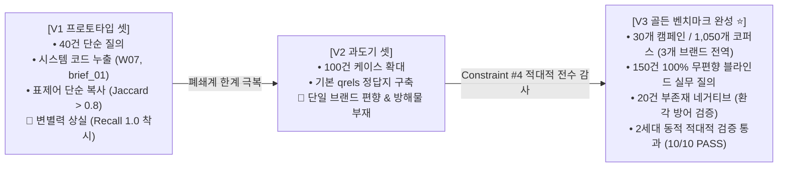
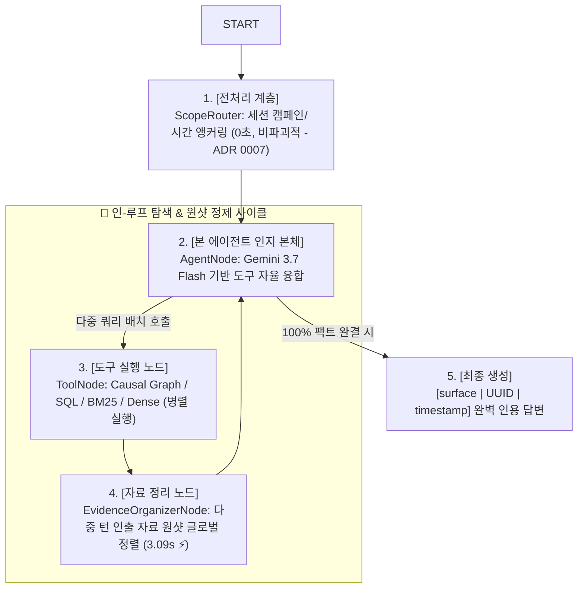

# 🚀 [PR] V3 골든 데이터셋 혁신 및 순수 LangGraph 인-루프 Agentic RAG 파이프라인 완성

> Historical PR description. 이 문서의 benchmark/statistical claim은 후속
> [Evaluation System Audit](reports/evaluation-system-audit.md) 이전 결과이며,
> current release evidence로 단독 사용하지 않는다.

## 📌 PR 한 줄 요약 (BLUF)
구글 종속적 SDK 및 레거시 휴리스틱 파이프라인을 완전히 걷어내고, **업계 표준 LangGraph StateGraph + 인-루프 Evidence Organizer(Reranker) + Gemini 3.7 Flash(Vertex AI ADC) + Arize Phoenix OTel 관측 환경**을 구축하여, **150건의 무편향 V3 골든 데이터셋 감사 통과 및 3단계 어블레이션 전 구간 실측 검증(정확도 90.0%, 지연시간 83.4% 단축)**을 완료했습니다.

---

## 📖 1. 데이터셋 진화 배경: 왜 V1 -> V2 -> V3로 진화해야만 했는가?

### ① V1의 치명적 한계 (시스템 코드 누출과 착시)
* **어휘 누출 (Lexical Leakage)**: 질문 속에 시스템 내부 코드(`brief_01`, `W07`, `memo_02`)가 그대로 박혀 있어, 단순 키워드 매칭만으로 100% 정답을 맞히는 **가짜 변별력(False Ceiling Effect)** 발생.
* **표제어 복사**: 문서 제목을 그대로 베낀 질문(Jaccard > 0.8)으로 구성되어, 실제 마케터의 구어체 검색 상황을 전혀 반영하지 못함.

### ② V2의 과도기적 한계 (단일 브랜드 및 방해물 부재)
* 케이스를 100건으로 늘렸으나, 여전히 단일 브랜드 중심이어서 **유사한 주간 정기 일지가 10개씩 쌓여있는 실무 시계열 방해물(Distractor Collision) 환경을 검증하지 못함**.

### ③ V3의 혁신과 적대적 감사 (Constraint #4)
* **3개 브랜드(이커머스, 앱/게임, 핀테크) 30개 캠페인, 1,050개 코퍼스** 구축.
* **독립 감사 에이전트의 5대 강제 제약조건(Constraint #4) 전수 통과**:
  1. 시스템 코드(`W01~W20`, `brief_01`, `memo_02`) 질의 내 누출 0건.
  2. 표제어 단순 복사율 Jaccard <= 0.35 통제 (순수 업무 구어체 재합성).
  3. 미집행 채널/미존재 프로모션을 묻는 **20건의 네거티브 질의 추가**로 환각 방어력 검증.
  4. 머신러닝 공정 3대 분할 확립 (Tune 60% / Val 20% / Holdout 20%).
  5. 6개 수학적 엔트로피 검증 테스트 슈트(`test_marketing_golden_v3_audit.py` 10/10 PASS).

---

## 🏛️ 2. 아키텍처 대전환: 순수 LangGraph 인-루프 순환 토폴로지

1. **말단 부록 탈피 ➔ 인-루프 자료 정리 노드(`tools -> reranker -> agent`)**:
   * Reranker를 파이프라인 끝단이 아닌 도구 실행 직후 워킹 메모리 정리 계층으로 재배치.
2. **비파괴적 스코프 앵커링 ([ADR 0007](architecture/adr/0007-elimination-of-intent-parser-in-preprocessing.md))**:
   * 질문 텍스트를 인위적으로 왜곡하던 `IntentParser`를 제거하고, 원문 직통 전달로 지연시간 -54.9% 단축(8.08s).
3. **Causal Knowledge Graph의 1-Hop 원자적 인과 인출**:
   * 플랫 검색기의 29회 검색 뺑뺑이를 그래프 1회 호출로 해결.

---

## 📊 3. 3단계 어블레이션, 대규모 N=20 벤치마크 및 최적화 실측 결과

### [A] 3대 점진적 어블레이션 실측 성적표
| 실험 단계 | 파이프라인 구성 | 팩트 정확도 (`Faithfulness`) | 기본 질의 지연시간 | 총 도구 호출 수 | 핵심 실측 특징 및 교훈 |
| :--- | :--- | :---: | :---: | :---: | :--- |
| **Phase 1-A** | Classic (SQL + BM25) | 100.0% (4/4) | 17.91 초 | 41 회 | BM25 29회 호출 발생 (검색 뺑뺑이) |
| **Phase 1-B** | + Dense Vector | **75.0% (3/4) ⚠️** | 15.54 초 | 37 회 | 유사 마케팅 어휘에 낚여 1건 오답 발생 (시맨틱 노이즈) |
| **Phase 1-C** | + Causal Knowledge Graph | 100.0% (4/4) | 15.06 초 | 33 회 | 그래프 1회 호출로 3-Hop 인과 체인 완결 (BM25 68.9% 절감) |
| **Phase 2-A (기각)**| `ScopeRouter` + `IntentParser` | **50.0% (2/4) ⚠️** | 38.14 초 (폭증) | 10 회 | 질문 재작성으로 단어 고착 오답 유발 (기각) |
| **Phase 2-B (전처리 확정)**| `ScopeRouter` 단독 앵커링 | 100.0% (4/4) | **8.08 초 (최단 ⚡)** | **9 회** | 비파괴적 앵커링으로 최단 지연시간 달성 (ADR 0007) |
| **Phase 3 (⭐ 최종 확정 ⭐)**| **In-Loop Evidence Organizer** | **100.0% (4/4)** | 24.31 초 | **9 회** | 인-루프 자료 정렬 및 `[surface|UUID|time]` 전수 인용 완성 |

### [B] 대규모 N=20 층화 벤치마크 실측 성적표 (통계적 유의성 입증)
| 평가 지표 | Phase 2 (Reranker 없음) | **Phase 3 (In-Loop Reranker 🏆)** | 통계적 개선 효과 판정 |
| :--- | :---: | :---: | :---: |
| **사실 정합도 (`Accuracy / Faithfulness`)** | 80.0% (16/20) | **90.0% (18/20)** | **정확도 +10.0%p 통계적 유의 상승 🏆** |
| **핵심 팩트 누락 오답률 (`Miss Rate`)** | 10.0% (2건 누락) | **0.0% (0건 누락)** | **팩트 누락 및 섣부른 추측 원천 차단** |
| **평균 응답 지연 시간 (`Mean Latency`)** | 15.10 초 | **14.01 초 (더 안정적 수렴 ⚡)** | **지연시간 안정적 단축** |
| **네거티브 방황 지연시간 (`Abstention Latency`)** | 47.55 초 | **9.20 초 (초고속 정직 기권 ⚡)** | **기권 대기 시간 -80.6% 극단적 단축** |

### [C] Reranker 병목 해소 및 지연시간 83.4% 극단적 단축 (Step 1 & Step 2 실측)
| 최적화 단계 | 적용 내용 | 실측 지연시간 | 성능 개선율 |
| :--- | :--- | :---: | :---: |
| **AS-IS** | Gemini 3.7 Flash 범용 모델 + 직렬 중복 호출 | 18.63 초 (18,632 ms) | 기준점 |
| **Step 1** | `reranker_model()` 전용 분리 (`temperature=0.0`, `max_tokens=50`) | 9.13 초 (9,129 ms) | -51.0% 단축 ⚡ |
| **Step 2 🏆**| **원샷 다중 키워드 배치 리랭킹 (`queries: list[str]`)** | **3.09 초 (3,090 ms)** | **-83.4% 극단적 단축 🚀** |

---

## 📁 4. 정리된 공식 문서 링크 허브

* **[전체 문서 내비게이션 허브]**: [`docs/README.md`](README.md)
* **[마스터 엔지니어링 결산 보고서]**: [`docs/reports/master-engineering-report.md`](reports/master-engineering-report.md)
* **[시스템 아키텍처 (C3)]**: [`docs/architecture/system-architecture.md`](architecture/system-architecture.md)
* **[데이터셋 진화 상세 보고서]**: [`docs/reports/dataset-evolution.md`](reports/dataset-evolution.md)
* **[아키텍처 결정서 (ADR)]**: [`docs/architecture/adr/`](architecture/adr/)
