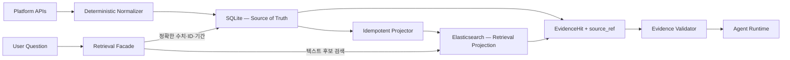

# ADR-0001: Retrieval 저장소를 원본 DB와 검색 Projection으로 분리한다

> 상태: **승인 — Phase 4 Eval 결과에 따라 재검토**
>
> 결정일: 2026-08-10
>
> 적용 범위: Phase 3A, 3B, 4A, 4B

## 1. 결정 요약

LaunchPilot은 저장소 하나에 모든 책임을 맡기지 않는다.

- **SQLite를 비즈니스 원본 저장소로 유지한다.** 캠페인, 불변 Observation, 수치, 기간, 단위와 출처를 저장하고 정확한 필터·집계를 담당한다.
- **Elasticsearch를 재생성 가능한 검색 Projection으로 사용한다.** 문서와 Artifact의 BM25, dense, learned sparse, hybrid 후보 검색을 담당한다. sparse 모델은 Elasticsearch에 종속시키지 않는다.
- **Agent는 두 저장소를 직접 선택하지 않는다.** Retrieval 계층이 질문을 구조화 조회와 문서 검색으로 분해하고, 공통 `EvidenceHit` 형태로 결과를 반환한다.
- **Graph DB는 지금 도입하지 않는다.** 관계 탐색은 먼저 관계형 데이터와 애플리케이션 로직으로 검증하고, 관계 중심 질문의 품질 개선이 Eval에서 확인될 때만 별도 graph projection을 검토한다.

Elasticsearch를 선택한 이유는 기존 프로젝트에서 사용했기 때문이 아니다. 이번 포트폴리오가 BM25부터 dense, sparse, hybrid, reranker까지 **동일한 데이터셋으로 비교하는 검색 실험**을 핵심 경험으로 삼기 때문이다. 반대로 작은 서비스를 가장 단순하게 출시하는 것이 목표라면 PostgreSQL과 pgvector가 더 합리적인 기본 선택일 수 있다.

## 2. 먼저 데이터 성격을 구분한다

우리 데이터에는 서로 다른 정답 조건이 있다.

| 데이터 | 예시 | 정답 조건 | 적합한 조회 |
| --- | --- | --- | --- |
| 정량 Observation | spend, impressions, clicks, conversions, 기간, 통화 | 값·기간·대상·grain이 정확해야 함 | 관계형 필터, 직접 조회, 집계 |
| 식별 가능한 업무 데이터 | Workspace, Campaign, Conversation, Artifact | ID와 소유권 경계가 정확해야 함 | 관계형 직접 조회 |
| 텍스트 근거 | 팀 메모, 브리프, 트렌드 문서, 과거 분석 | 질문과 관련성이 높은 후보가 필요함 | BM25, dense, sparse, hybrid, rerank |
| 근거 관계 | Claim → Evidence, Signal → Hypothesis → Recommendation | 연결 경로와 출처를 추적할 수 있어야 함 | 관계 조회, 필요 시 graph expansion |

따라서 “RAG를 하니 모든 것을 벡터 DB에 넣는다”거나 “Elasticsearch가 집계도 지원하니 수치 원본도 옮긴다”는 결론은 우리 정답 조건과 맞지 않는다. 광고 성과 수치는 유사도가 아니라 결정적으로 계산해야 하고, 검색 결과는 원본을 가리키는 후보여야 한다.

## 3. 결정 기준

저장소는 다음 질문으로 비교했다.

1. 수치·기간·플랫폼별 조회와 출처 추적을 정확히 수행할 수 있는가?
2. Phase 3A의 BM25 기준선을 과도한 우회 구현 없이 만들 수 있는가?
3. Phase 3B의 dense, learned sparse, hybrid, reranker를 같은 corpus에서 비교할 수 있는가?
4. 검색 인덱스를 지워도 원본에서 재구축할 수 있는가?
5. 포트폴리오 규모에서 복잡성을 설명할 만한 학습·검증 가치가 있는가?
6. 특정 검색 엔진이 Agent의 판단 로직까지 소유하지 않도록 경계를 둘 수 있는가?

마지막 기준이 특히 중요하다. **Agentic RAG는 저장소 제품명이 아니라**, Agent가 질문의 범위를 잡고 필요한 검색 도구를 선택하며 결과가 부족할 때 재검색하고 근거를 검증하는 실행 방식이다.

## 4. 검토한 선택지

| 선택지 | 강점 | 우리 상황의 한계 | 판단 |
| --- | --- | --- | --- |
| SQLite만 사용 | 이미 원본 모델이 구현되어 있고 운영 부담이 가장 작음 | 고급 lexical·vector·sparse 실험을 위한 기반이 제한적 | 원본·Structured Retrieval에 유지 |
| PostgreSQL + pgvector | 관계형 원본, FTS, dense·sparse vector를 한 시스템에 둘 수 있어 단순함 | learned sparse 모델과 여러 검색 결과의 fusion·rerank를 애플리케이션에서 더 많이 조립해야 함 | 실제 소규모 제품의 유력한 단일 저장소 대안 |
| Elasticsearch | BM25, filter, aggregation, dense kNN, sparse vector와 RRF를 한 검색 엔진에서 비교 가능 | 작은 corpus에는 운영 비용이 크고 원본 DB로 쓰면 이중 쓰기·일관성 문제가 커짐 | **검색 Projection으로 채택** |
| Qdrant / Weaviate | vector-first 검색과 dense+sparse 또는 BM25 hybrid 구성이 편리함 | 정량 원본을 위한 관계형 DB는 여전히 필요하며 BM25 기준선과 learned sparse 비교 목적에서 ES보다 뚜렷한 이점이 없음 | 현 단계에서는 보류 |
| Neo4j | 다단계 관계 탐색과 경로 설명에 적합하고 full-text·vector index도 제공 | 현재 핵심 질문은 수치 분석과 텍스트 근거 검색이며 별도 graph 동기화 비용이 먼저 발생함 | Graph Eval이 필요성을 증명할 때 검토 |

이 비교는 제품의 절대 우열이 아니다. 예를 들어 pgvector는 Postgres FTS와 결합한 hybrid 검색, RRF와 cross-encoder 조합을 공식적으로 안내한다. Weaviate와 Qdrant도 hybrid 검색을 직접 지원한다. 그럼에도 Elasticsearch를 고른 것은 **이번 Phase의 비교 실험 범위**와 가장 잘 맞기 때문이다.

## 5. 목표 구조



### 5.1 원본 저장소의 책임

SQLite는 다음 데이터의 권위 있는 원본이다.

- Workspace, Campaign, Conversation
- CampaignObservation, PlatformSlice, MetricObservation
- Artifact, DocumentExcerpt, EvidenceLink
- 기간, 통화, metric grain, provenance, captured/published/retrieved 시각

비율과 합계 같은 수치 계산도 원본의 canonical metric을 사용한다. LLM이나 검색 점수로 계산 대상을 결정하지 않는다.

### 5.2 Elasticsearch Projection의 책임

검색 문서는 원본을 대체하지 않고 `source_ref`로 원본을 가리킨다. 최소 계약은 다음과 같다.

```text
EvidenceDocument
├── document_id, source_ref, source_version
├── workspace_id, campaign_id
├── source_kind, artifact_type, platform
├── period_start, period_end, as_of
├── title, content
├── content_embedding
└── sparse_token_weights
```

- `document_id + source_version`으로 투영을 멱등 처리한다.
- Workspace와 Campaign 필터를 모든 검색에 먼저 적용한다.
- 인덱스는 삭제 후 SQLite에서 다시 만들 수 있어야 한다.
- 검색 결과에는 검색 방식, rank, score와 `source_ref`를 남겨 Eval과 근거 검증이 가능해야 한다.
- Elasticsearch의 aggregation 기능은 검색 후보 분석에는 쓸 수 있지만, 광고 성과의 권위 있는 계산 경로로 사용하지 않는다.
- learned sparse는 ELSER 또는 외부 모델이 미리 계산한 token-weight 쌍으로 실험한다. ELSER는 공식 문서상 영어에 권장되고 별도 구독·ML 자원 조건이 있으므로, 한국어가 포함된 우리 corpus의 기본 모델로 미리 확정하지 않는다.

## 6. Phase별 적용

| Phase | 구현·검증 내용 | 저장소 결정과의 관계 |
| --- | --- | --- |
| 3A | Retrieval 데이터 모델, SQLite Structured Retrieval, Elasticsearch BM25 | 가장 단순하고 해석 가능한 두 기준선 확립 |
| 4A | Query Dataset, Ground Truth, Recall@K·MRR·nDCG@K | 이후 변경을 비교할 고정 측정판 확립 |
| 3B | Dense → learned sparse → hybrid/RRF → reranker → graph 순서로 한 요소씩 추가 | 기능 지원이 아니라 측정 가능한 개선 여부로 채택 |
| 4B | 4A의 동일 데이터셋으로 품질·지연·복잡성 비교 | 유지할 구성과 제거할 구성을 결정 |

Graph는 Phase 3B의 마지막 실험이지, Neo4j 선도입을 의미하지 않는다. 우선 구조화된 관계 확장으로 가설을 검증하고, graph DB 자체가 필요한 데이터 규모·질문 깊이·품질 향상이 확인되면 별도 ADR을 작성한다.

## 7. 감수하는 비용과 위험

### 얻는 것

- 정량 사실과 확률적 검색 결과의 책임이 분리된다.
- BM25부터 고급 Retrieval까지 같은 검색 문서와 Eval dataset으로 비교할 수 있다.
- 검색 엔진을 교체해도 도메인 원본과 Evidence 관계가 유지된다.
- “유행 기술을 넣었다”가 아니라 기준선 대비 개선을 증명할 수 있다.

### 감수하는 것

- 포트폴리오 규모에 Elasticsearch는 분명히 무겁다.
- SQLite와 Elasticsearch 사이에 투영 지연과 실패가 생길 수 있다.
- learned sparse 모델 배포와 dense embedding 생성 비용이 추가된다. 특히 한국어·영어가 섞인 corpus에서는 모델별 언어 품질도 평가해야 한다.
- 지원되는 기능이 많다는 사실이 실제 품질 향상을 보장하지 않는다.

따라서 초기에는 별도의 메시지 브로커나 CDC를 도입하지 않는다. 동기 또는 명시적 rebuild 가능한 projector로 시작하고, 실패를 기록해 재실행할 수 있게 한다. 이는 운영용 분산 시스템을 흉내 내기보다 검색 품질 실험에 복잡성 예산을 쓰기 위한 선택이다.

## 8. 기존 결정을 비판적으로 돌아본 결과

기존 “Elasticsearch 유지” 결정은 방향은 맞았지만 근거가 불완전했다.

- **잘못된 근거:** 이전 프로토타입이 사용했다, 검색 업계에서 익숙하다, 확장성이 좋다.
- **유효한 근거:** 우리 corpus에서 BM25·dense·learned sparse·hybrid·reranker를 단계적으로 비교할 수 있다. Elasticsearch 기능이나 내장 모델을 무조건 채택한다는 뜻은 아니다.
- **필요한 제한:** Elasticsearch는 source of truth가 아니라 파생 인덱스이며, Structured Retrieval을 대체하지 않는다.
- **증명할 책임:** Phase 4 Eval에서 기본 검색보다 나아지지 않는 기능은 제거한다.

즉 Elasticsearch는 “현대적인 Agentic RAG의 정답”이라서 채택한 것이 아니다. 이번 포트폴리오에서 검색 방법의 진화를 통제된 실험으로 보여 주기에 적합해서 채택했다.

## 9. 재검토 조건

다음 중 하나가 확인되면 이 결정을 다시 연다.

1. SQLite Structured Retrieval과 단순 FTS/BM25만으로 대표 질문을 충분히 해결한다.
2. Elasticsearch 운영·모델 배포 비용이 품질 개선보다 크다.
3. 단일 트랜잭션과 강한 일관성이 검색 기능보다 중요해져 PostgreSQL + pgvector가 단순해진다.
4. 관계 중심 질문에서 graph expansion이 반복적으로 실패하고 Neo4j projection이 유의미한 개선을 보인다.
5. corpus 규모나 latency 요구가 vector-first 저장소의 장점을 필요로 한다.

최종 유지 조건은 특정 수치를 지금 임의로 정하지 않는다. Phase 4A에서 dataset과 metric을 확정한 뒤, query 유형별 품질과 p95 latency, 구현·운영 복잡성을 함께 비교해 4B에서 결정한다.

## 10. 공식 근거

- [Elasticsearch RRF retriever](https://www.elastic.co/docs/reference/elasticsearch/rest-apis/retrievers/rrf-retriever)
- [Elasticsearch dense vector field](https://www.elastic.co/docs/reference/elasticsearch/mapping-reference/dense-vector)
- [Elasticsearch sparse vector search with ELSER](https://www.elastic.co/docs/solutions/search/vector/sparse-vector)
- [Elasticsearch sparse vector query with precomputed token weights](https://www.elastic.co/docs/reference/query-languages/query-dsl/query-dsl-sparse-vector-query)
- [ELSER language and subscription requirements](https://www.elastic.co/guide/en/machine-learning/current/ml-nlp-elser.html)
- [Elasticsearch aggregations](https://www.elastic.co/docs/reference/aggregations)
- [pgvector: hybrid search, sparse vectors and reranking](https://github.com/pgvector/pgvector)
- [PostgreSQL full-text search configuration](https://www.postgresql.org/docs/current/textsearch-configuration.html)
- [Qdrant hybrid queries](https://qdrant.tech/documentation/search/hybrid-queries/)
- [Weaviate hybrid search](https://docs.weaviate.io/weaviate/concepts/search/hybrid-search)
- [Neo4j semantic indexes](https://neo4j.com/docs/cypher-manual/current/indexes/semantic-indexes/)
