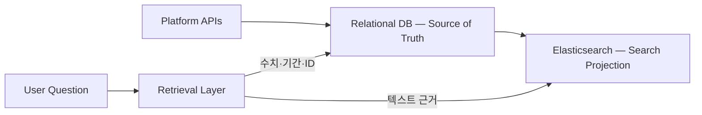

# ADR-0001: 원본 DB와 검색 저장소를 분리한다

> 상태: **승인 — Retrieval Eval 후 재검토**
>
> 결정일: 2026-08-10

## 맥락

LaunchPilot이 다루는 데이터는 성격이 다르다.

| 데이터 | 필요한 처리 |
| --- | --- |
| 광고 성과 수치·기간·통화·출처 | 정확한 필터, 직접 조회, 집계 |
| 캠페인·대화·Observation | ID와 소유권에 따른 관계형 조회 |
| 메모·브리프·트렌드·과거 분석 | BM25, dense, sparse 검색과 재정렬 |
| Claim과 Evidence의 관계 | 출처 추적과 제한적인 관계 확장 |

광고 수치는 유사도로 찾으면 안 되고, 텍스트 근거는 정확 일치만으로 충분하지 않다. 따라서 하나의 저장소가 모든 Retrieval을 담당하게 하지 않는다.

## 결정

- **관계형 DB를 source of truth로 사용한다.** 포트폴리오 단계에서는 현재 구현된 SQLite를 유지한다.
- **Elasticsearch는 재생성 가능한 검색 Projection으로만 사용한다.** BM25 기준선과 이후 dense·sparse·hybrid·reranker 실험을 담당한다.
- Agent는 저장소를 직접 선택하지 않는다. `Structured Retrieval`과 `Evidence Search` 같은 논리적 도구를 선택하고, Retrieval 계층이 실제 저장소를 호출한다.
- Graph DB는 도입하지 않는다. 관계형 조회로 먼저 검증하고 graph expansion의 개선이 Eval에서 확인될 때 별도로 결정한다.



## Elasticsearch를 유지하는 이유

기존 프로젝트에서 사용했다는 사실은 근거가 아니다. Elasticsearch를 선택하는 이유는 이번 포트폴리오가 다음 검색 단계를 **동일한 데이터셋으로 비교**하려 하기 때문이다.

```text
Structured Retrieval + BM25
→ Dense
→ Learned Sparse
→ Hybrid/RRF
→ Reranker
→ Graph Expansion
```

Elasticsearch는 BM25, dense vector, sparse vector와 RRF를 한 검색 엔진에서 실험할 수 있다. 하지만 작은 데이터에 비해 무겁고 이중 저장에 따른 동기화 비용이 있으므로, 비즈니스 원본으로는 사용하지 않는다.

ELSER도 미리 확정하지 않는다. 공식 문서상 영어에 권장되고 구독·ML 자원 조건이 있으므로, 한국어가 포함된 우리 데이터에서는 외부 multilingual sparse 모델과 함께 평가한다.

## 검토한 대안

| 대안 | 이번에 선택하지 않은 이유 |
| --- | --- |
| SQLite만 사용 | Structured Retrieval에는 충분하지만 계획한 고급 검색 비교가 제한된다. |
| PostgreSQL + pgvector | 실제 소규모 제품이라면 가장 단순한 대안이다. 다만 이번 포트폴리오의 sparse·fusion 비교에는 애플리케이션 조립이 더 필요하다. |
| Qdrant·Weaviate | vector와 hybrid 검색에는 강하지만 정량 원본 DB가 별도로 필요하다. |
| Neo4j | 현재 핵심 질문보다 관계 탐색 비중이 커질 때 가치가 생긴다. 지금 도입하면 동기화 비용이 먼저 발생한다. |

## 검증과 재검토

Phase 3A에서 관계형 Structured Retrieval과 Elasticsearch BM25를 기준선으로 만든다. Phase 4A에서 Query Dataset과 Ground Truth를 고정한 뒤, Phase 3B의 검색 방식을 하나씩 추가하고 Phase 4B에서 같은 데이터로 비교한다.

다음 경우에는 Elasticsearch 결정을 다시 검토한다.

- 기본 검색만으로 대표 질문을 충분히 해결한다.
- 품질 개선보다 운영·동기화 비용이 크다.
- 관계 중심 질문에서 별도 graph projection이 유의미한 개선을 보인다.

기능이 지원된다는 이유만으로 채택하지 않으며, Eval에서 개선된 구성만 남긴다.

## 근거

- [Elasticsearch ranking and reranking](https://www.elastic.co/docs/solutions/search/ranking)
- [Elasticsearch sparse vector query](https://www.elastic.co/docs/reference/query-languages/query-dsl/query-dsl-sparse-vector-query)
- [ELSER requirements](https://www.elastic.co/guide/en/machine-learning/current/ml-nlp-elser.html)
- [pgvector hybrid search](https://github.com/pgvector/pgvector)
