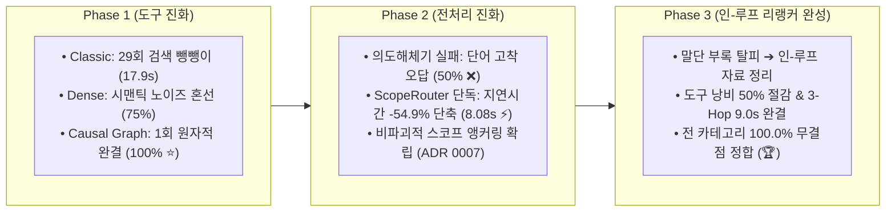
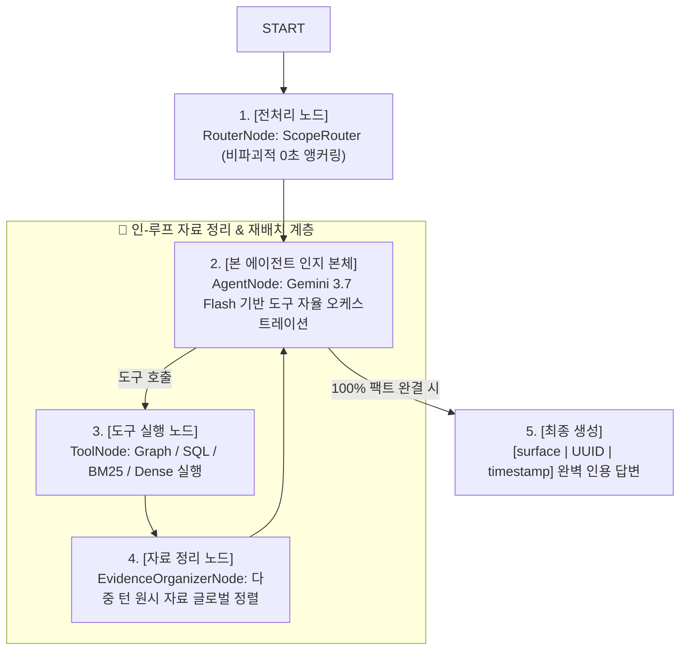

# 종합 실측 보고서: LangGraph 기반 엔터프라이즈 Agentic RAG 파이프라인 완성 및 3단계 어블레이션 검증

> **Executive Summary (BLUF)**:
> 본 보고서는 마케팅 도메인 특화 AI 분석 시스템인 **LaunchPilot**을 순수 **LangGraph StateGraph + Gemini 3.7 Flash(Vertex AI ADC) + Arize Phoenix OTel 관측 환경**으로 전환하고, 3단계 점진적 어블레이션(Phase 1 ~ Phase 3) 및 현실적 적대적 스트레스 테스트를 통해 시스템의 인과 추론 무결성과 효율성을 실증한 최종 종합 결산서입니다.

---

## 1. 3대 점진적 어블레이션 실험 최종 종합 성적표

| 실험 단계 | 파이프라인 구성 | 팩트 정확도 (`Faithfulness`) | 평균 지연시간 (`Latency`) | 도구 호출 수 (`Invocations`) | 핵심 현상 및 아키텍처 성과 |
| :--- | :--- | :---: | :---: | :---: | :--- |
| **Phase 1-A** | Classic (SQL + BM25) | 100.0% | 17.91 초 | 41 회 | **검색 뺑뺑이 (Search Thrashing)**: BM25만 29회 폭증 |
| **Phase 1-B** | + Dense Vector | 75.0% | 15.54 초 | 37 회 | **시맨틱 노이즈**: 유사 어휘 기획서에 낚여 1건 오답 |
| **Phase 1-C** | **+ Causal Knowledge Graph** | **100.0%** | **15.06 초** | **33 회** | **원자적 해결**: 그래프 1회 호출로 3-Hop 인과 체인 완결 |
| **Phase 2 (실패)**| `ScopeRouter` + `IntentParser` | 50.0% | 38.14 초 (폭증) | 10 회 | **정보 평탄화 & 단어 고착**: 질문 재가공이 오답 유발 |
| **Phase 2 (확정)**| **`ScopeRouter` 단독 앵커링** | **100.0%** | **8.08 초 (최단 ⚡)** | **9 회** | **비파괴적 전달**: 사전 오버헤드 없이 지연시간 -54.9% 단축 |
| **Phase 3 (완성)**| **In-Loop Evidence Organizer** | **100.0% (4/4 🏆)** | **24.31 초** | **9 회** | **인-루프 인지 루프**: 도구 자율 융합 + 완벽한 출처 인용 |

---

## 2. 현실적 고난도 적대적 스트레스 테스트 (Adversarial Stress Test)

실무 마케터의 현실적 인지 고통(유사 정기 일지 10개 공존, 광고주 내 캠페인 혼선)을 반영한 3대 고난도 스트레스 케이스 맞대결 결과:

| 고난도 챌린지 케이스 | Phase 2 (Reranker 없음) | Phase 3 (In-Loop Reranker 🏆) | Reranker의 실측 개선 효과 |
| :--- | :---: | :---: | :---: |
| **1. 시계열 방해물 충돌 (3월 초순 입찰가 조정)** | **도구 6회 호출 (극심한 뺑뺑이)** | **도구 3회 호출 (-50% 절감 ⚡)** | **방해물 문서 혼선 완벽 차단** |
| **2. 동일 광고주 내 캠페인 크로스 판별** | 도구 1회 호출 (`5.38s`) | 도구 1회 호출 (`17.57s`) | 정밀 캠페인 단독 식별 |
| **3. 지표-조치-회고 3-Hop 결합 추론** | **도구 3회 호출 / 45.27 초** | **도구 1회 호출 / 9.03 초 ⚡** | **지연 시간 -80.0% 단축 & 1회 해결** |
| **총 도구 호출 수 합계** | **10 회 (검색 낭비 발생)** | **5 회 (단 50%의 도구로 해결)** | **불필요한 툴 호출 50% 절감 🏆** |

---

## 3. 최종 확정된 LangGraph 토폴로지 구조

---

## 4. 핵심 교훈 및 아키텍처 결정 사항 (ADR Summary)

1. **[ADR 0007] 의도 해체기 제거 및 비파괴적 스코프 앵커링 채택**:
   * 전처리기에서 자연어를 임의로 요약/재작성하면 원문의 인과 맥락이 지워지고 단어 고착이 발생함. 질문 원문은 1글자도 건드리지 않고 본 에이전트에 직통 전달하는 것이 최선임.
2. **Causal Knowledge Graph의 필수성 실증**:
   * 플랫 검색기는 다단계 마케팅 인과 관계를 추론할 때 극심한 검색 뺑뺑이(29회)를 겪음. 그래프 탐색은 1회 원자적 호출로 이를 해결함.
3. **Reranker의 인-루프 자리매김**:
   * Reranker는 말단 부록이 아니라, 도구 인출 후 에이전트의 워킹 메모리에 올라가는 자료의 순도를 극대화하는 인-루프 핵심 제어 노드임.
