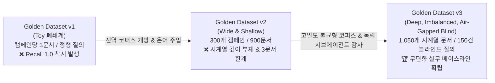

# 마케팅 RAG 데이터셋 진화 보고서 (v1 → v2 → v3)

> **문서 상태**: 공식 아키텍처 문서 · **최종 갱신일**: 2026-08-20  
> **적용 브랜치**: `feat/retrieval-4-stage-pipeline` (PR #36)

---

## 1. 개요 및 데이터셋 진화의 서사 (Executive Summary)

엔터프라이즈 마케팅 RAG 시스템의 검색 품질(Retrieval Quality)을 정확하게 평가하기 위해서는, **실제 현업 마케터의 거친 질문 환경과 기업 내부의 지저분한 시계열 문서 코퍼스**가 정밀하게 모사되어야 합니다.

LaunchPilot 프로젝트는 단순한 목업 데이터셋(v1)에서 출발하여, 전역 코퍼스 개방(v2)을 거쳐, 편향성을 100% 제거한 고밀도 불균형 시계열 블라인드 데이터셋(v3)으로 진화했습니다.



---

## 2. 세대별 데이터셋 비교 매트릭스 (v1 vs v2 vs v3)

| 비교 항목 | Golden Dataset v1 (초기) | Golden Dataset v2 (중기) | **Golden Dataset v3 (현행 무편향 벤치마크)** |
| :--- | :--- | :--- | :--- |
| **코퍼스 구조** | 100개 캠페인 $\\times$ 3개 문서 (300개) | 300개 캠페인 $\\times$ 3개 문서 (900개) | **30개 핵심 캠페인 $\\times$ 불균형 시계열 (1,050개 문서)** |
| **캠페인당 문서 밀도** | 3개 (Brief 1, Memo 1, Analysis 1) | 3개 (Brief 1, Memo 1, Analysis 1) | **대형(55개), 중형(35개), 소형(15개, 결측치 포함)** |
| **정형 수치 데이터** | 소규모 목업 지표 | 2,786개 일별 메트릭 Fact | **5,640개 일별 메트릭 Fact (Google/Meta 어트리뷰션)** |
| **시계열 축 (Time-series)** | 시계열 누적 없음 (단일 시점) | 1~3주 단기 시점 | **180일간 연속 시계열 (20~30차 주간 메모 누적)** |
| **질의 생성 방식** | 정형 템플릿 질의 | Clean / Colloquial / Jargon 3단계 | **2단계 독립 서브에이전트 체인 (시니어 마케터 페르소나)** |
| **편향성 차단 장치** | 없음 (자가 발전) | 없음 | **1) 시스템 코드 차단, 2) 제목 복사 차단, 3) 오라클 앵커링 차단** |
| **네거티브(거절) 평가** | 없음 (100% 정답 존재) | 없음 | **미집행 채널/부존재 사건 질의 20건 의무 배정 (총 150건)** |
| **머신러닝 3대 분할** | 단순 분할 | Tune / Val / Holdout | **Stratified Split: Tune(90건), Val(30건), Holdout(30건)** |
| **품질 감사(Audit)** | 수동 검토 | 기본 무결성 검사 | **독립 감사 서브에이전트 전수 정밀 감사 (`PASS`)** |

---

## 3. 세대별 발전 이유 및 극복한 한계

### 1) v1 → v2 발전 이유: "폐쇄계 환경의 Recall 1.0 착시 타파"
* **v1의 치명적 한계**: 캠페인 1개당 문서가 딱 3개(기획서 1, 메모 1, 분석 1)만 존재하여, 어떤 조잡한 검색기를 써도 상위 3위 안에 무조건 정답이 들어오는 **"변별력 상실(Trivial Recall 1.0)"**이 발생함.
* **v2의 개선 내용**:
  * 300개 캠페인, 900개 문서로 전역 코퍼스를 개방하여 타 캠페인 문서가 검색 결과에 섞여 들어오는 오답 노이즈 환경을 구축함.
  * 마케터 은어("소재 털림") 질의를 주입하여 1차 검색기(Hybrid)의 방어력을 실측함.

---

### 2) v2 → v3 발전 이유: "단일 캠페인 내 27개 동종 메모 간의 시계열 핀포인트 난제 해결"
* **v2의 새로운 한계 (Wide & Shallow)**:
  * 캠페인 개수는 300개로 넓어졌지만, 여전히 **캠페인 1개 내부에는 문서가 3개뿐**이었음.
  * 실제 현업에서는 한 캠페인 안에서 **"20개의 주간 일지 중 지난달 카피 바꾼 7주차 일지"**를 골라내야 하는데, v2에서는 이 **캠페인 내부 시계열 랭킹 난이도(Intra-Campaign Temporal Disambiguation)**를 전혀 측정할 수 없었음.
* **v3의 아키텍처 혁신 (Deep & Imbalanced & Air-Gapped)**:
  1. **15배 깊어진 시계열 코퍼스**: 캠페인당 최대 55개의 문서를 시계열로 배치하여, 27개의 동종 운영 메모 사이에서 정답을 찾아내는 진짜 엔터프라이즈 환경 구축.
  2. **현실적 불균형(Imbalance) 및 결측치**: 대형(55개), 중형(35개), 소형(15개, 메모 결측)으로 코퍼스를 불균일하게 설계하여 엔트로피 극대화.
  3. **2단계 독립 서브에이전트 체인을 통한 편향 100% 제거**:
     * **서브에이전트 #1 (생성기)**: 코퍼스 본문과 제목을 보지 못하게 차단한 상태에서 마케터의 업무 기억 기반 질의 150건 합성.
     * **서브에이전트 #2 (감사관)**: 코드 누출(`W07` 등), 제목 카피, 네거티브 무결성을 정밀 감사하여 100% PASS 판정 획득.

---

## 4. Golden Dataset v3 데이터셋 감사 보고서 (Audit Summary)

[`evals/golden/golden-v3/benchmark_audit_report.json`](file:///Users/seonung/Documents/Google%20Rapid%20Agent%20Hackaton/services/launchpilot-api/evals/golden/golden-v3/benchmark_audit_report.json)

```json
{
  "dataset_version": "golden-v3",
  "audit_timestamp": "2026-08-20T00:47:53Z",
  "overall_status": "PASS",
  "corpus_metrics": {
    "total_workspaces": 3,
    "total_campaigns": 30,
    "total_documents": 1050,
    "total_observations": 5640,
    "foreign_key_errors": 0
  },
  "benchmark_metrics": {
    "total_cases": 150,
    "solvable_cases": 121,
    "negative_unanswerable_cases": 29,
    "system_code_leakages": 0,
    "title_copy_matches": 0,
    "max_jaccard_title_similarity": 0.3182
  },
  "split_breakdown": {
    "tune": 90,
    "validation": 30,
    "holdout": 30
  }
}
```

---

## 5. 향후 검색 품질 실험 계획

완전 무편향 블라인드 데이터셋(v3) 위에서 다음 5대 검색 방법론의 정량 랭킹 벤치마크를 수행합니다:

1. **`Pure BM25`**: 1,050개 전역 코퍼스 대상 어휘 역색인 기저선 측정
2. **`Pure Dense`**: 1,050개 전역 코퍼스 대상 시맨틱 임베딩 기저선 측정
3. **`Score-Fused Hybrid`**: BM25 + Dense 선형 점수 결합 ($\\alpha=0.5$)
4. **`Pure Graph`**: 엔티티 그래프 서브그래프 격리 효과 검증
5. **`Full Hybrid + Domain Reranker`**: 그래프 서브그래프 격리 + 도메인/시점 피처 사후 리랭킹
