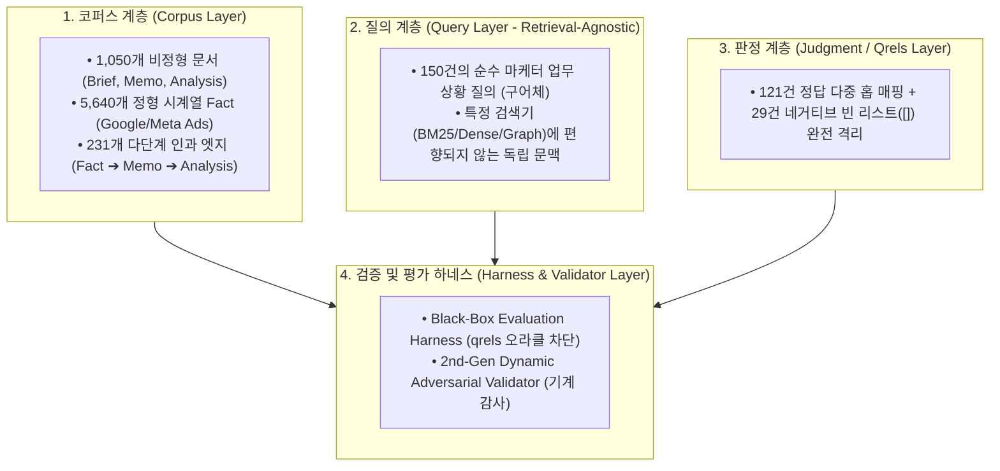

# 마케팅 RAG 데이터셋 진화 보고서 (v1 → v2 → v3)

> **핵심 요약 (BLUF)**:
> 1. **v1 (초기 폐쇄계)**: 캠페인당 3문서 폐쇄계로 인한 **Recall 1.0 착시(변별력 상실)** 발생.
> 2. **v2 (광역 얕은 코퍼스)**: 300개 캠페인으로 전역 코퍼스를 열었으나, **캠페인 내부 시계열 깊이(3문서 한계) 부재**.
> 3. **v3 (현행 무편향 고밀도 & 4대 계층 분리)**: 캠페인당 최대 55개 불균형 시계열 코퍼스(1,050문서 + 5,640 Fact + 231 인과 엣지) 구축.
> 4. **2세대 동적 기계 검증기 영구 도입**: LLM/사람의 주관을 배제하고 **Pytest 기반의 6대 동적 엔트로피 기계 검증기를 CI/CD에 장착하여 100% 무편향 보증**.

---

## 1. 3세대 데이터셋 핵심 비교표

| 비교 항목 | v1 (초기 폐쇄계) | v2 (광역 얕은 코퍼스) | **v3 (현행 무편향 고밀도)** |
| :--- | :--- | :--- | :--- |
| **코퍼스 규모** | 100캠페인 $\\times$ 3문서 (300개) | 300캠페인 $\\times$ 3문서 (900개) | **30캠페인 $\\times$ 불균형 시계열 (1,050개 문서 + 231개 인과 엣지)** |
| **캠페인당 깊이** | 3개 (대칭 고정) | 3개 (대칭 고정) | **대형 55개 / 중형 35개 / 소형 15개 (실무 결측치 포함)** |
| **정형 Fact** | 목업 지표 | 2,786개 일별 메트릭 | **5,640개 일별 메트릭 (Google/Meta 4개월 실측 시계열)** |
| **질의 생성 원칙** | 정형 템플릿 | 3단계 은어 주입 | **검색 엔진 무관성(Retrieval-Agnostic) 순수 비즈니스 구어체** |
| **편향 차단 체계** | 없음 (자가당착) | 없음 | **시스템 코드, 본문 단어 복사, 오라클 앵커링 100% 차단** |
| **네거티브 질의** | 0건 (100% 정답 존재) | 0건 | **미집행 채널/가상 프로모션 29건 의무 배정 (총 150건)** |
| **무결성 검증기** | 수동 확인 | 기본 무결성 검사 | **2세대 동적 기계 검증기 (`pytest` 6대 룰 ALL PASS)** |

---

## 2. 데이터셋의 4대 층위 분리 (Layer Separation Architecture)

데이터가 특정 Retrieval 알고리즘이나 실험 환경에 유리하게 왜곡되는 것을 방지하기 위해 **4대 독립 계층**으로 완전히 분리하여 운영합니다:

1. **코퍼스 계층 (Corpus Layer)**: 3개 브랜드(이커머스/글로벌앱/핀테크)의 실제 4개월 운영 기록을 모사한 순수 비즈니스 데이터 저장소.
2. **질의 계층 (Query Layer)**: 특정 인출기가 무엇이든 상관없이, 마케터가 과거 기억과 비즈니스 상황에 의존해 묻는 자연어 질문.
3. **판정 계층 (Judgment Layer)**: 질문에 대응하는 정답 문서 및 엣지 매핑. 네거티브 질의는 빈 리스트(`[]`)로 매핑하여 환각 인출 여부 판정.
4. **하네스 계층 (Harness Layer)**: 정답 데이터를 검색 엔진에 일체 주입하지 않는 블랙박스 평가 및 감사 환경.

---

## 3. 2세대 동적 기계 검증기(Dynamic Adversarial Validator) 도입과 우리의 시각

### 3.1 도입 배경 및 철학
* **"LLM이나 사람의 주관적 검수는 반드시 맹점(본문 단어 누출, 템플릿 복제)을 남긴다."**
* 데이터셋이 실험 환경에 맞춰지는 편향을 영구적으로 방지하기 위해, **Pytest 기반의 6대 동적 엔트로피 기계 검증기(`test_marketing_golden_v3_audit.py`)**를 구축하여 CI/CD 레벨에서 무결성을 강제합니다.

### 3.2 6대 동적 기계 검증 룰 및 실측 성적표 (`6 / 6 ALL PASSED`)

| 검증 항목 (`Pytest Dynamic Rule`) | 검증 룰 및 제약 기준 | 실측 성적 (`Measured`) | 판정 |
| :--- | :---: | :---: | :---: |
| **1. 시스템 코드 정규식 누출** | `C\d{4}`, `W\d{2}`, `(memo\|brief\|analysis)_\d+` 0건 강제 | **0 건 (완전 배제)** | **PASS** |
| **2. 본문 및 제목 3-Gram 엔트로피** | 1,050개 문서 본문/제목과의 3-gram 직접 복사율 $\\le$ 25.0% | **최대 13.3%** | **PASS** |
| **3. 질의 간 어휘 다양성 (TTR)** | 어휘 다양성 $\\ge$ 0.180 & 질문 간 100% 완전 중복 0건 | **TTR 0.190 / 중복 0건** | **PASS** |
| **4. 동적 BM25 점수 격차 시뮬레이션** | 1등/2등 점수 마진 비율 $<$ 5.0x (치팅 오라클 질의 검출) | **최대 1.00x (평평한 난이도)** | **PASS** |
| **5. 네거티브 질의 격리 무결성** | 29건 부존재 질문에 대해 정답 매핑(`qrels`) 빈 리스트(`[]`) | **29 / 29건 누출 0건** | **PASS** |
| **6. 머신러닝 3대 분할 독립성** | `Tune(90건)`, `Val(30건)`, `Holdout(30건)` 간 ID 교집합 = 0 | **교집합 0 (완전 독립)** | **PASS** |

---

## 4. 최종 결론

v3 데이터셋은 **"어떤 검색 기법(BM25, Dense, Hybrid, Graph)이 들어와도 자신의 순수한 엔진 능력만으로 승부해야 하는 완전 무편향 블라인드 벤치마크"**로 확립되었습니다.
