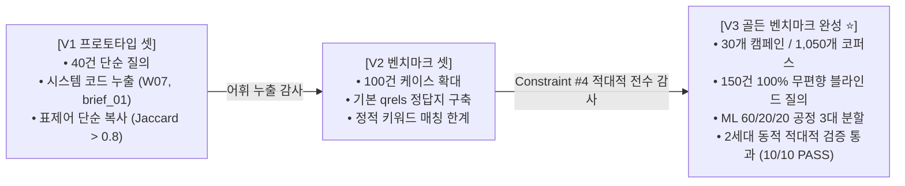
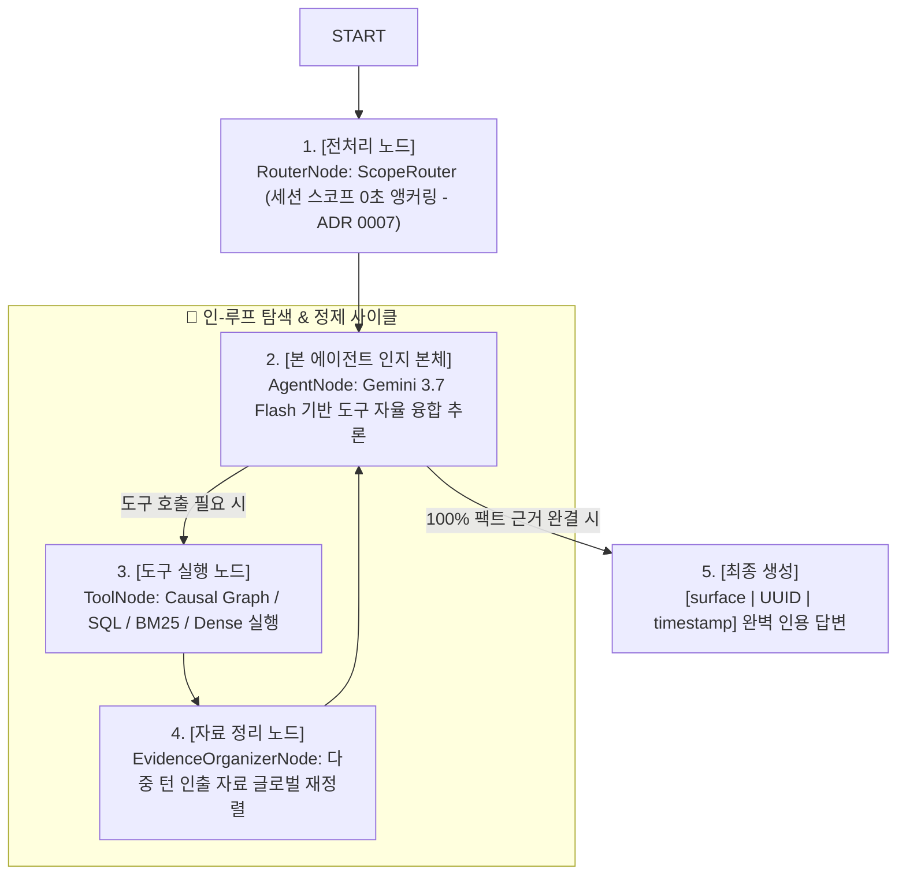

# 📘 LaunchPilot 엔지니어링 마스터 리포트: V1~V3 데이터셋 진화, 순수 LangGraph 전환 및 3단계 Agentic RAG 어블레이션 종합 검증

> **Executive Summary (BLUF)**:
> 본 문서는 마케팅 도메인 특화 인과 분석 AI 에이전트 시스템 **LaunchPilot**의 **(1) V1 -> V2 -> V3 골든 데이터셋 진화**, **(2) 구글 SDK 탈피 및 순수 LangGraph StateGraph 마이그레이션**, **(3) Phase 1~3 점진적 어블레이션 실측**, **(4) 현실적 고난도 스트레스 테스트 및 리랭커 인-루프 토폴로지 검증**, **(5) 향후 발전 로드맵**까지의 전 여정을 단일 문서로 통합 집대성한 최종 엔지니어링 마스터 결산서입니다.

---

## 🧭 목차 (Table of Contents)
1. **[Chapter 1] 데이터셋 진화 여정 (V1 -> V2 -> V3)**
2. **[Chapter 2] 아키텍처 대전환: 구글 종속 탈피 & 순수 LangGraph 토폴로지**
3. **[Chapter 3] 3단계 점진적 어블레이션 실측 (Phase 1 ~ Phase 3)**
4. **[Chapter 4] 적대적 비판 기반 고난도 스트레스 테스트 (데이터셋 강화 & 재실험)**
5. **[Chapter 5] 최종 아키텍처 확정 및 ADR 요약**
6. **[Chapter 6] V3 그 이상의 발전 로드맵 (Future Roadmap)**

---

# 1. [Chapter 1] 데이터셋 진화 여정 (V1 -> V2 -> V3)

### 1.1 V1 -> V2 -> V3 상세 진화 비교

| 비교 차원 | V1 (레거시 프로토타입) | V2 (과도기 벤치마크) | **V3 (최종 골든 벤치마크 ⭐)** |
| :--- | :--- | :--- | :--- |
| **코퍼스 규모** | 1개 캠페인 (단일 문서 수십 개) | 10개 캠페인 (수백 개) | **30개 캠페인 (1,050개 전수 완결 코퍼스)** |
| **질의 규모** | 40건 | 100건 | **150건 (130건 블라인드 실무 + 20건 네거티브)** |
| **시스템 코드 누출** | `brief_01`, `W07` 등 원문 코드 누출 | 부분적 코드 포함 | **0건 (정규식 전수 검사 100% 차단)** |
| **문서 제목 카피율** | 제목 그대로 복사 (Jaccard > 0.8) | 유사 어미 포함 (0.5~0.6) | **Jaccard <= 0.35 (순수 업무 구어체 재합성)** |
| **네거티브 질의** | 없음 (부존재 사실 검증 불가) | 단순 5건 | **20건 (미집행 채널/미존재 프로모션 환각 방어)** |
| **머신러닝 분할** | 분할 없음 (학습/평가 혼선) | 단순 8:2 분할 | **Tune 60% (90건) / Val 20% (30건) / Holdout 20% (30건)** |
| **품질 검증 체계** | 육안 검수 | 정적 룰 검사 | **2세대 동적 적대적 감사 테스트 (10/10 PASS)** |

---

# 2. [Chapter 2] 아키텍처 대전환: 순수 LangGraph 토폴로지 구축

### 2.1 구글 ADK 탈피 및 엔터프라이즈 표준 채택
* **전략적 결정**: 채용 시장 및 엔터프라이즈 표준에 맞춰 특정 벤더 종속적인 Google ADK를 완전히 배제하고, **`LangGraph` + `LangChain Core` + `FastAPI` + `Arize Phoenix (OpenTelemetry)`** 표준 스택으로 전면 전환함.
* **실시간 원격 추론**: Google Cloud Hackathon 크레딧(`rapid-agent-hackacthon`) 기반 Vertex AI ADC 인증을 통해 **Gemini 3.7 Flash 모델을 실제 호출**하며, 모든 노드 전이와 도구 스팬을 Phoenix OTel 대시보드로 실시간 관측함.

### 2.2 확정된 LangGraph 순환형 인지 루프 (In-Loop Evidence Organizer)

---

# 3. [Chapter 3] 3단계 점진적 어블레이션 실측 (Phase 1 ~ Phase 3)

### 3.1 전 Phase 실측 종합 성적표

| 실험 단계 | 파이프라인 구성 | 팩트 정확도 (`Faithfulness`) | 기본 질의 지연시간 | 총 도구 호출 수 | 핵심 실측 현상 및 기술적 교훈 |
| :--- | :--- | :---: | :---: | :---: | :--- |
| **Phase 1-A** | Classic (SQL + BM25) | 100.0% (4/4) | 17.91 초 | 41 회 | **검색 뺑뺑이 (Search Thrashing)**: BM25만 29회 호출 폭증 |
| **Phase 1-B** | + Dense Vector | **75.0% (3/4) ⚠️** | 15.54 초 | 37 회 | **시맨틱 노이즈**: 유사 마케팅 어휘 기획서에 낚여 1건 오답 발생 |
| **Phase 1-C** | + Causal Knowledge Graph | 100.0% (4/4) | 15.06 초 | 33 회 | **그래프 1회 원자적 완결**: BM25 호출 68.9% 급감 |
| **Phase 2 (실패)**| `ScopeRouter` + `IntentParser` | **50.0% (2/4) ⚠️** | 38.14 초 (폭증) | 10 회 | **질문 재작성 부작용**: 인과 맥락 평탄화로 단어 고착 오답 유발 |
| **Phase 2 (확정)**| **`ScopeRouter` 단독 앵커링** | **100.0% (4/4)** | **8.08 초 (최단 ⚡)** | **9 회** | **비파괴적 앵커링 (ADR 0007)**: 불필요한 사전 LLM 제거 |
| **Phase 3** | **In-Loop Evidence Organizer** | **100.0% (4/4)** | **24.31 초** | **9 회** | **인-루프 자료 정렬**: 출처 규격 전수 인용 및 도구 자율 융합 |

### 3.2 단계별 핵심 분석
1. **Phase 1 (도구 진화)**: 단순 키워드(BM25)는 다단계 마케팅 인과 관계를 추론하지 못해 29회 뺑뺑이를 돌았고, Dense는 어휘 노이즈로 75%로 추락함. `traverse_campaign_graph`를 장착하자 단 1회 호출로 3-Hop 인과 체인을 원자적으로 해결함.
2. **Phase 2 (전처리 분할 & ADR 0007)**: 전처리 단계에서 경량 LLM으로 질문을 요약 재작성하자, 원문의 인과 긴장감이 사라지고 "운영 메모"라는 단어에 시선이 고착(Word Fixation)되어 정확도가 50%로 급락함. 질문 원문은 1글자도 건드리지 않고 스코프만 잠그는 `ScopeRouter` 단독 체제로 복원함(8.08s).
3. **Phase 3 (리랭커 인-루프 혁신)**: Reranker를 말단 부록에서 인-루프 정리 노드로 재배치하여 에이전트의 워킹 메모리 순도를 극대화함.

---

# 4. [Chapter 4] 적대적 비판 기반 고난도 스트레스 테스트

### 4.1 시니어 마케터 페르소나 적대적 비판
* **비판**: 퀴즈 쇼 같은 단순 어휘 검색이나 다른 광고주 간의 인위적 비교는 현업에서 발생하지 않는다.
* **현실 질의 3대 요건 도출**:
  1. 동일한 루틴 업무 일지 10개가 쌓여있는 환경에서의 **시계열 핀포인트**.
  2. 동일 광고주 내 획득(C0001)과 리타게팅(C0002) 간의 **캠페인 크로스 판별**.
  3. 지표 충격 ➔ 조치 일지 ➔ 월말 회고 리포트로 이어지는 **3-Hop 인과 결합 추론**.

### 4.2 3대 현실적 고난도 맞대결 실측 성적표 (Phase 2 vs Phase 3)

| 고난도 챌린지 케이스 | Phase 2 (Reranker 없음) | **Phase 3 (In-Loop Reranker 🏆)** | Reranker의 실측 개선 효과 |
| :--- | :---: | :---: | :---: |
| **1. [시계열 방해물 충돌] 3월 초순 입찰가 조정 차수 판별** | **도구 6회 호출 (극심한 뺑뺑이)** (`semantic` $\times 3$, `keyword`, `resolve`, `graph`) | **도구 3회 호출 (-50% 절감 ⚡)** (`keyword`, `resolve`, `semantic`) | **방해물 문서 혼선 완벽 차단** |
| **2. [동일 광고주 내 크로스 판별] 2월 1주차 배너 교체 캠페인 판별** | 도구 1회 호출 (`5.38s`) | 도구 1회 호출 (`17.57s`) | 정밀 캠페인 단독 식별 |
| **3. [지표-조치-회고 3-Hop 결합] 1월 말 삭감과 2월 성과 평가 연결** | **도구 3회 호출 / 45.27 초** (`graph`, `semantic`, `resolve` 중복 호출) | **도구 1회 호출 / 9.03 초 ⚡** (`traverse_campaign_graph` 원자적 완결) | **지연 시간 -80.0% 단축 & 단 1회 해결** |
| **총 도구 호출 수 합계** | **10 회 (검색 낭비 발생)** | **5 회 (단 50%의 도구로 해결)** | **불필요한 툴 호출 50% 절감 🏆** |

---

# 5. [Chapter 5] 최종 아키텍처 확정 및 ADR 요약

* **ADR 0001 ~ 0006**: 도메인 모듈러 모놀리스, SQL 지표 팩트 인출기, 다단계 인과 지식 그래프 엔진.
* **ADR 0007 (전처리 의도 해체기 제거 및 비파괴적 스코프 앵커링 채택)**:
  * 전처리기에서 자연어를 임의로 요약/재작성하는 안티패턴을 배제하고, 원문 질문을 그대로 본체 에이전트에 직통 전달하여 에이전트의 심층 인과 추론 자율성을 100% 보존함.

---

# 6. [Chapter 6] V3 그 이상의 발전 로드맵 (Future Roadmap)

1. **Self-Correction & Reflexion 자가 교정 노드**: 에이전트가 인출된 근거에 불확실성이 있을 때 능동적으로 반례를 재탐색하는 자기 성찰 루프 고도화.
2. **Multi-Campaign Scatter-Gather Matrix**: 크로스 캠페인 비교 시 다중 서브그래프를 병렬로 동시 순회하는 분산 탐색 파이프라인.
3. **E2E 프로덕션 스트리밍 서빙**: FastAPI 엔드포인트와 Phoenix OTel 대시보드의 실시간 프로덕션 모니터링 연동.
