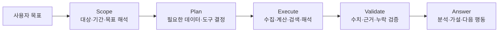

# Phase 0 Decision Charter

> 상태: **확정**
>
> 확정일: 2026-08-03
>
> 역할: 리빌드의 제품·에이전트·평가 방향을 고정하는 단일 기준 문서

## 0. Executive decision

LaunchPilot은 기존 Google ADK 해커톤 프로토타입의 점진적 마이그레이션이 아니라 **같은 문제를 새 기술 선택과 평가 체계로 다시 푸는 포트폴리오 프로젝트**로 구축한다.

핵심 제품 경험은 다음 한 문장으로 고정한다.

> 사용자가 “A 캠페인 분석해 줘”라고 요청하면, 에이전트가 허용된 범위에서 필요한 데이터를 수집하고 분석·검색·검증한 뒤, 근거와 한계를 포함한 의사결정 자료를 제공한다.

Phase 0의 최소 에이전트 하네스는 다음과 같다.

```text
Scope → Plan → Execute → Validate → Answer
```

## 1. Product thesis

### 1.1 해결할 문제

소규모 마케팅 조직과 크리에이터는 플랫폼이 제공하는 수치를 볼 수 있지만, 다음 질문에 답하기 위해 수집·비교·해석·리서치를 수작업으로 연결해야 한다.

- 어떤 성과 변화가 실제로 중요한가?
- 그 변화와 관련된 원인 후보는 무엇인가?
- 현재 사회·시장 맥락까지 고려하면 어떤 판단을 피해야 하는가?
- 다음에는 무엇을 검증해야 하는가?

LaunchPilot은 대시보드를 대체하는 것이 아니라, **성과 데이터에서 다음 실험 결정까지 이어지는 분석 업무**를 에이전트로 지원한다.

### 1.2 핵심 사용자

1차 사용자는 **소규모 인하우스 마케팅팀의 실무자**다. 여러 광고·콘텐츠 채널을 운영하지만 별도의 데이터 분석 조직 없이 캠페인 결과를 설명하고 다음 행동을 정해야 한다.

인접 사용자는 **자신의 채널 성과를 직접 관리하는 전문 인플루언서·크리에이터**다. 조직 형태는 다르지만, 성과 근거를 해석해 다음 콘텐츠 실험을 정한다는 핵심 업무가 같다.

두 집단을 별도 제품으로 나누지 않는다. 공통 작업을 중심에 두고, 권한·보고 형식·운영 규모의 차이는 이후 사용자 맥락으로 다룬다.

### 1.3 핵심 JTBD

> 캠페인이나 콘텐츠 성과가 변했을 때, 관련 데이터를 다시 모으고 해석하는 시간을 줄이고 다음에 검증할 행동을 근거와 함께 결정하고 싶다.

## 2. Representative quality scenario

### 2.1 사용자 요청

```text
A 캠페인 분석해 줘.
```

사용자에게 “최신 데이터를 가져와라”, “웹을 검색하라”, “어떤 API를 호출하라”와 같은 기술 지시를 요구하지 않는다. 필요한 작업을 추론하는 것이 에이전트의 책임이다.

### 2.2 기대 동작



1. **Scope:** 캠페인, 연결된 플랫폼, 분석 기간, 사용자의 목표를 해석한다.
2. **Plan:** 플랫폼 데이터 수집, 결정적 수치 분석, 내부 근거 검색, 필요한 외부 맥락 검색을 계획한다.
3. **Execute:** 도구가 데이터를 가져오고 계산하며, 검색기가 관련 문서를 찾고, LLM이 근거를 해석한다.
4. **Validate:** 요청한 대상을 조회했는지, 수치가 도구 출력과 일치하는지, 주요 주장에 근거가 있는지 확인한다.
5. **Answer:** 분석 결과와 가설, 다음 행동을 제시하고 데이터 기준 시각과 한계를 공개한다.

### 2.3 기본값과 확인 질문

정보가 부족해도 결과를 크게 바꾸지 않는다면 안전한 기본값을 적용하고 답변에 가정을 표시한다. 대상이나 권한처럼 결과를 실질적으로 바꾸는 정보가 없을 때만 사용자에게 확인한다.

초기 기본 분석 기간은 최근 28일과 직전 동기간 비교로 둔다. 이 값은 Phase 1에서 플랫폼 데이터 특성과 함께 재검증한다.

## 3. Agent authority and harness

### 3.1 권한 원칙

> **사용자는 목표를 말하고, 에이전트는 작업을 계획하며, 정책은 자율성의 경계를 정하고, 사람은 권한 확대와 외부 행동을 승인한다.**

- 이미 연결되고 승인된 범위의 읽기, 검색, 계산, 분석은 에이전트가 자율 수행한다.
- 새로운 플랫폼 연결이나 OAuth scope 확대는 사용자 확인을 받는다.
- 데이터 수정, 게시, 광고 변경, 외부 메시지 전송처럼 상태를 바꾸는 행동은 사용자 승인을 받는다.
- 비용이나 범위가 크게 늘어나는 모호한 작업은 실행 전에 확인한다.

Phase 0의 대표 시나리오는 읽기 전용 분석이므로, 정상 경로에서 단계별 승인을 요구하지 않는다.

### 3.2 최소 하네스

#### Scope Resolver

자연어 요청에서 분석 대상, 연결된 플랫폼, 기간, 목표를 구조화한다. 중요한 모호성만 질문하고 나머지는 기본값으로 처리한다.

#### AnalysisPlan + Policy Gate

어떤 데이터와 도구가 필요한지 실행 전에 명시한다. 계획의 각 작업이 승인된 읽기 범위인지 확인한다.

#### Evidence-based Execution

- Fetcher는 플랫폼의 실제 데이터를 가져온다.
- Analysis Tool은 기간 비교, 비율, 증감과 같은 수치를 결정적으로 계산한다.
- Retrieval은 내부 메모·과거 실험·관련 외부 맥락을 찾는다.
- LLM은 계산을 대신하지 않고, 수치와 검색 근거의 의미를 해석한다.

주요 주장은 최소한 `evidence_id`, `source`, `as_of`로 근거와 연결한다.

#### Validation + One Repair

도구 선택, 수치, 근거, 누락 공개를 검증한다. 실패하면 한 번만 수정하고, 여전히 통과하지 못하면 불확실성을 숨기지 않고 중단 사유를 답변에 표시한다.

무제한 자기비평 루프는 비용과 동작을 예측하기 어려우므로 포트폴리오 MVP에서 제외한다.

### 3.3 시간과 최신성

분석, 가설 생성, 실험 설계는 서로 다른 시점에 일어날 수 있다. 따라서 모든 단계를 과거의 단일 스냅샷에 고정하지 않는다.

- 기존 분석 산출물은 당시의 `as_of`와 출처를 보존한다.
- 이후 판단에는 정책상 허용된 최신 데이터와 외부 맥락을 사용할 수 있다.
- 에이전트가 매 단계 무조건 새로 검색하지는 않는다. 목표와 현재 근거의 충분성을 보고 필요한 경우에만 계획에 포함한다.
- 사회적 사건이나 시장 변화처럼 판단을 크게 바꿀 수 있는 맥락은 최신성을 별도로 확인한다.

정교한 이력·유효시간 모델은 Phase 0 범위가 아니며, Phase 1의 데이터 설계에서 다룬다.

## 4. Architecture thesis

### 4.1 에이전트 런타임

- **LangGraph**를 상태, 분기, 재시도, 검증을 표현하는 주 오케스트레이션 런타임으로 사용한다.
- **LangChain**은 모델·도구·retriever 통합 등 필요한 생태계 컴포넌트에 선택적으로 사용한다.
- 둘은 양자택일 대상이 아니다. LangGraph가 흐름을 소유하고 LangChain 컴포넌트가 필요한 노드 내부를 지원한다.

이 선택의 목적은 특정 프레임워크 이름을 추가하는 것이 아니라, 에이전트의 계획·도구 호출·상태 전이·검증 경로를 명시적으로 설계하고 평가하는 경험을 확보하는 것이다.

### 4.2 Retrieval 방향

우리 데이터는 한 가지 검색 방식으로 다루기 어렵다.

- 정확한 수치와 기간 비교: 구조화 필터·집계
- ID가 명확한 캠페인과 산출물: 직접 조회
- 팀 메모, 브리프, 트렌드 문서: lexical·dense·sparse 검색 후보
- Signal → Hypothesis → Experiment → Outcome 관계: 관계 확장 후보

Elasticsearch를 비즈니스 원본이 아닌 검색 Projection의 주요 후보로 둔다. 구조화 조회와 BM25를 기준선으로 만든 뒤, dense·sparse·hybrid·reranker·graph를 평가 라운드에서 하나씩 비교한다. **측정 가능한 개선이 있는 구성만 유지한다.** 해커톤 프로젝트와의 연속성, 대안과 최종 판단 기준은 [ADR-0001](adr/0001-retrieval-storage-strategy.md)에 기록한다.

### 4.3 신규 구축 원칙

기존 Google ADK 코드, 계약, 배포 구조는 요구사항과 실패 사례를 이해하기 위한 참고 자료다. 신규 언어·프레임워크 설계의 제약이나 마이그레이션 출발점으로 사용하지 않는다.

## 5. Evaluation thesis

Eval은 마지막에 점수를 매기는 작업이 아니라, 에이전트와 검색 품질을 반복적으로 개선하기 위한 개발 루프다.

```text
대표 사례 정의
→ 실행과 trace 수집
→ 실패 유형 분류
→ 한 가지 변경
→ 같은 데이터셋으로 재평가
→ 개선 여부에 따라 채택 또는 폐기
```

### 5.1 최소 결정적 지표

| 지표 | 확인할 질문 |
| --- | --- |
| Tool Selection Accuracy | 필요한 플랫폼과 분석 도구를 올바르게 선택했는가? |
| Numeric Accuracy | 답변의 수치·기간·대상이 도구 출력과 일치하는가? |
| Evidence Coverage | 주요 분석 주장에 추적 가능한 근거가 있는가? |
| Partial Failure Disclosure | 일부 데이터나 도구가 실패했을 때 이를 숨기지 않았는가? |

### 5.2 제한된 LLM 평가

규칙으로 판단하기 어려운 다음 항목에만 LLM judge를 보조적으로 사용한다.

- 분석 해석이 타당한가?
- 근거보다 강한 인과관계를 주장하지 않는가?
- 제안한 다음 행동이 실무적으로 유용한가?

LLM judge 점수만으로 품질을 선언하지 않는다. 결정적 검사, 실행 trace, 실패 사례를 함께 본다.

### 5.3 품질 게이트

| Gate | 통과 조건 |
| --- | --- |
| Tool Gate | 요청과 데이터 출처에 맞는 도구를 사용함 |
| Data Gate | 캠페인·기간·수치가 실제 도구 출력과 일치함 |
| Grounding Gate | 주요 주장에 출처와 기준 시각이 연결됨 |
| Transparency Gate | 누락 데이터, 실패, 가정과 한계를 공개함 |

## 6. Scope boundary

### 6.1 Phase 0에서 확정한 것

- 핵심 사용자와 공통 JTBD
- 대표 품질 시나리오
- 최소 에이전트 하네스
- 읽기 자동화와 승인 경계
- 평가 루프와 최소 품질 지표
- LangGraph 중심의 아키텍처 방향
- 검색 기준선 이후 실험적으로 고도화한다는 원칙

### 6.2 의도적으로 미룬 것

- 프로덕션용 고가용성, 분산 실행, 동시성·재해복구
- 예약 동기화와 항상 최신 상태를 유지하는 백그라운드 파이프라인
- 무제한 critique·repair 루프
- 복잡한 confidence 산식
- 실행 중 취소·계획 재협상
- bitemporal 데이터베이스
- 자동 맥락 충돌 해결과 장기 가설 변경 관리
- 광고 게시·예산 변경 등 쓰기 도구

이는 품질을 포기한다는 뜻이 아니다. 포트폴리오에서 설명하고 측정할 핵심인 **도구 선택, 근거 기반 분석, 상태 흐름, Eval 최적화**에 시간을 집중하기 위한 범위 결정이다.

## 7. Interview defense

### 왜 기존 Google ADK 코드를 점진적으로 전환하지 않았는가?

프로덕션 운영 서비스라면 위험을 줄이기 위한 점진적 마이그레이션이 합리적이다. 이 프로젝트는 운영 트래픽을 유지할 필요가 없는 포트폴리오 리빌드다. 따라서 기존 구조와의 호환성보다, 시장에서 요구되는 LangGraph·LangChain·RAG·Eval을 문제에 맞게 선택하고 비교한 과정을 명확하게 보여주는 편이 목적에 부합한다.

### 왜 LangGraph와 LangChain을 함께 사용하는가?

두 프레임워크의 책임이 다르기 때문이다. LangGraph는 장기 실행 상태와 제어 흐름을 표현하고, LangChain은 모델·도구·검색 통합을 제공한다. 프로젝트는 LangGraph가 전체 실행 흐름을 소유하도록 경계를 명확히 한다.

### 왜 모든 RAG 패턴을 처음부터 구현하지 않는가?

우리 데이터가 구조화 수치, 문서, 관계를 모두 포함하므로 여러 검색 방식의 후보가 필요한 것은 맞다. 그러나 복잡한 구성이 항상 더 좋은 것은 아니다. 기준선을 먼저 만들고 같은 평가셋에서 검색 품질과 최종 답변 품질을 비교해야 각 기술 선택을 근거로 방어할 수 있다.

### 왜 사용자가 요청할 때만 데이터를 가져오는가?

포트폴리오 단계에서는 예약 수집 운영보다 에이전트가 목표를 해석하고 적절한 읽기 도구를 선택하는 능력이 핵심이다. 사용자 요청 기반 수집은 최신 데이터 사용, 비용 통제, 권한 가시성을 함께 보여주면서 운영 복잡도를 줄인다.

## 8. Exit criteria

Phase 0는 다음 조건을 만족하므로 완료한다.

- 제품의 핵심 사용자와 해결할 의사결정이 한 문장으로 설명된다.
- 대표 요청에서 답변까지의 에이전트 책임과 사용자 책임이 구분된다.
- 자동 실행 가능한 읽기 범위와 승인이 필요한 행동이 구분된다.
- 최소 품질 게이트와 Eval 지표가 정의된다.
- 구현할 것과 의도적으로 미룬 것이 구분된다.
- 기술 선택을 사용자 문제, 데이터 특성, 평가 계획으로 방어할 수 있다.

Phase 0 확정 당시의 다음 단계는 **Phase 1 — Domain, Data & Evidence Design**이었다. 첫 결정은 플랫폼마다 다른 활동을 하나의 분석 대상으로 묶기 위해, LaunchPilot 내부에서 “캠페인”을 어떤 상위 도메인 개념으로 정의할지 결정하는 것이었다.
