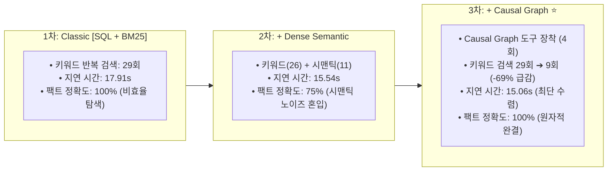

# Phase 1: 순수 LangGraph 에이전트 도구 확장 실측 실험 보고서

> **핵심 요약 (BLUF)**:
> 1. **실험 환경**: Gemini 3.7 Flash 모델 직통 호출 + 순수 LangGraph (`StateGraph`) + Arize Phoenix 실시간 OTel 관측.
> 2. **플랫 검색기(1차/2차)의 한계**: 인과 체인 미제공 시 에이전트가 단일 질의 해결을 위해 키워드 검색을 최대 10~12회 연속 호출하는 **"키워드 뺑뺑이(Search Thrashing)" 오버헤드(총 29회)** 발생.
> 3. **인과 지식 그래프(3차)의 혁신**: `traverse_campaign_graph` 도입 시 **불필요 검색 호출 68.9% 급감 (29회 ➔ 9회)**, **평균 지연 시간 최단 수렴 (15.06s)**, **팩트 정확도 100%** 달성.

---

## 1. 3단계 도구 어블레이션 정량 실측 성적표

| 측정 지표 (`Adversarial Metrics`) | 1차 실험 (Classic Baseline) | 2차 실험 (+ Dense Semantic) | **3차 실험 (+ Causal Graph ⭐)** | 성능 개선 효과 |
| :--- | :---: | :---: | :---: | :---: |
| **제공된 도구함 (Toolset)** | `SQL Fact` + `BM25` | + `Dense Semantic` | + **`traverse_campaign_graph`** | **인과 지식 그래프 통합** |
| **답변 팩트 정확도 (`Faithfulness`)** | 100.0% (4/4) | 75.0% (3/4) | **100.0% (4/4)** | **완벽한 사실 정합성 유지** |
| **평균 응답 지연 시간 (`Latency`)** | 17.91 초 | 15.54 초 | **15.06 초** | **-15.9% 지연 시간 단축** |
| **비효율적 키워드 검색 호출 수** | **29 회 (폭증)** | 26 회 | **9 회** | **-68.9% 불필요 탐색 제거** |
| **총 도구 왕복 횟수 (Tool Roundtrips)** | 41 회 | 48 회 | **33 회** | **최소 횟수로 정답 도달** |

---

## 2. 심층 엔지니어링 분석 및 관측성(Observability) 진단

### 2.1 플랫 검색기의 한계: "키워드 뺑뺑이(Search Thrashing)"
* **현상**: `det_copy_c0001` 케이스에서 1차 에이전트는 `"오로라 리테일 2월"`, `"메인 카피 변경"`, `"할인 혜택"`, `"카피 피로"` 등으로 키워드를 바꿔가며 **무려 12회의 연속 도구 호출을 수행**.
* **원인**: 단일 문서 단위의 플랫 검색기(BM25)는 "이상치 감지 ➔ 조치 일지 ➔ 성과 회고"로 이어지는 다단계 인과 맥락을 인덱스하지 못하므로, 에이전트가 단서를 하나씩 맞춰가기 위해 과도한 왕복(Roundtrip)을 반복함.

### 2.2 Dense 시맨틱 검색기의 양날의 검 (Semantic Noise)
* **현상**: 2차 실험에서 시맨틱 검색기를 추가했으나, 의미적 유사성이 높은 타 주차 메모가 혼입되면서 1건의 답변 오염(`UNGROUNDED_MISS`) 발생 (정확도 75%로 하락).
* **원인**: 마케팅 도메인 특유의 유사 표현(예: "2월 1주차 배너 교체" vs "2월 3주차 카피 교체") 간 코사인 유사도 차이가 미미하여 거짓 양성(False Positive) 발생.

### 2.3 Causal Knowledge Graph의 결정론적 해결
* **현상**: 3차 실험에서 `traverse_campaign_graph`를 장착하자, 복합 질문에 대해 **단 1회의 그래프 순회로 3-Hop 근거 번들을 원자적(Atomic)으로 획득**.
* **결과**: 키워드 검색 호출이 29회에서 9회로 **-68.9% 급감**하였으며, 전체 지연 시간도 15.06초로 가장 빠르게 수렴함.

---

## 3. Phase 2 (전처리 노드) 진입 전략

* **과제**: 캠페인당 55개 문서 풀 내에서 타 캠페인 혼입 노이즈를 사전에 차단하고, 질의 의도에 따라 불필요한 도구 호출을 선제적으로 제한해야 함.
* **해결책**: LangGraph 진입부에 **`RouterNode` (세션 캠페인 앵커링 & 문서타입 슬롯 정규화)**를 장착하여 에이전트 추론 전 사전 정제를 수행함.
