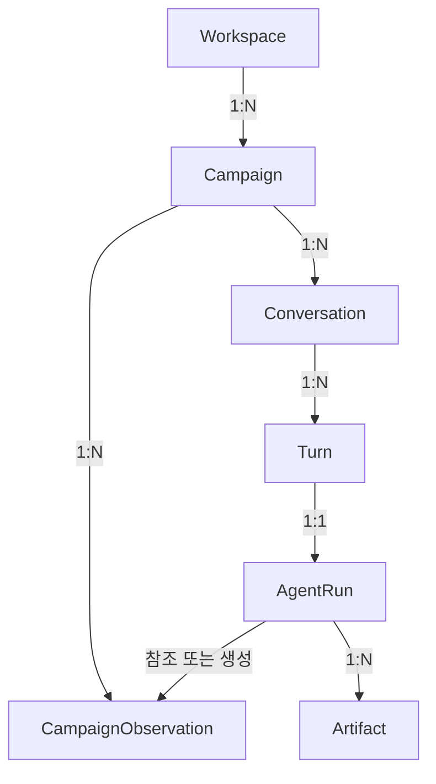

# Phase 1 Domain Model

> 상태: **확정**
>
> 목적: 플랫폼 데이터, 관측 사실과 LLM 산출물의 경계를 정의한다.

## 1. Decisions

- `Campaign`은 목표와 기간을 가진 플랫폼 독립적인 업무 단위다.
- `Workspace`는 소규모 팀의 소유권 경계이며 Campaign은 정확히 하나의 Workspace에 속한다.
- Campaign 하나에는 여러 `Conversation`과 `CampaignObservation`이 존재할 수 있다.
- `CampaignObservation`은 다중 플랫폼 데이터를 묶은 불변 사실 스냅샷이다.
- 사용자 요청 하나는 하나의 논리적 `AgentRun`으로 처리한다.
- 분석·가설·권장안은 Campaign 상태가 아니라 AgentRun의 `Artifact`다.
- Evidence는 Artifact의 주장과 관측값·문서 사이의 관계다.

## 2. Contexts

| Context | 책임 | 주요 모델 |
| --- | --- | --- |
| Workspace | 팀과 접근 권한의 경계 | `Workspace`, `WorkspaceMembership` |
| Campaign | 사용자 업무 범위 | `Campaign`, `CampaignResourceBinding` |
| Platform Integration | 외부 인증·계정·원본 응답 | `PlatformConnection`, `ExternalResource`, `FetchRun` |
| Campaign Observation | 캠페인별 수치·출처·누락 | `CampaignObservation`, `PlatformSlice`, `MetricObservation` |
| Conversation & Artifact | 채팅, Agent 실행과 답변 | `Conversation`, `Turn`, `AgentRun`, `Artifact` |

플랫폼 모델은 결정적 Normalizer를 거친다. YouTube Video나 Google Ads Campaign 같은 외부 객체를 핵심 비즈니스 엔티티로 직접 사용하지 않는다.

## 3. Relationships



Campaign은 Conversation과 Observation의 소속 범위지만, 이들을 하나의 Aggregate에 임베드하지 않는다. 각 Aggregate는 `campaign_id`로 관계를 맺는다.

## 4. Aggregates

| Aggregate Root | 책임 | 핵심 정보 | 핵심 규칙 |
| --- | --- | --- | --- |
| `Workspace` | 팀 소유권·접근 경계 | ID, members, roles | 사용자는 membership을 통해 Campaign에 접근한다. |
| `Campaign` | 목표·기간·분석 대상 관리 | ID, workspace ID, goal, period, target metrics, resource bindings | 한 Workspace에 속하며 LLM 산출물을 상태로 저장하지 않는다. |
| `Conversation` | 캠페인별 채팅방 | ID, campaign ID, title, turns | 한 Campaign에만 속하며 Turn은 append-only다. |
| `CampaignObservation` | 캠페인 데이터 스냅샷 | period, captured at, platform slices, completeness | 불변이며 수치의 grain·출처·누락을 보존한다. |
| `AgentRun` | 한 Turn의 계획·실행·검증 | analysis plan, observations, tool calls, validation, artifacts | 같은 Campaign의 근거만 사용하고 실패를 숨기지 않는다. |

`Artifact`는 AgentRun이 생성하는 식별 가능한 불변 Entity다. 검색용 저장 projection은 별도로 만들 수 있지만 생성 책임은 AgentRun에 있다.

## 5. CampaignObservation

```text
CampaignObservation
├── observation_id, campaign_id
├── period, captured_at
├── platform_slices[]
└── completeness

PlatformSlice
├── surface, connector, account_ref, fetch_run_ref
└── metric_observations[]

MetricObservation
├── subject_ref, subject_level
├── metric_key, value, unit, period
└── calculation, provenance_ref
```

같은 YouTube라도 일반 콘텐츠는 YouTube Analytics, 광고는 Google Ads에서 조회될 수 있다. 따라서 `PlatformSlice`는 플랫폼명뿐 아니라 connector와 account까지 보존한다.

필수 규칙:

- 최신 데이터는 기존 Observation 수정이 아니라 새 Snapshot으로 추가한다.
- 계정·광고·콘텐츠 수준 지표를 같은 grain으로 취급하지 않는다.
- 파생 수치는 입력값과 계산 공식을 추적할 수 있어야 한다.
- 부분 실패와 누락은 `completeness`에 기록한다.
- LLM의 원인 추정이나 권장안을 포함하지 않는다.

## 6. AgentRun and Artifact

```text
AgentRun
├── run_id, conversation_id, turn_id
├── analysis_plan
├── observation_refs[], tool_call_refs[]
├── validation_result
└── artifacts[]

Artifact
├── artifact_id, artifact_type
├── campaign_id, conversation_id, run_id
├── as_of, claims[], evidence_links[]
├── assumptions[], limitations[]
└── content
```

초기 Artifact 유형은 `ANALYSIS_REPORT`, `HYPOTHESIS_REPORT`, `EXPERIMENT_RECOMMENDATION`, `COMPARISON_REPORT`, `OUTCOME_ASSESSMENT`로 제한한다.

Signal, Hypothesis와 Experiment Recommendation은 Artifact 내부 내용이며 독립 Aggregate가 아니다. Artifact는 Campaign이나 외부 플랫폼 상태를 변경하지 않는다.

## 7. Evidence boundary

```text
API RawRecord
→ MetricObservation / 출처가 있는 DocumentExcerpt
→ EvidenceLink
→ Artifact의 Signal·Hypothesis·Recommendation
```

```text
EvidenceLink
├── claim_ref
├── source_ref
├── source_kind: METRIC_OBSERVATION | DOCUMENT_EXCERPT
└── relation: SUPPORTS | CONTRADICTS | CONTEXTUALIZES
```

LLM은 관련성과 해석을 제안할 수 있다. 결정적 Validator는 참조 존재 여부, 수치·기간·대상 일치, 문서 출처·시점, 주요 주장의 근거 유무를 검사한다.

`EvidenceLink`는 시점을 복제하지 않는다. `source_ref`가 가리키는 `MetricObservation` 또는 `DocumentExcerpt`에서 관측·발행·조회 시점을 반드시 해석할 수 있어야 하며, Validator는 주장별 근거의 기준 시점을 이 원본에서 확인한다.

## 8. Main scenario

```text
“A 캠페인 분석해 줘”
→ Campaign의 Conversation에 Turn 생성
→ AgentRun이 Scope와 AnalysisPlan 구성
→ 필요한 플랫폼 데이터 조회
→ CampaignObservation 생성 또는 재사용
→ 계산·검색·해석·검증
→ 근거·as-of·한계가 있는 Artifact 반환
```

후속 채팅에서는 기존 Observation의 시점과 충분성을 확인하고 필요할 때만 새 Snapshot을 만든다.

## 9. Out of scope

- 권장안을 운영 계획으로 승격하는 workflow
- 게시·광고 변경·캘린더 반영
- Experiment 실행 상태 관리
- 예약 수집과 Campaign 간 통합 채팅
- 운영용 Campaign 상태 머신

## 10. Interview defense

| 질문 | 답변 근거 |
| --- | --- |
| 왜 Campaign 중심인가? | 여러 플랫폼 활동을 하나의 목표·기간으로 분석하는 사용자 업무 단위이기 때문이다. |
| 왜 User가 아니라 Workspace가 Campaign을 소유하는가? | 소규모 팀이 Campaign과 근거를 공유할 수 있어야 하며, 개인 계정과 업무 데이터의 생명주기를 분리하기 위해서다. |
| 왜 Conversation을 분리했는가? | 한 Campaign에 여러 채팅이 존재하며 대화 이력이 Campaign Aggregate를 비대하게 만들면 안 되기 때문이다. |
| 왜 Observation이 불변인가? | 과거 답변을 재현하면서 후속 판단에는 최신 Snapshot을 사용할 수 있어야 하기 때문이다. |
| 왜 LLM 결과가 Campaign 상태가 아닌가? | 분석과 권장안은 사실이 아니라 특정 시점 근거에 기반한 채팅 산출물이기 때문이다. |
| 왜 PlatformSlice가 필요한가? | 같은 surface도 API·계정·metric 의미가 다르기 때문이다. |
| 왜 Evidence Context가 없는가? | Evidence는 데이터 자체가 아니라 특정 주장과 출처 사이의 관계이기 때문이다. |

Elasticsearch index, API DTO와 플랫폼별 필드 매핑은 이 도메인 모델에서 파생하되 별도의 데이터 설계로 다룬다.

## 11. Persistence decision

Campaign, Conversation, CampaignObservation은 SQLite repository에 영속화한다. Observation은 `campaign_observations`, `platform_slices`, `metric_observations`의 관계형 구조로 저장해 다음 Retrieval 단계에서 기간·플랫폼·지표별 결정적 조회가 가능하게 한다.

OAuth 연결과 외부 Campaign binding도 같은 SQLite 파일을 사용하지만 별도 repository 경계로 관리한다. 따라서 인증 control-plane 모델과 분석 domain 모델은 저장 매체를 공유하더라도 코드의 책임은 합치지 않는다.
