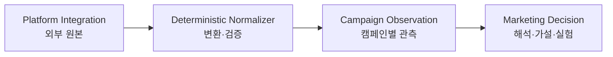

# Phase 1 Domain Model

> 상태: **논의 중**
>
> 목표: 플랫폼 API 모델과 LaunchPilot 비즈니스 모델의 경계를 분리하고, 캠페인 분석에 필요한 도메인 언어·관계·불변 규칙을 확정한다.

## 0. Working decisions

현재까지 다음 원칙에 합의했다.

- 플랫폼 API의 리소스 구조를 LaunchPilot의 핵심 비즈니스 모델로 사용하지 않는다.
- 플랫폼 원본은 출처와 수집 조건을 잃지 않은 채 보존한다.
- 플랫폼 원본에서 캠페인 분석용 모델로의 변환은 결정적 코드가 담당한다.
- LLM이 생성한 해석을 플랫폼 사실이나 관측 수치와 같은 계층에 저장하지 않는다.
- Phase 1의 비즈니스 엔티티와 Aggregate Root는 사용자 업무를 기준으로 논의해 확정한다.

아직 확정하지 않은 항목은 다음과 같다.

- `Campaign`의 정확한 의미와 생명주기
- 핵심 Aggregate Root
- `Signal`을 관측, 규칙 판정, 모델 해석 중 어디에 둘지
- `Hypothesis`, `Experiment`, `Outcome`의 상태 전이와 불변 규칙

## 1. Archive findings

해커톤 프로토타입은 Instagram, X, YouTube, TikTok 네 채널을 대상으로 했지만 실제 공식 API 연동은 제외했다. 여러 플랫폼의 데이터를 공통 CSV의 `ContentPost` 구조로 평탄화했다.

이 구조는 데모에는 단순했지만 다음 개념을 하나로 합쳤다.

```text
콘텐츠 자체
+ 플랫폼에 게시된 외부 리소스
+ 계정·콘텐츠·기간별 성과 수치
```

신규 모델은 기존 `Channel` enum이나 `metrics` map을 핵심 도메인 모델로 승계하지 않는다.

## 2. Context boundary

### 2.1 Platform Integration Context

외부 플랫폼이 정의한 리소스, 인증, 조회 응답을 다룬다.

```text
PlatformConnection
ExternalAccount
ExternalResource
FetchRun
RawRecord
```

이 영역의 모델은 YouTube, Google Ads, Meta 등 외부 API의 변화에 영향을 받을 수 있다. 외부 식별자와 원본 응답은 보존하되 핵심 비즈니스 엔티티로 직접 노출하지 않는다.

### 2.2 Campaign Observation Context

여러 플랫폼에서 수집한 데이터를 하나의 캠페인 분석 범위로 정규화한다. 이 단계에는 LLM의 해석을 포함하지 않는다.

책임은 다음과 같다.

- 캠페인과 분석 기간을 기준으로 수집 결과를 묶는다.
- 플랫폼·API·계정별 출처를 보존한다.
- 계정 수준과 콘텐츠 수준 등 지표의 측정 대상을 구분한다.
- 수집 시각, 누락, 부분 실패와 계산 공식을 보존한다.

### 2.3 Marketing Decision Context

관측 결과를 이용해 사용자의 마케팅 판단과 학습 과정을 표현한다.

현재 후보 개념은 다음과 같다.

```text
Signal
Hypothesis
Experiment
Outcome
DecisionRecord
```

이 후보들은 API에서 자동으로 도출하지 않는다. 사용자 업무에서 각 개념의 정체성, 생명주기, 상태 전이와 불변 규칙을 찾아 확정한다.

## 3. Translation boundary



이 변환 경계는 Anti-Corruption Layer 역할을 한다. 플랫폼 용어와 지표 구조가 변경되어도 LaunchPilot의 비즈니스 언어와 의사결정 규칙이 직접 오염되지 않도록 한다.

## 4. Fact and interpretation boundary

```text
RawRecord
→ 정규화된 Observation
→ 주장과 Observation의 EvidenceLink
→ Signal 또는 Hypothesis
→ Experiment
→ Outcome 평가
```

- 원본 응답과 정규화된 수치는 사실 계층이다.
- 결정적 공식으로 계산한 증감률·평균은 계산된 관측이다.
- Evidence는 별도 원본이 아니라 특정 주장과 관측값 사이의 추적 가능한 관계다.
- 원인 추정과 다음 행동 제안은 해석 계층이다.
- 모든 주요 해석은 원본까지 역추적 가능한 참조를 가져야 한다.
