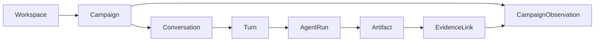

# Phase 1 — Domain, Data & Evidence

> 상태: **완료**

이 단계는 플랫폼 원본, 관측된 사실과 LLM 산출물을 분리해 과거 답변을 재현하고 최신 데이터로 후속 판단할 수 있게 한다.

## Core model

- `Workspace`는 팀 소유권과 접근 권한의 경계다.
- `Campaign`은 목표·기간을 가진 플랫폼 독립 업무 단위이며 하나의 Workspace에 속한다.
- Campaign에는 여러 `Conversation`과 불변 `CampaignObservation`이 존재할 수 있다.
- 사용자 Turn 하나는 하나의 `AgentRun`을 만들고 분석·가설·권장안은 그 Run의 `Artifact`로 남는다.
- `EvidenceLink`는 Artifact의 주장과 관측값·문서 사이의 관계다.



각 Aggregate는 `campaign_id`로 협력하며 하나의 거대한 객체로 임베드하지 않는다. 플랫폼의 Video나 Ads Campaign도 핵심 도메인 Entity가 아니라 외부 참조다.

## Observation: measured facts

```text
CampaignObservation
├── campaign_id, period, captured_at, completeness
└── PlatformSlice[]
    ├── connector, account_ref, fetch_run_ref
    └── MetricObservation[]
        └── subject_ref, grain, metric, value, unit, period, provenance
```

- 새 수집은 기존 Observation을 수정하지 않고 Snapshot을 추가한다.
- 계정·Campaign·콘텐츠 지표의 grain을 보존한다.
- 파생 수치는 입력과 공식을 추적할 수 있어야 한다.
- 부분 실패와 누락은 `completeness`에 기록한다.
- LLM의 원인 추정과 권장안은 Observation에 넣지 않는다.

같은 YouTube surface도 채널 분석은 YouTube Analytics, 광고 성과는 Google Ads가 출처일 수 있으므로 플랫폼명만으로 합치지 않는다.

## Artifact and evidence: interpreted outputs

```text
AgentRun → Artifact(claims, assumptions, limitations, as_of)
                    ↓
              EvidenceLink
                    ↓
       MetricObservation | DocumentExcerpt
```

Signal·Hypothesis·Recommendation은 사실이나 Campaign 상태가 아니라 특정 시점 근거에 기반한 Artifact 내용이다. LLM은 연결을 제안할 수 있지만 Validator가 출처 존재, 수치·기간·대상, 문서 시점과 주요 주장별 근거를 검사한다.

`EvidenceLink`는 출처와의 관계(`SUPPORTS`, `CONTRADICTS`, `CONTEXTUALIZES`)만 표현한다. 시점과 원문은 source가 소유하므로 복제하지 않는다.

## Persistence

Campaign, Conversation, Observation과 OAuth control-plane은 PostgreSQL을 공유하지만 별도 Repository 경계를 유지한다. Observation은 관계형 구조로 저장해 기간·플랫폼·지표별 Structured Retrieval의 원본이 된다. Elasticsearch는 여기서 파생된 검색 Projection일 뿐이다. 결정 근거는 [ADR-0002](adr/0002-source-of-truth-database.md)에 있다.

## Why these boundaries

| 질문 | 답 |
| --- | --- |
| 왜 Campaign 중심인가? | 여러 플랫폼 활동을 하나의 목표와 기간으로 분석하는 사용자 업무 단위이기 때문이다. |
| 왜 Workspace가 소유하는가? | 팀 데이터의 생명주기를 개인 로그인과 분리하기 위해서다. |
| 왜 Observation이 불변인가? | 과거 답변은 재현하면서 후속 판단에는 최신 Snapshot을 쓸 수 있어야 한다. |
| 왜 LLM 결과를 Campaign 상태로 두지 않는가? | 해석은 사실이 아니라 특정 Run과 근거에 종속된 산출물이기 때문이다. |

다음 단계는 이 모델에 플랫폼 데이터를 넣는 [Phase 2 Ingestion](phase-2-multiplatform-ingestion.md)이다.
