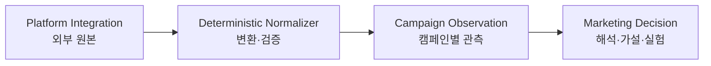

# Phase 1 Domain Model

> 상태: **논의 중**
>
> 목표: 플랫폼 API 모델과 LaunchPilot 비즈니스 모델의 경계를 분리하고, 캠페인 분석에 필요한 도메인 언어·관계·불변 규칙을 확정한다.

## 0. Working decisions

현재까지 다음 원칙에 합의했다.

- 플랫폼 API의 리소스 구조를 LaunchPilot의 핵심 비즈니스 모델로 사용하지 않는다.
- 플랫폼 원본은 출처와 수집 조건을 잃지 않은 채 보존한다.
- 플랫폼 원본에서 캠페인 분석용 모델로의 변환은 결정적 코드가 담당한다.
- LLM이 생성한 해석을 플랫폼 사실이나 관측 수치와 같은 계층에 저장하지 않는다.
- Phase 1의 비즈니스 엔티티와 Aggregate Root는 사용자 업무를 기준으로 논의해 확정한다.

아직 확정하지 않은 항목은 다음과 같다.

- `Campaign`의 정확한 의미와 생명주기
- 핵심 Aggregate Root
- `Signal`을 관측, 규칙 판정, 모델 해석 중 어디에 둘지
- `Hypothesis`, `Experiment`, `Outcome`의 상태 전이와 불변 규칙

## 1. Archive findings

해커톤 프로토타입은 Instagram, X, YouTube, TikTok 네 채널을 대상으로 했지만 실제 공식 API 연동은 제외했다. 여러 플랫폼의 데이터를 공통 CSV의 `ContentPost` 구조로 평탄화했다.

이 구조는 데모에는 단순했지만 다음 개념을 하나로 합쳤다.

```text
콘텐츠 자체
+ 플랫폼에 게시된 외부 리소스
+ 계정·콘텐츠·기간별 성과 수치
```

신규 모델은 기존 `Channel` enum이나 `metrics` map을 핵심 도메인 모델로 승계하지 않는다.

## 2. Context boundary

### 2.1 Platform Integration Context

외부 플랫폼이 정의한 리소스, 인증, 조회 응답을 다룬다.

```text
PlatformConnection
ExternalAccount
ExternalResource
FetchRun
RawRecord
```

이 영역의 모델은 YouTube, Google Ads, Meta 등 외부 API의 변화에 영향을 받을 수 있다. 외부 식별자와 원본 응답은 보존하되 핵심 비즈니스 엔티티로 직접 노출하지 않는다.

### 2.2 Campaign Observation Context

여러 플랫폼에서 수집한 데이터를 하나의 캠페인 분석 범위로 정규화한다. 이 단계에는 LLM의 해석을 포함하지 않는다.

책임은 다음과 같다.

- 캠페인과 분석 기간을 기준으로 수집 결과를 묶는다.
- 플랫폼·API·계정별 출처를 보존한다.
- 계정 수준과 콘텐츠 수준 등 지표의 측정 대상을 구분한다.
- 수집 시각, 누락, 부분 실패와 계산 공식을 보존한다.

### 2.3 Marketing Decision Context

관측 결과를 이용해 사용자의 마케팅 판단과 학습 과정을 표현한다.

현재 후보 개념은 다음과 같다.

```text
Signal
Hypothesis
Experiment
Outcome
DecisionRecord
```

이 후보들은 API에서 자동으로 도출하지 않는다. 사용자 업무에서 각 개념의 정체성, 생명주기, 상태 전이와 불변 규칙을 찾아 확정한다.

## 3. Translation boundary



이 변환 경계는 Anti-Corruption Layer 역할을 한다. 플랫폼 용어와 지표 구조가 변경되어도 LaunchPilot의 비즈니스 언어와 의사결정 규칙이 직접 오염되지 않도록 한다.

## 4. Fact and interpretation boundary

```text
RawRecord
→ 정규화된 Observation
→ 주장과 Observation의 EvidenceLink
→ Signal 또는 Hypothesis
→ Experiment
→ Outcome 평가
```

- 원본 응답과 정규화된 수치는 사실 계층이다.
- 결정적 공식으로 계산한 증감률·평균은 계산된 관측이다.
- Evidence는 별도 원본이 아니라 특정 주장과 관측값 사이의 추적 가능한 관계다.
- 원인 추정과 다음 행동 제안은 해석 계층이다.
- 모든 주요 해석은 원본까지 역추적 가능한 참조를 가져야 한다.

## 5. CampaignObservation working model

대표 품질 시나리오인 “A 캠페인 분석해 줘”에서는 하나의 캠페인 범위에 여러 플랫폼의 관측 데이터를 묶는다.

```text
Campaign 1 ── N CampaignObservation

CampaignObservation
└── PlatformSlice[]
    └── MetricObservation[]
```

`CampaignObservation`은 캠페인의 현재 상태를 계속 덮어쓰는 객체가 아니다. 특정 분석 기간과 수집 기준 시각을 가진 불변 스냅샷이다.

```text
CampaignObservation
├── observation_id
├── campaign_id
├── period
├── captured_at
├── platform_slices[]
└── completeness
```

분석, 가설 재검토, 실험 결과 확인이 서로 다른 시점에 실행되면 각각 새로운 `CampaignObservation`을 만든다.

```text
Campaign
├── CampaignObservation v1: 최초 분석
├── CampaignObservation v2: 가설 재검토
└── CampaignObservation v3: 실험 결과 관측
```

### 5.1 PlatformSlice

플랫폼별 배열은 사용자에게 보이는 채널명만으로 구분하지 않는다. 동일한 노출면도 서로 다른 API와 계정에서 데이터를 가져올 수 있기 때문이다.

```text
PlatformSlice
├── surface
├── provider
├── connector
├── account_ref
├── fetch_run_ref
├── fetch_status
├── observed_subjects[]
└── observed_metrics[]
```

예를 들어 YouTube 일반 콘텐츠와 YouTube 광고는 `surface=youtube`를 공유하지만 connector와 account가 다르다.

```text
YouTube 일반 콘텐츠
→ connector: youtube_analytics
→ account: youtube_channel

YouTube 광고
→ connector: google_ads
→ account: google_ads_customer
```

따라서 slice의 실질적인 출처 식별자는 다음 조합이다.

```text
surface + connector + account_ref + fetch_run_ref
```

### 5.2 MetricObservation

상위 분석 단위는 `CampaignObservation`이지만, 개별 수치는 독립적으로 참조할 수 있어야 한다.

```text
MetricObservation
├── metric_observation_id
├── subject_ref
├── subject_level
├── metric_key
├── value
├── unit
├── period
├── dimensions
├── calculation
└── provenance_ref
```

`subject_level`은 지표의 측정 대상을 구분한다.

```text
ACCOUNT
CAMPAIGN
AD_GROUP
DELIVERY_ITEM
CONTENT
```

예를 들어 구독자 증가는 계정 수준 관측이고, 영상 조회수는 콘텐츠 수준 관측이다. 계정 수준 수치를 편의를 위해 게시물 속성으로 복제하지 않는다.

`calculation`은 플랫폼 원본인지 결정적 파생값인지 구분한다.

```text
RAW
SUM
AVERAGE
RATE
DELTA
LIFT
```

계산된 값은 공식, 입력 observation 참조와 반올림 규칙을 함께 보존한다.

### 5.3 Completeness

다중 플랫폼 분석에서는 일부 API만 성공할 수 있다. `CampaignObservation`은 성공한 데이터만 조용히 반환하지 않고 전체 요청 범위와 플랫폼별 상태를 보존한다.

```text
Completeness
├── requested_sources[]
├── succeeded_sources[]
├── failed_sources[]
├── missing_periods[]
└── limitations[]
```

이 정보는 Phase 0에서 정의한 Partial Failure Disclosure와 Transparency Gate의 결정적 입력이 된다.

### 5.4 Invariants

1. 모든 `CampaignObservation`은 하나의 `campaign_id`, 분석 기간과 수집 기준 시각을 가진다.
2. 생성된 `CampaignObservation`은 수정하지 않는다. 최신 데이터가 필요하면 새 스냅샷을 만든다.
3. 모든 `PlatformSlice`는 connector, account와 fetch run을 식별할 수 있어야 한다.
4. 모든 `MetricObservation`은 측정 대상, 기간, 단위와 provenance를 가져야 한다.
5. 파생 수치는 입력 observation과 계산 공식을 역추적할 수 있어야 한다.
6. 계정·캠페인·콘텐츠 수준 지표를 같은 grain으로 취급하지 않는다.
7. 플랫폼 부분 실패와 데이터 누락을 스냅샷에 명시한다.
8. `CampaignObservation`에는 원인 가설이나 다음 행동 같은 LLM 해석을 저장하지 않는다.

### 5.5 Evidence relationship

`CampaignObservation` 자체가 특정 주장의 Evidence인 것은 아니다. 분석 과정에서 특정 `MetricObservation`이나 문서가 주장과 연결될 때 `EvidenceLink`가 생성된다.

```text
EvidenceLink
├── claim_ref
├── source_ref
├── relation
└── created_by
```

`source_ref`는 `MetricObservation` 또는 출처가 검증된 문서를 가리킨다. `relation`은 `supports`, `contradicts`, `contextualizes` 중 하나다. 에이전트가 이 관계를 제안할 수 있지만 참조 존재 여부와 수치 일치는 결정적 Validator가 검사한다.
