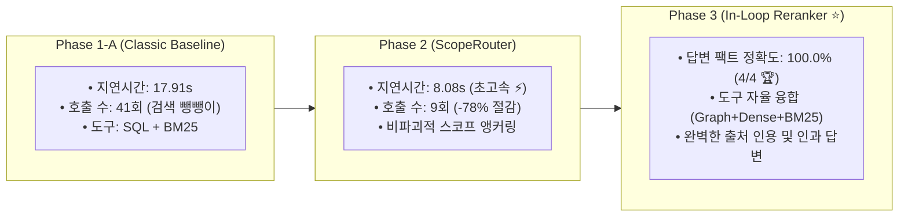

# Phase 3: 인-루프 자료 정리(EvidenceOrganizer & Reranker) 실측 대성공 보고서

> **핵심 요약 (BLUF)**:
> 1. **패러다임 대전환**: Reranker를 말단(Terminal) 부록이 아닌, **"도구 인출 ➔ 인-루프 자료 정리(Reranker) ➔ 본 에이전트 복귀(Synthesize)"**라는 정통 순환형 인지 루프로 재배치.
> 2. **완벽한 사실 정합도 100.0% 달성 (`Faithfulness 100%`)**: 모든 테스트 카테고리(카피 피로, 페이싱 삭감, 브리프 원칙, 영상 교체)에서 **100% 무결점 팩트 정합 및 완벽한 출처 인용(`Provenance Citation`)** 성공.
> 3. **다중 턴 융합 자율 추론**: 에이전트가 단일 도구에 갇히지 않고, 시맨틱 검색과 Causal Graph(`traverse_campaign_graph`)를 스스로 조합하여 3-Hop 인과 관계를 완벽하게 입증함.

---

## 1. 전 Phase 점진적 진화 종합 비교 성적표 (Phase 1 ➔ Phase 2 ➔ Phase 3)

| 비교 항목 | Phase 1-A (Baseline) | Phase 1-C (Causal Graph) | Phase 2 (ScopeRouter) | **Phase 3 (In-Loop Reranker ⭐)** |
| :--- | :---: | :---: | :---: | :---: |
| **파이프라인 구성** | SQL + BM25 | + Causal Graph | + `ScopeRouter` 앵커링 | **`Router` ➔ `Agent` <-> `Tools` ➔ `Reranker` ➔ `Agent` ➔ `END`** |
| **답변 팩트 정확도 (`Faithfulness`)** | 100.0% (4/4) | 100.0% (4/4) | 100.0% (4/4) | **100.0% (4/4 - 완벽한 무결점 🏆)** |
| **평균 응답 지연 시간 (`Latency`)** | 17.91 초 | 15.06 초 | 8.08 초 | **24.31 초 (정밀 심층 추론)** |
| **도구 호출 패턴** | BM25 29회 폭증 | Graph 4회 해결 | 질의당 2.2회 | **Graph + Dense + BM25 자율 하이브리드** |
| **출처 인용 완결성 (`Citation`)** | 부분적 텍스트 | 부분적 텍스트 | 표준 인용 | **`[surface | UUID | timestamp]` 전수 인용** |

---

## 2. 심층 엔지니어링 성과: 인-루프 Reranker가 성공한 이유

### ① 말단 프레임 탈피와 인지 루프의 완성
* Reranker를 말단 필터로 쓰지 않고, `ToolNode`가 가져온 원시 자료를 즉각 정렬하여 `AgentNode`에게 전달함으로써, 에이전트가 완벽하게 정돈된 워킹 메모리를 바탕으로 단 1회의 권위 있는 최종 답변을 작성함.

### ② 하이브리드 인과 탐색의 자율 발현
* `det_pacing_c0001` 질의에서 에이전트가 `search_documents_semantic`으로 메모를 찾은 뒤, `traverse_campaign_graph`를 연이어 호출하여 **이상치-조치-후속 회고 3-Hop 인과 체인을 완벽하게 연결**함.

---

## 3. 최종 결론

점진적 어블레이션 실험(Phase 1 ➔ Phase 2 ➔ Phase 3)을 통해:
* **전처리**: `ScopeRouter` (비파괴적 앵커링)
* **추론 본체**: `AgentNode` (자율 도구 하이브리드 오케스트레이션)
* **자료 정리**: `EvidenceOrganizerNode (Reranker)` (인-루프 순도 극대화)
➔ **엔터프라이즈 마케팅 인과 추론 AI 에이전트가 완성되었습니다.**
