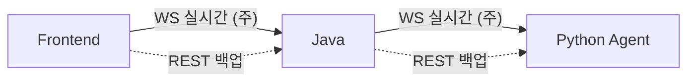
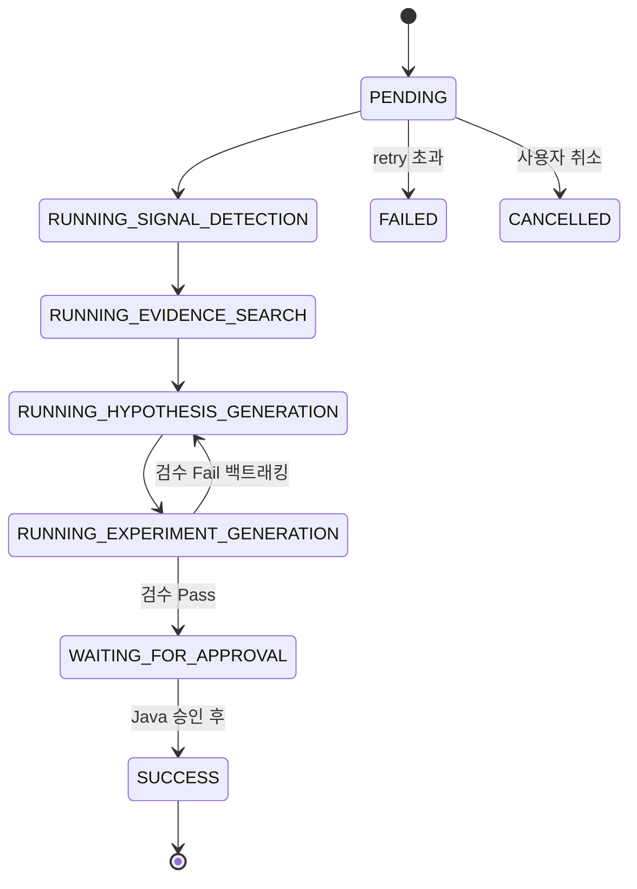
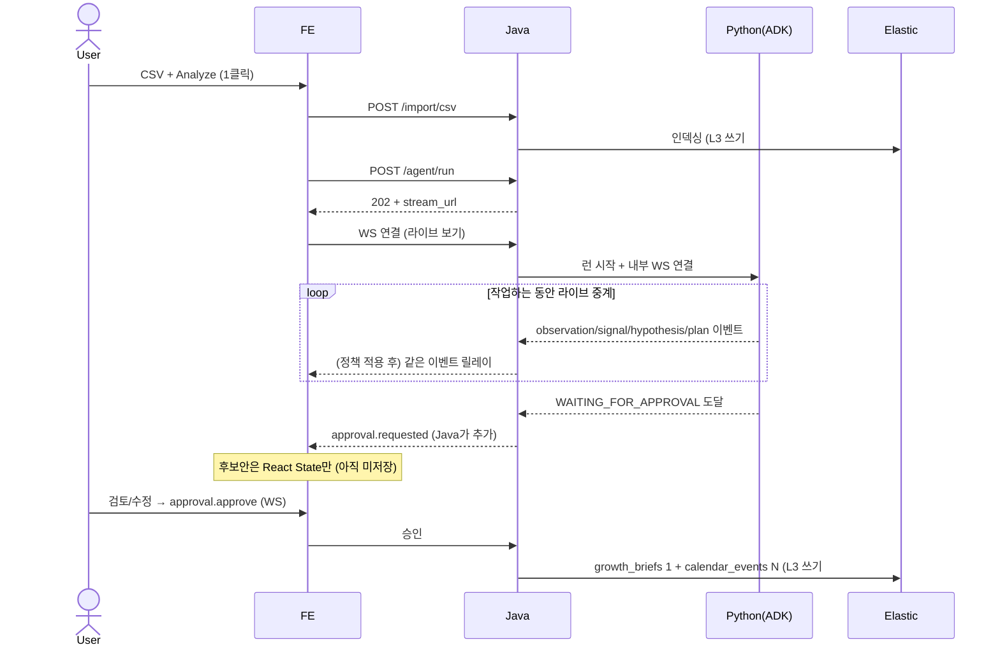
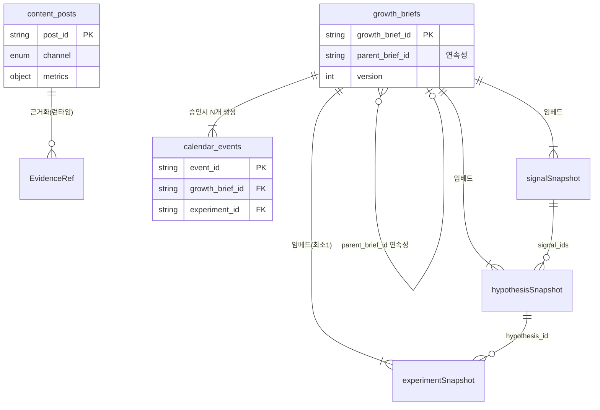

# LaunchPilot SPEC Dashboard

> 이 1장만 보면 전체 파악되게 만든 트래킹 문서. 줄글 원본 안 읽어도 됨.
> 세부는 각 표의 `원본` 컬럼 링크로. Last synced: 2026-06-02 (HEAD `d472ff0`)

---

## 0. 이게 뭐 하는 시스템인가 (3줄)

1. 크리에이터 팀이 **SNS 성과 CSV**를 올린다.
2. **AI 에이전트 4명**(분석가/전략가/작가/검수자)이 협업해서 "이번 주 중요한 변화 → 왜 → 다음 주에 뭘 테스트할지"를 만든다.
3. 사람이 **검토·수정·승인**하면, 다음 주 콘텐츠 실험안 + 캘린더 + 1페이지 브리프가 확정 저장된다.

> 챗봇 아님. 핵심 흐름: **신호(Signal) → 가설(Hypothesis) → 실험안(Experiment) → 검수 → 승인 → 브리프 → 다음 캠페인으로 연속**

---

## 1. 누가 뭘 하나 (컨테이너 6개)

배포하는 거 3개 + 빌려쓰는 외부 3개.

| 컨테이너 | 스택 | 한 일 | 절대 안 하는 일 |
|---|---|---|---|
| **Frontend** | React / Next.js | 화면, CSV 업로드, 승인 버튼 | Python/Elastic/Gemini 직접 호출 |
| **Java Backend** | Java 21 / Spring Boot | 문지기(게이트웨이), CSV 파싱, **Elastic에 쓰기**, 비동기 잡 | DB 추론 로직, RDB 사용 |
| **Python Agent** | FastAPI / Google ADK | 4워커 추론, Gemini 호출, 근거 검색 | **승인 처리, Elastic 쓰기** |
| Gemini API (외부) | - | 추론, 도구 호출 결정, 글 생성 | - |
| Elastic (외부) | - | **유일한 DB**, 근거 검색 (별도 벡터DB 없음, 하이브리드로 해결) | - |
| Phoenix/Arize (외부) | - | 에이전트 행동 기록(L4), 자가 성찰 | - |

> 한 문장 요약: **FE는 화면만, Java는 쓰기/문지기만, Python은 추론만, Elastic은 저장만.** 책임이 안 섞임.

---

## 2. 통신 채널 (★ 최근 큰 변경 — 폴링 → WebSocket)

각 경계가 **2개 채널**을 가짐. 비유: WS = 라이브 중계방송, REST = 끊겼을 때 보는 다시보기.

| 채널 | 용도 | 언제 씀 | 스펙 파일 |
|---|---|---|---|
| **WebSocket (주 채널)** | 에이전트 작업을 실시간 중계 | 평소 (라이브 진행 보기) | `asyncapi.yaml` |
| **REST (백업)** | 시작 트리거, 스냅샷 조회, 승인/취소 fallback | 재접속/새로고침/스트림 끊김 | `openapi.yaml` |

흐름: `POST /run` → 202 응답에 **`stream_url`** 들어있음 → FE가 그 WS 열고 라이브로 받음. 끊기면 `GET` 스냅샷으로 복구.

### 왜 WS랑 REST를 동시에 쓰나 (중복 아님, 역할 분담)

비유: **WS = 전화 통화**(실시간인데 끊김), **REST = 문자/저장된 기록**(느려도 확실, 다시 읽힘).

| | WebSocket | REST |
|---|---|---|
| 잘하는 것 | 서버가 실시간으로 밀어줌(push) | 요청-응답, 확실, 재시도 쉬움 |
| 약점 | 끊김(와이파이/탭 절전/서버 재시작) 시 메시지 유실 | 실시간 push 불가 (폴링하면 느리고 낭비) |
| 담당 | 진행상황 **라이브 보기** | 시작/승인 같은 **행위** + 끊겼을 때 **복구** |

- WS만 → 끊기면 진행 날아가고 복구 불가, 행위 신뢰성 약함.
- REST만 → 실시간 못 보여줌, 폴링 흉내는 렉/낭비.
- **그래서 둘 다:** 평소 WS 라이브, 끊기면 `GET` 스냅샷으로 "어디까지 했더라" 복구, 시작/승인/취소는 REST로도 보장.

---

## 3. API / 이벤트 한눈에

### REST (백업 채널)

| 경계 | Method | Path | 목적 |
|---|---|---|---|
| FE→Java | POST | `/api/import/csv` | CSV → Elastic 인덱싱 |
| FE→Java | POST | `/api/agent/run` | 분석 시작 (202 + `stream_url`) |
| FE→Java | GET | `/api/agent/runs/{id}` | 스냅샷 복구 (fallback) |
| FE→Java | POST | `/api/agent/actions/{id}/approve` | 승인 fallback |
| FE→Java | POST | `/api/agent/actions/{id}/cancel` | 취소 fallback |
| Java→Py | POST | `/internal/agent/runs` | 런 시작 (202 + `stream_url`+`snapshot_url`) |
| Java→Py | GET | `/internal/agent/runs/{id}` | 스냅샷 (상태+payload만, **이벤트 히스토리 없음**) |
| Java→Py | POST | `/internal/agent/runs/{id}/cancel` | 취소 fallback |

### WebSocket (주 채널) 이벤트

| 스트림 | 서버→클라 이벤트 | 클라→서버 명령 |
|---|---|---|
| **FE↔Java** (`01/asyncapi`) | 13종: run.started, step.updated, observation.created, tool.updated, signal.detected, hypothesis.created, experiment_plan.drafted, **approval.requested**, run.paused/resumed/cancelled/completed/failed | 4종: run.cancel, approval.update_payload, **approval.approve**, approval.reject |
| **Java↔Python** (`02/asyncapi`) | 8종: run.started, step.updated, observation.created, signal.detected, hypothesis.created, experiment_plan.drafted, run.failed, run.cancelled | 1종: run.cancel |

**왜 Python은 approval 이벤트를 안 보내나?**
규칙: **쓰기·승인은 Java만, 추론은 Python만.** 승인은 "DB에 확정 저장"을 부르는 비즈니스 행위라 Python 소관이 아님. Python은 "후보 다 만들었음"(`WAITING_FOR_APPROVAL`)까지만 신호하고, 그걸 받아 "승인하실래요?"(`approval.requested`)를 띄우고 실제 저장하는 건 Java. 그래서 approval 4종은 FE↔Java 스트림에만 있고 Python 스트림엔 없음.

**Glass-box 규칙이 뭐냐 (쉽게):**
Gemini 속은 지저분함 — 토큰 조각, 반쪽 생각, 내부 표식(`thoughtSignature`), 도구 통신용 raw 메시지. 이걸 그대로 화면에 뿌리면 노이즈인 데다 민감한 내부 추론이 샘. 그래서 Python이 **번역기**처럼 그 raw 덩어리를 사람이 읽어도 되는 깔끔한 카드("BTS 클립이 baseline 2.8배")로 바꿔서만(`observation`) 내보냄.
- Glass-box(유리상자) = 에이전트가 뭐 하는지 **들여다보되 정제된 화면**으로. 속 내장(raw)은 안 보임.
- 반대말 black-box = 아무것도 안 보임. 우리는 그 중간을 의도적으로 택함.

---

## 4. 상태 2축 (헷갈리기 쉬움 — 분리해서 봐야 함)

같은 런을 보는 **굵은 상태(Status)** 와 **세밀한 단계(Stage)** 두 축이 따로 있음.

**축 A — Run Status (9개, 굵은 생명주기):**

**축 B — Run Stage (7개, WS 진행표시줄용, `asyncapi`에만 존재):**
`IMPORT_METRICS → DETECT_PERFORMANCE_SIGNAL → GROUND_WITH_EVIDENCE → GENERATE_HYPOTHESIS → DRAFT_EXPERIMENT_PLAN → WAIT_FOR_APPROVAL → APPLY_APPROVED_PLAN`

| 보조 enum | 값 |
|---|---|
| Step status | PENDING / IN_PROGRESS / SUCCEEDED / FAILED / SKIPPED |
| Observation kind | progress / evidence / signal / hypothesis / plan / warning |

> 정리: **Status = "지금 크게 어디쯤"(폴링/스냅샷용), Stage = "세부 작업 단계"(라이브 진행바용).** 둘은 별개 enum.

---

## 5. 에이전트 4명이 실제로 하는 일

| 워커 | Status / Stage | 입력 | 행위 | 출력 |
|---|---|---|---|---|
| **분석가** Data Analyst | SIGNAL_DETECTION→EVIDENCE_SEARCH / DETECT→GROUND | 시계열·콘텐츠 로그 | 도구 호출(baseline 집계, 고성과 포스트 검색) → 이상치 랭킹 | `SignalDraftOutput` |
| **전략가** Data Strategist | HYPOTHESIS_GENERATION / GENERATE_HYPOTHESIS | 누적 신호 | 팀 메모 검색 + Gemini로 "왜?" 가설 | `HypothesisDraftOutput` |
| **작가** Data Writer | EXPERIMENT_GENERATION / DRAFT_EXPERIMENT_PLAN | 가설 | Gemini로 실험안 작성 (도구 거의 없음). 검수 통과 후 최종 브리프 MD | `ExperimentPlanDraftOutput` |
| **검수자** Reviewer Gate | (VALIDATING) | 전체 누적 | 기계적 검증(스키마+근거ref) + Phoenix 성찰 → Pass/Fail | `ValidationReport` |

> "입력→행위→출력" 루프가 깔끔히 맞는 건 **분석가 1명**. 전략가는 추론 위주, 작가는 거의 순수 생성, 검수자는 판정 단계. 4명이 똑같은 패턴 반복이 아님.

---

## 6. 메인 시나리오 (실시간 + 사람 승인)

---

## 7. 데이터 쓰기/읽기 (DB 단기 vs 장기)

| 계층 | 저장소 | 쓰기 시점 | 누가 | 특징 |
|---|---|---|---|---|
| **단기 L1/L2** | Shared Context (Python 메모리) | 워커 매 단계 | Python | 휘발성, **DB 아님**, 런 끝나면 사라짐 |
| **장기 L3** | Elastic | ① CSV import ② 승인 (**딱 2번**) | **Java만** | 불변(append-only), 수정/삭제 없음 |
| L3 읽기 | Elastic | 런 중 근거 검색 | Python (MCP, **읽기 전용**) | - |
| **메타 L4** | Phoenix | 런 내내 | Python | 행동 기록 + 다음 런 성찰 |

> 기억할 것: **에이전트는 장기 DB에 안 쓴다. 읽기만.** 쓰기는 Java가 import할 때 1번, 사람이 승인할 때 1번. 그게 전부.

---

## 8. 데이터 모델 ER (Java가 Elastic에 쓰는 문서)

| 공유 enum | 값 |
|---|---|
| Channel | youtube / tiktok / instagram / x / unknown |
| Confidence | low / medium / medium_high / high |
| EvidenceRef.ref_type | content_post / metric_aggregate / team_note / growth_brief |
| ID prefix | run_ / req_ / imp_ / post_ / sig_ / hyp_ / exp_ / plan_ / brief_ / cal_ |

---

## 9. 계약 6경계 (진실의 원천)

| # | 경계 | 스펙 파일 | 원본 |
|---|---|---|---|
| 01 | FE ↔ Java | `openapi.yaml` + **`asyncapi.yaml`** | `contracts/01-frontend-java` |
| 02 | Java ↔ Python | `openapi.yaml` + **`asyncapi.yaml`** | `contracts/02-java-python-agent` |
| 03 | Java ↔ Elastic | `documents.schema.json` | `contracts/03-java-elastic` |
| 04 | Python ↔ ES MCP | `evidence-tools.schema.json` | `contracts/04-agent-elastic-mcp` |
| 05 | 워커 ↔ 구조화출력 | `agent-output.schema.json` | `contracts/05-agent-output` |
| 06 | Python ↔ Phoenix | `openinference-traces.schema.json` | `contracts/06-observability` |

---

## 10. MVP 진행 트래커

| ID | 요구사항 | 상태 |
|---|---|---|
| R1 | CSV 제공 | 🟡 계약완료, UI 대기 |
| R2~R8 | Analyze 1클릭, 비동기, 검토 | 🟢 Covered |
| R9 | 실험 title 편집 | 🟢 Covered |
| R10 | 실험 체크박스 선택 | ⚪ Deferred |
| R11 | 승인→불변 적재 | 🟢 Covered |
| R12/R13 | 연속성 parent_brief_id | 🔴 미구현 |
| R14/R15 | EvidenceRef, OpenInference | 🟢 계약 Covered |
| R16 | Apple 절제 비주얼 | 🟡 UI 후 검토 |

🟢 완료 / 🟡 부분 / 🔴 미구현 / ⚪ 보류

---

## 11. 🔴 지금 추적할 갭 & 미정

| 갭 | 내용 | 영향 |
|---|---|---|
| G1 | `documents.schema.json`은 문서 3종만. PRD §10.1은 6 인덱스 주장(+follower_logs, campaigns, team_notes) | 3개는 Java-Elastic 문서계약 부재 |
| G2 | 연속성(R12/R13) 미구현 | 캠페인 학습루프 데모 불가 |
| G3 | **WS 재접속 리플레이 정책 미정** (d472ff0에서 이벤트 히스토리 제거됨) | 스트림 끊기면 중간 이벤트 유실 가능 |
| ~~G4~~ | ~~PRD/C4 폴링 서술~~ → **해결됨.** PRD v1.1 + C4 v0.2 둘 다 WS-first 반영 완료 | - |

**미정(Open Decisions):**
- Reviewer Gate retry limit 값
- formatter = 별도 LlmAgent vs Python normalization
- `cancel` 데모에 필요한지
- 내부 서비스 인증 필요 여부

---

## 12. 최근 변경 로그 (계약)

| 커밋 | 변경 |
|---|---|
| `d472ff0` | GET 스냅샷에서 `workflow_events` 제거. 이벤트 히스토리는 MVP 범위 밖 |
| `1e65411` | `02/asyncapi.yaml` 신설 (Python→Java WS 스트림). start 응답에 stream_url/snapshot_url |
| `32c6b0f` | `01/asyncapi.yaml` 신설 (FE↔Java WS). CANCELLED 상태 + stage 축 + glass-box 규칙 도입 |

---

## 13. 원본 링크

- PRD: [`docs/product/LaunchPilot_PRD.md`](product/LaunchPilot_PRD.md)
- C4: [`docs/architecture/launchpilot-c4.md`](architecture/launchpilot-c4.md)
- 계약 인덱스: [`contracts/README.md`](../contracts/README.md)
- 추적 매트릭스: [`docs/product/mvp-requirements-traceability.md`](product/mvp-requirements-traceability.md)
